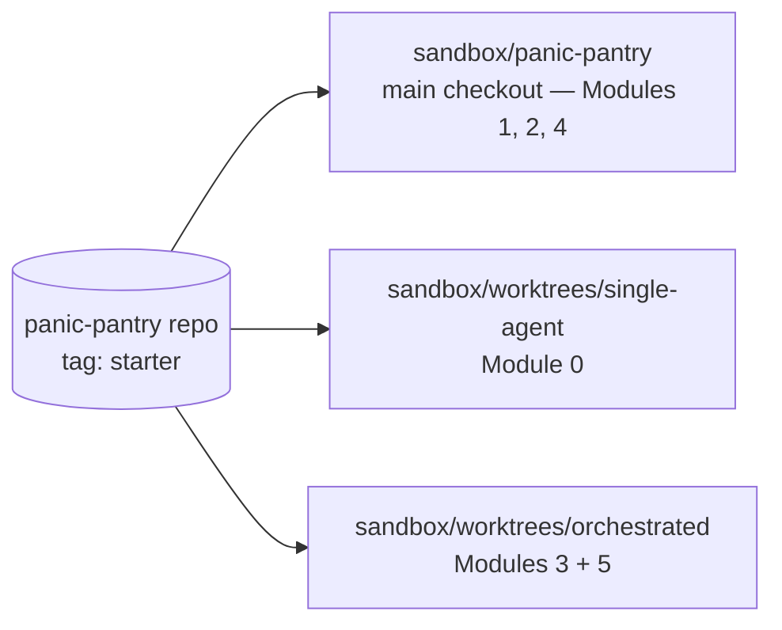

# Orchestration Fundamentals for Agentic Development — Student Guide

**Tool:** OpenCode **1.18.33** (pinned by your instructor; the commands here target that version).
**Sandbox:** the Panic Pantry snack shop in [../sandbox/panic-pantry](../sandbox/panic-pantry/README.md). Pure Python 3, standard library only, fully offline.
**Promise:** you leave having split, delegated, run, reviewed and integrated a real feature with a crew of agents.

---

## The story

Panic Pantry, a late-night snack shop, launches the **Midnight Crunch Drop** at midnight. Marketing hands over a CSV of promo codes minutes before launch. You build the importer.

> **The rule that must never break:** discounts **above 20%** need a manager's approval. Exactly 20% is fine and goes live. 21% or more is stored as `pending_approval` and refused at checkout until a manager approves it.

The nightmare: someone imports `FREE-ALL,100`, the importer skips the rule, and the shop gives away its pretzels. All afternoon, no agent (fast, clever or free) gets to bypass that rule.

---

## The course on one screen

If you read nothing else, read this.

| Module | You learn to… | Orchestration step | The one rule |
|---|---|---|---|
| 0 | Watch one agent do the whole job alone | The baseline to beat | Measure before you multiply |
| 1 | Split the job and write down each piece | Split | Split by file, not by function |
| 2 | Build agents with hard limits on what they can touch | Staff | A role is a permission, not a name |
| 3 | Hand the cards to agents, run them, compare with Module 0 | Run | Parallel only when tasks share no files |
| 4 | Pick the right model for each piece, using what Module 3 showed you | Budget | Cheap model + hard check beats pricey model + blind trust |
| 5 | Handle a launch-night failure | Recover | Green tests are evidence, not a verdict |

Start with [Module 0](module-0-baseline.md), then [1](module-1-decomposition.md), [2](module-2-agent-crew.md), [3](module-3-parallel-run.md), [4](module-4-model-routing.md), [5](module-5-capstone.md). The [appendices](appendices.md) hold the glossary, Git in 90 seconds, a command crib sheet and sources.

---

## The shop's code in 60 seconds

| Name | What it is | Where |
|---|---|---|
| **`Promotion`** | One promo code with a discount and a **status**: `active` (usable at checkout) or `pending_approval` (refused until a manager approves) | `src/panic_pantry/models.py` |
| **`PromotionService.create_promotion`** | The only door into the store. **It decides the status**: this is where the 20% rule lives | `src/panic_pantry/promotions.py` |
| **`import_promotions(csv_path, service)`** | What you're building: reads a CSV and creates promotions *through* the service | `src/panic_pantry/importer.py` (doesn't exist yet) |
| **`ImportReport`** | What the importer returns: four lists (`created`, `pending_approval`, `skipped_duplicate`, `errors`), so every row is accounted for | same file |

- **The store already has codes.** Every reset copies `data/promotions.json.seed` into the store, including `WELCOME10`. A CSV row for `WELCOME10` is a duplicate even if it appears only once.
- **Line numbers count the header as line 1.** The first data row is line 2.

---

## Check your setup

New here? Clone this repo and run `bash sandbox/setup.sh` once: [Module 0 → Before you start](module-0-baseline.md#before-you-start--get-the-course-ready) walks you through it. **Don't re-run setup after that: it wipes both worktrees.**

```bash
cd sandbox/panic-pantry          # from the course root (your clone of opencode-orchestration)
bash scripts/check_env.sh        # python3, git, opencode 1.18.33, then the tests
bash scripts/reset.sh            # anytime: back to a clean store
```

`check_env.sh` should end with `OK (skipped=9)`: 23 tests, 9 skipped. The 9 skipped tests are the importer's acceptance tests, waiting for a file that doesn't exist yet. They're the finish line.



*Figure 0 — Where each module runs: one repository, three folders. New to worktrees? Read [Git in 90 seconds](appendices.md#appendix-f--git-in-90-seconds).*
Text alternative: one repository tagged starter feeds three folders: the main checkout for Modules 1, 2 and 4, the single-agent worktree for Module 0, and the orchestrated worktree for Modules 3 and 5.

Two files every agent obeys:

- [AGENTS.md](../sandbox/panic-pantry/AGENTS.md): project rules OpenCode loads into every session.
- [workshop/WRITABLE_FILES.md](../sandbox/panic-pantry/workshop/WRITABLE_FILES.md): who may edit what, exercise by exercise.

---

## How to read these files

Read them rendered (on GitHub, or in VS Code's Markdown preview: Ctrl/Cmd+Shift+V) so answers stay folded until you open them.

Callouts: 🎯 goal · 🌍 real-world story · 🔮 predict before you peek · ⚡ optional Level up · 🔑 the one thing to remember. (Modules 3–5 still use 📘 Concept and 💡 Field note boxes until they're rewritten.)

Stuck on a word? The [glossary](appendices.md#appendix-e--glossary) lists every term and the module that teaches it.

Start here: [Module 0](module-0-baseline.md).
