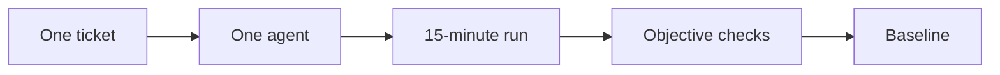
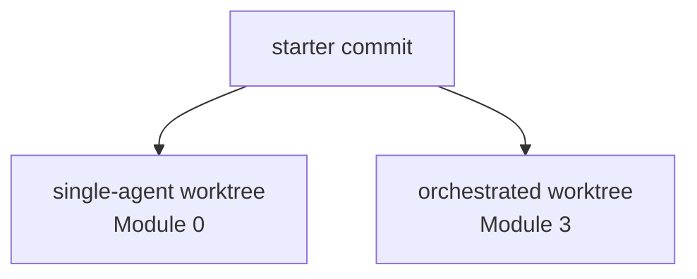

# Module 0 — Establish the Baseline with ONE Agent 📏

> 🎯 **Goal:** give one agent the entire ticket, measure what it produces in 15 minutes, and preserve the evidence.
>
> In Module 3, you'll solve the same problem with an orchestrated crew and compare where orchestration **helped, hurt, or made no difference**.
>
> **You'll leave with:**
>
> - the Module 0 side of `workshop/scorecard.md`
> - `/tmp/baseline.diff`
> - a record of the exact model + variant used
> - an intervention count
> - a baseline artifact we can honestly compare against later

| Module | You learn to… | Orchestration step | The one rule |
|---|---|---|---|
| **0 ← you are here** | **Measure one agent before changing the workflow** | **Baseline** | **Measure before you multiply** |
| 1 | Turn one job into independently understandable pieces | **Decompose** | Split by independent outcome |
| 2 | Give each worker only the authority it needs | **Isolate** | Minimum necessary authority |
| 3 | Run, verify, integrate, review, and repair | **Execute** | Returned is not done |
| 4 | Give each worker enough model capability | **Route** | Minimum sufficient capability |
| 5 | Respond to a launch-night failure | **Recover** | Green tests are evidence, not a verdict |

---

# Why start with one agent? 🤔

Because otherwise you won't know whether orchestration actually helped.

Imagine you immediately build:

```text
Lead
├── Implementer
├── Breaker
└── Reviewer
```

It feels sophisticated.

But sophisticated is not the same as better.

Without a baseline, you cannot answer:

```text
Did the crew improve quality?

Was it faster?

Did it cost more?

Did it need more human attention?

Would one agent have done just as well?
```

So before adding architecture, we measure the simple system.



> 🔑 **Measure before you multiply.**

---

# What this experiment is — and is not 🧪

Today you are creating a **baseline observation**.

Later, Module 3 will reuse:

- the same starter commit
- the same ticket
- the same frozen contract tests
- the same 15-minute implementation window
- the same model + variant for the core matched comparison

What changes is the **workflow**.

Module 0:

```text
one agent
```

Module 3:

```text
Lead
+
specialists
+
acceptance gates
+
independent verification
```

That gives us a much better basis for comparison than simply saying:

> “The multi-agent version felt better.”

---

## One important limitation

This is a classroom comparison, not a scientific benchmark.

By Module 3, **you will know more** about:

- the ticket
- likely bugs
- the architecture
- the tests
- the application

Git worktrees can reset repository state.

They cannot erase what the human learned.

So later:

> Avoid steering the crew with implementation details you only discovered after Module 0, and record every intervention you do make.

That keeps the comparison as honest as practical.

---

# Before you start — get the course ready

**Time: about 5 minutes**

Do this once on the class VM.

Open a terminal.

---

## 1. Check the supplied tools

OpenCode, Git, Python, and a connected model provider are already installed.

You are only verifying the environment.

| Check | Expect |
|---|---|
| `opencode --version` | `1.18.33` |
| `git --version` | Any version |
| `python3 --version` | Any Python 3 |
| Start `opencode`, run `/models`, then quit | At least one usable model |

The exercises in this course target the supplied OpenCode version.

If a check fails:

> **Tell the instructor. Do not install or upgrade tools yourself.**

That matters because a different OpenCode version can change configuration and agent behavior.

---

## 2. Clone the course repository

From your home folder:

```bash
cd ~

git clone https://github.com/varoonsahgal/opencode-orchestration.git

cd opencode-orchestration
```

From now on, we'll call this:

```text
the course root
```

---

## 3. Run setup once

```bash
bash sandbox/setup.sh
```

Setup prepares the Panic Pantry repository, tags the original state as:

```text
starter
```

and creates two Git worktrees that begin at that same commit:

```text
sandbox/worktrees/single-agent

sandbox/worktrees/orchestrated
```

The first is for today's baseline.

The second is reserved for Module 3.

> ⚠️ **Run setup once.**
>
> Recreating the worktrees later can erase your Module 0 and Module 3 work.

The setup script protects against accidental reruns unless explicitly forced.

---

## Why worktrees already?

We want both experiments to begin from the same repository state without their ordinary working-copy changes contaminating one another.

Conceptually:



They're separate working directories attached to the same Git repository.

You'll explore what worktrees isolate—and what they **do not** isolate—in Module 3.

---

## 4. Check the environment

Run:

```bash
bash sandbox/panic-pantry/scripts/check_env.sh
```

Expect something like:

```text
Ran 23 tests

OK (skipped=9)

[check_env] OK
```

Why are 9 tests skipped?

Because they are waiting for:

```text
src/panic_pantry/importer.py
```

which does not exist yet.

That's intentional.

---

# Know your three workspaces 🗂️

| Folder | Used in |
|---|---|
| `sandbox/worktrees/single-agent` | **Module 0** |
| `sandbox/panic-pantry` | **Modules 1, 2, 4** |
| `sandbox/worktrees/orchestrated` | **Modules 3 + 5** |

Think:

```text
Module 0
baseline experiment

Modules 1–2
design the orchestration system

Module 3 + Module 5
run the orchestrated system

Module 4
tune it: which model for which worker?
```

---

# Troubleshooting setup 🩹

| Problem | Fix |
|---|---|
| `opencode` not found or wrong version | Ask the instructor |
| Clone says directory already exists | `cd ~/opencode-orchestration` |
| Setup says already configured | Continue to environment check |
| `/models` shows nothing usable | Ask the instructor before starting |
| `check_env.sh` fails | Confirm setup completed, then ask the instructor |

---

# Why measure first? 📐

There are three reasons.

### 1. Agents multiply your design

One poorly scoped agent may make one bad assumption.

Five poorly scoped agents can make five different assumptions at once.

---

### 2. More agents are not free

Anthropic reported that its multi-agent research setup used substantially more tokens than a simple chat interaction—even though it also produced large gains on its research benchmark. ([Anthropic, Jun 2025](https://www.anthropic.com/engineering/multi-agent-research-system))

The takeaway isn't:

> “multi-agent is expensive.”

It's:

> **additional architecture should buy something measurable.**

---

### 3. Human intuition is unreliable

> 🌍 **Real world:** METR ran a 2025 randomized study in which experienced open-source developers believed AI tools made them about **20% faster**, while measured task completion showed them about **19% slower** in that study. ([METR, Jul 2025](https://metr.org/blog/2025-07-10-early-2025-ai-experienced-os-dev-study/))
>
> METR's 2026 follow-up reports that the picture is evolving as tools improve. ([METR, Feb 2026](https://metr.org/blog/2026-02-24-uplift-update/))

That's exactly why this course starts with:

```text
measure
```

before:

```text
architect
```

---

# You're the chef at the pass 👨‍🍳


*The pass: the counter where every plate is checked against the ticket before it leaves the kitchen. Photo: MarkBuckawicki, [Wikimedia Commons](https://commons.wikimedia.org/wiki/File:Restaurant_Kitchen_expo_station.jpg), CC0.*

This image is going to follow us through the course.

The **pass** is the final checkpoint between the kitchen and the customer.

Today there is only **one cook**.

Later there will be several stations.

But your role never changes.

You are the release lead standing at the pass.

```text
Cook:
"Done!"

You:
"Show me the ticket."
```

Later:

```text
Implementer:
"Done!"

Breaker:
"Done!"

Reviewer:
"Looks good!"

You:
"Show me the evidence."
```

> 🔑 **No plate leaves the kitchen because the cook said, “Trust me.”**

This becomes Module 3's rule:

> **Returned is not done.**

---

# Read the cockpit before every run 🛩️


*The OpenCode TUI. Your model may differ; the layout is what matters. Screenshot: [OpenCode project](https://github.com/sst/opencode), MIT License.*

Before any experiment, know what you're actually running.

| On screen | Tells you | Control |
|---|---|---|
| **Build / Plan** | Which primary agent you're talking to | **Tab** |
| Model name | Current model | `/models` |
| Variant | Reasoning/effort setting | **ctrl+t** |
| Commands | Available actions | **ctrl+p** |
| Interrupt | Stop the current response | **Esc** |

Many shortcuts use the leader key:

```text
ctrl+x
```

So:

```text
<Leader>+n
```

means:

1. press `ctrl+x`
2. release
3. press `n`

Why care?

Because:

> **If you cannot identify the model and variant, you cannot honestly compare the run later.**

---

# Count every time you grab the wheel 🚗

One metric in our comparison is:

```text
human interventions
```

An **intervention** occurs when you supply information, direction, diagnosis, or work that the agent needed in order to continue correctly.

Why measure it?

A system that works only while a human constantly rescues it may not scale well to multiple agents.

Think:

> A self-driving car that needs you to grab the wheel six times per trip is giving you useful data about its autonomy.

---

## What counts?

| Human action | Intervention? |
|---|:---:|
| Starting prompt | ❌ |
| Routine permission approval with no new information | ❌ |
| Answering a question from the agent | ✅ |
| Correcting its interpretation | ✅ |
| Giving it missing requirements/context | ✅ |
| Saying “keep going” after it stalls | ✅ |
| Manually editing its code | ✅ |
| Telling it exactly what failed | ✅ |
| Stopping it at the hard 15-minute limit | ❌ |

Keep a simple tally:

```text
Interventions: |||
```

Three marks = three interventions.

Don't overthink it.

Consistency matters more than philosophical perfection.

---

# What are we scoring? 🎯

This is where the baseline becomes much clearer.

We are **not** trying to manufacture one magical number.

There is no:

```text
Single agent = 73 points
Crew = 81 points
```

because that would hide the tradeoffs.

Instead, think of the scorecard as a dashboard.

```text
QUALITY
TIME
HUMAN EFFORT
RESOURCE COST
```

> 🔑 **The scorecard is a dashboard, not a leaderboard.**

---

# Two views of the experiment 👀

Later you'll read the comparison in **two passes**.

## View 1 — Matched 15-minute snapshot

Ask:

> **At the same hard stop, which workflow produced the stronger artifact?**

This is the fairest direct comparison.

---

## View 2 — Workflow lifecycle

Ask:

> **What extra quality did orchestration buy after integration, review, and repair—and how much coordination tax did that require?**

These are different questions.

Do not mix them.

```text
MATCHED SNAPSHOT
same 15-minute budget

        versus

FULL WORKFLOW
integration
review
repair
assurance
```

Today, Module 0 primarily creates the first view.

---

# Scorecard — Single Agent vs. Orchestrated Crew 📋

Create or open:

```text
workshop/scorecard.md
```

Use this structure.

---

## A. Matched conditions

These rows tell us whether the comparison is actually comparable.

| Metric | Module 0 — one agent | Module 3 — crew | How recorded |
|---|---|---|---|
| Starter commit | | | Git / scorer |
| Model + variant | | | **MANUAL** |
| Ticket | `TICKET-001` | `TICKET-001` | Fixed |
| Implementation timebox | 15 min | 15 min | Fixed |

> If Module 3 cannot reproduce the same model + variant, write:
>
> `NOT MATCHED`
>
> Don't hide the mismatch.

---

## B. Quality at the hard stop

| Metric | Module 0 — one agent | Module 3 — crew | What it tells us |
|---|---|---|---|
| Contract tests passing `/9` | | | Frozen acceptance criteria |
| Whole suite | | | Regressions / overall health |
| Policy ownership check | | | Did importer appear to take over approval logic owned by the service? |
| Product files changed | | | Scope of the actual product change |
| Complete at hard stop? | | | Was the requested artifact finished? |

The first four can be populated from:

```bash
bash scripts/score.sh
```

---

## C. Human + coordination effort

| Metric | Module 0 — one agent | Module 3 — crew | What it tells us |
|---|---|---|---|
| Human interventions during timed run | | | Supervision burden |
| Breaker findings/tests | n/a | | Independent executable evidence |
| Reviewer actionable findings | n/a | | Independent analytical evidence |
| Repair cycles | n/a | | Work returned to an owner |
| Integration + rework minutes | not run | | Coordination tax |

---

## D. Time + resource usage

| Metric | Module 0 — one agent | Module 3 — crew | How recorded |
|---|---|---|---|
| Timed-window elapsed | | | MANUAL |
| Total human elapsed including post-window work | | | MANUAL |
| Tokens | | | Exact value or `unavailable` |
| Cost | | | Exact value or `unavailable` |

Never estimate unavailable cost or token data.

---

# Why each row exists

This makes the scorecard much easier to reason about.

| Metric | Why we care |
|---|---|
| **Model + variant** | Changed model capability would confound the comparison |
| **Contract tests** | Direct evidence against frozen requirements |
| **Whole suite** | Finds regressions beyond the targeted feature |
| **Policy ownership** | Catches an architectural boundary violation tests might miss |
| **Product files changed** | Reveals scope and supports ownership analysis |
| **Interventions** | Measures human supervision burden |
| **Elapsed time** | Measures time-to-artifact |
| **Integration/rework** | Measures coordination tax |
| **Tokens/cost** | Measures computational economics |

Now every row has a reason.

---

# A quick example 💡

**Do not copy these numbers.**

Imagine you eventually get:

| Metric | Module 0 | Module 3 |
|---|---:|---:|
| Model + variant | Model-X / medium | Model-X / medium |
| Contract tests | 7/9 | 9/9 |
| Whole suite | 2 failures | PASS |
| Policy ownership | REVIEW — 1 flag | PASS |
| Product files changed | `importer.py` | `importer.py`, `test_promo_import.py` |
| Human interventions | 3 | 1 |
| Complete at hard stop? | No | Yes |
| Timed-window elapsed | 15:00 | 15:00 |
| Integration/rework | not run | 6 min |
| Tokens/cost | unavailable | unavailable |

How would you interpret that?

Not:

> “Crew won 9–7.”

Instead:

> **At the matched 15-minute stop, the crew produced stronger contract coverage and required fewer human interventions. It also incurred six additional minutes of integration/rework afterward.**

That's what the scorecard is for.

---

# Exercise 0 — Establish the baseline 🔨

**Total time: about 25 minutes**

---

# Step 1 — Warm-up: see where the rules come from 🔥

**Time: about 8 minutes**

Move into your baseline worktree:

```bash
cd sandbox/worktrees/single-agent

git branch --show-current
# must print: single-agent

python3 -m unittest discover -s tests
# expected: OK with 9 skipped

opencode
```

If Git worktrees are new to you:

[Git in 90 seconds](appendices.md#appendix-f--git-in-90-seconds)

---

## The warm-up is not scored

Its job is to teach you:

> **Where does an agent actually get its understanding of the task?**

Afterward, we'll start a fresh session before the real baseline.

---

## Switch to Plan

Press:

```text
Tab
```

until you're talking to:

```text
Plan
```

Then paste:

```text
Add a CSV importer for promo codes.

Show me your plan first.

Do not edit any files.
```

If the agent asks you to resolve ambiguity:

1. press **Esc**
2. reply:

```text
Don't resolve these.

List them as open questions in the plan.
```

---

## Investigate two things

### Question 1

Where did its rules come from?

Was it:

```text
your one-line prompt?

AGENTS.md?

tickets/TICKET-001.md?

something else?
```

Did the model find the ticket itself?

---

### Question 2

Where is the 20% approval rule actually enforced?

`AGENTS.md` gives you a clue about where to look.

<details>
<summary>▶ Reveal answer</summary>

`PromotionService.create_promotion` in:

```text
src/panic_pantry/promotions.py
```

decides the status.

Above 20%:

```text
pending_approval
```

Exactly 20%:

```text
active
```

If the plan correctly understood that behavior, much of the intelligence came from the **repository context and contract**, not from your vague one-line prompt.

That's important.

In real repositories, those rules may not be written down nearly as clearly.

Module 1 is about making the contract explicit before multiplying workers.

</details>

---

# Step 2 — The real baseline run ⏱️

**15 minutes. Hard stop.**

This is the run that counts.

The instructor calls:

```text
START
```

and:

```text
STOP
```

If the agent is unfinished at 15 minutes:

> **Stop anyway.**

Unfinished work is valid evidence.

---

## Before the clock starts

Complete this checklist.

- [ ] Start a fresh conversation using `/new`
- [ ] Press **Tab** back to **Build**
- [ ] Record the exact model
- [ ] Record the exact variant
- [ ] Reset your intervention tally to 0
- [ ] Confirm you're on branch `single-agent`
- [ ] Use one agent only
- [ ] Do not deliberately invoke subagents

Why `/new`?

Because we don't want the warm-up conversation giving this run information the Module 3 crew won't automatically receive.

---

## Give the agent the whole ticket

Paste:

```text
Implement tickets/TICKET-001.md exactly as written.

Create src/panic_pantry/importer.py and nothing else outside the ticket's scope.

When done, run:

python3 -m unittest discover -s tests -v

Show me the output.
```

Start the timer.

---

## During the run

Observe.

Don't coach unless you need to.

Every time you provide real help, add one intervention mark.

If the agent asks:

> “Should I write my own tests?”

reply:

```text
No — contract tests only.
```

Count that as an intervention.

Why?

Because:

```text
tests/test_promo_import.py
```

is reserved for Module 3's independent Breaker.

We want the baseline implementation and independent attack tests to remain separable.

---

# Step 3 — Hard stop 🛑

At 15 minutes:

> **Stop the run.**

Do not extend it because:

```text
"It's nearly done."
```

That would make the later comparison meaningless.

Record:

```text
Complete at hard stop: YES / NO
```

and:

```text
Timed-window elapsed:
```

If it finished in 9 minutes:

```text
09:00
```

If it was still working when the clock stopped:

```text
15:00
```

---

# Step 4 — Score the artifact 🧮

Now the agent has **returned**.

We haven't decided whether its artifact is good.

This is your first exposure to a concept that becomes central in Module 3:

```text
RETURNED
   ↓
VERIFY
   ↓
ACCEPT / FAIL
```

Run:

```bash
bash scripts/score.sh
```

---

# What `score.sh` is checking

It gives you four objective rows.

### Contract tests

Question:

> **How many of the 9 frozen contract checks pass?**

Skipped tests count as:

```text
0
```

not success.

Otherwise a missing importer could misleadingly look green.

---

### Whole suite

Question:

> **Does the repository still pass as a system?**

Targeted success is not enough if the feature breaks something else.

---

### Policy ownership check

Question:

> **Does `importer.py` appear to implement the 20% approval decision itself?**

The ticket says that policy belongs to the service.

This is a **static warning**, not proof.

If the script flags a line:

> **Read the line.**

Do not blindly treat a heuristic as a verdict.

---

### Product files changed

Question:

> **What actual product code did the agent touch?**

The relevant product areas are:

```text
src/
tests/
```

Later, Module 3 also contains orchestration files under:

```text
.opencode/
workshop/
```

Those are part of the **experiment harness**, not the product itself.

---

# Step 5 — Add the manual evidence ✍️

Now fill the Module 0 column manually for:

```text
model + variant
interventions
complete at hard stop
timed-window elapsed
tokens
cost
```

If OpenCode exposes attributable token/cost data through:

```bash
opencode stats
```

record it.

If not:

```text
unavailable
```

Never estimate.

---

# Step 6 — Save the baseline diff 💾

We want the exact artifact for later comparison.

Stage the product work:

```bash
git add src/ tests/
```

Then save the product diff:

```bash
git diff --cached > /tmp/baseline.diff
```

Why not blindly use:

```bash
git add -A
```

?

Because later modules introduce experiment-harness files under:

```text
.opencode/
workshop/
```

and we want the comparison to focus on the **system under test**.

---

# Your Module 0 scorecard should now contain

## Matched conditions

```text
Starter commit:
Model + variant:
Ticket: TICKET-001
Timebox: 15 min
```

## Quality

```text
Contract tests:
Whole suite:
Policy ownership:
Product files changed:
Complete at hard stop:
```

## Human effort

```text
Interventions:
```

## Resource usage

```text
Timed elapsed:
Tokens:
Cost:
```

The Module 3-only rows stay blank for now.

---

# ⚡ Level Up — Ask the agent to grade itself

<details>
<summary>▶ Optional — 2 minutes</summary>

Stay in the same Build session after the hard stop.

Ask:

```text
Rate your implementation from 1 to 10.

Then list its three biggest risks.
```

Write down the result.

Now compare it with:

```text
contract tests
whole suite
policy ownership check
```

You may see something like:

```text
Agent:
"9/10 — very confident"

Evidence:
7/9 contract tests
1 failing test
1 policy flag
```

Or perhaps the self-assessment is accurate.

Either result is interesting.

The lesson is not:

> “Models always overrate themselves.”

It is:

> 🔑 **Confidence is metadata. External checks are evidence.**

Module 2 introduces independent specialists precisely because the agent that produced an artifact should not be the only source of evidence about its quality.

</details>

---

# Done when ✅

You are finished with Module 0 when:

- [ ] `workshop/scorecard.md` has a complete Module 0 column
- [ ] `/tmp/baseline.diff` exists
- [ ] exact model + variant are recorded
- [ ] intervention count is recorded
- [ ] complete-at-hard-stop is recorded
- [ ] contract test score is recorded
- [ ] whole-suite result is recorded
- [ ] policy ownership warnings were inspected
- [ ] your notes identify where the 20% rule actually lives
- [ ] your notes explain where the warm-up agent found its rules

---

# Troubleshooting 🩹

| Problem | Fix |
|---|---|
| Tests won't run | Run them from `sandbox/worktrees/single-agent`, not from `tests/` |
| OpenCode opened the wrong project | Quit, `cd` into the worktree, restart OpenCode |
| Worktree was already dirty | Ask the instructor before resetting anything |
| Contract tests say 0/9 | Check whether importer is missing/misnamed or tests skipped |
| Policy ownership shows REVIEW | Inspect the flagged lines manually |
| Can't isolate token/cost data | Record `unavailable` |
| Forgot model variant | Do not guess; mark it unknown and tell the instructor |
| Run exceeded 15 minutes | Record the mistake; do not pretend it was a matched run |
| Unsure whether something counted as intervention | Use the table above and record your best consistent judgment |

---

# Debrief 🗣️

<details>
<summary><b>▶ Why did we count interventions?</b></summary>

Because intervention is hidden human labor.

If an agent only succeeds because you repeatedly supply:

```text
context
corrections
diagnosis
direction
```

that matters.

When Module 3 introduces several workers, your ability to personally supervise every one decreases.

So intervention count is a rough measure of:

```text
how much human attention the workflow consumes
```

</details>

---

<details>
<summary><b>▶ Which interventions were really missing context?</b></summary>

Often several.

Every time you had to say:

```text
"No, the service owns that rule."

"Don't modify that file."

"Remember seeded duplicates."
```

you discovered something the task specification could have said earlier.

Module 1 turns those discoveries into explicit contracts and cards.

</details>

---

<details>
<summary><b>▶ Why don't we turn all these rows into one numerical score?</b></summary>

Because that would hide the tradeoffs.

Imagine:

```text
Crew:
better quality
more cost
less human intervention
more integration time
```

Is that “better”?

It depends on the use case.

The scorecard preserves the dimensions so you can make an informed judgment.

> **The scorecard is a dashboard, not a leaderboard.**

</details>

---

<details>
<summary><b>▶ Why is the policy ownership check separate from tests?</b></summary>

Because passing output tests does not necessarily prove that the architecture respected the intended responsibility boundary.

For example, `importer.py` might reproduce the correct 20% rule itself.

Tests could pass.

But the system now contains duplicated policy logic that can drift later.

So we want both:

```text
behavioral evidence
+
architecture evidence
```

</details>

---

<details>
<summary><b>▶ Why do we care about the exact model + variant?</b></summary>

Because changing the underlying model changes the experiment.

If Module 0 used:

```text
Model A / medium
```

and Module 3 used:

```text
Model B / maximum
```

then an improvement might come from:

```text
better orchestration
```

or simply:

```text
more model capability
```

Module 3 will deliberately separate those questions.

</details>

---

<details>
<summary><b>▶ Why isn't one run enough to prove anything universal?</b></summary>

Because model outputs vary, and one classroom ticket represents one workload.

Today's run creates:

```text
a baseline
```

not:

```text
a universal benchmark
```

The valid conclusion later will be something like:

> “Under these conditions, this workflow produced these observable results.”

That's strong evidence.

It's just appropriately scoped evidence.

</details>

---

# The scorecard in one picture 🖼️

```text
                 15-MINUTE RUN
                       │
                       ▼
                    RETURN
                       │
                       ▼
                  SCORECARD
       ┌───────────────┼────────────────┐
       ▼               ▼                ▼
     QUALITY       HUMAN EFFORT      RESOURCES
       │               │                │
 contract tests   interventions       time
 whole suite                         tokens
 policy check                         cost
 scope
       │               │                │
       └───────────────┼────────────────┘
                       ▼
                BASELINE SNAPSHOT
                       │
                       ▼
               PRESERVE RECEIPTS
                       │
                       ▼
                   MODULE 3
```

---

# Three things to remember 🔑

1. **Measure before you multiply.**
2. **Returned is not the same as accepted.**
3. **The scorecard is a dashboard, not a leaderboard.**

And keep the kitchen image in your head:

> **The cook says “done.”  
> The person at the pass checks the ticket.**

---

## The comparison you'll complete in Module 3

At the end of the orchestrated run, you'll read the scorecard in two passes:

### Pass 1 — Matched snapshot

> **At the same 15-minute hard stop, which workflow produced the stronger artifact?**

### Pass 2 — Lifecycle

> **What extra quality did orchestration buy—and what coordination tax did it introduce?**

Then you'll write:

> **One honest sentence:** what did the crew buy you, and what did it cost?

---

**Next:** [Module 1](module-1-decomposition.md) — take the same ticket and turn it into explicit outcomes, ownership, and task cards before another agent writes a single line of code.
