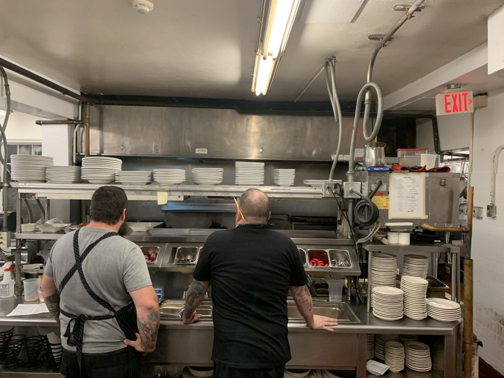

# Module 0 — Watch one agent do it alone

> 🎯 **Goal:** give one agent the whole ticket, measure what it does in 15 minutes, and keep the numbers. In Module 4 a crew of agents has to beat them.
>
> **You'll leave with:** the Module 0 column of `workshop/scorecard.md` filled in, and `/tmp/baseline.diff`.

| Module | You learn to… | Orchestration step | The one rule |
|---|---|---|---|
| **0 ← you are here** | **Watch one agent do the whole job alone** | **The baseline to beat** | **Measure before you multiply** |
| 1 | Split the job and write down each piece | Split | Split by file, not by function |
| 2 | Build agents with hard limits on what they can touch | Staff | A role is a permission, not a name |
| 3 | Pick the right model for each piece | Budget | Cheap model + hard check beats pricey model + blind trust |
| 4 | Hand the cards to agents, run them, compare with Module 0 | Run | Parallel only when tasks share no files |
| 5 | Handle a launch-night failure | Recover | Green tests are evidence, not a verdict |

---

## Before you start: get the course (5 min)

Do this once, before anything else. If your instructor gave you a machine that already has the course cloned and a `sandbox/worktrees/` folder inside it, skip to step 4 to check it.

**1. You need:**

| Tool | Check | If it's missing |
|---|---|---|
| Git | `git --version` | [git-scm.com/downloads](https://git-scm.com/downloads) |
| Python 3 | `python3 --version` | [python.org/downloads](https://www.python.org/downloads/). Nothing to `pip install`: the shop uses the standard library only |
| OpenCode **1.18.33** | `opencode --version` | `npm install -g opencode-ai@1.18.33`. Use exactly this version: the commands in this course target it |
| A model provider | Start `opencode`, type `/models`, and see at least one model | Your instructor tells you which provider to use. Connect it with `/connect` inside OpenCode. **Never put API keys in the repo** |

**2. Clone the student repo.** It's the only repo you need. Put it anywhere; your home folder is fine.

```bash
cd ~
git clone https://github.com/varoonsahgal/opencode-orchestration.git
cd opencode-orchestration        # the "course root": paths in this course start here
```

**3. Run setup once.**

```bash
bash sandbox/setup.sh
```

It turns `sandbox/panic-pantry` into its own Git repo, tags its starting point `starter`, and creates two identical copies (worktrees) for the matched runs. It ends with `[setup] done`.

> ⚠️ **Run it once.** Running it again wipes both worktrees, including your Module 0 and Module 4 work. A second run refuses unless you add `--force`; only do that if your instructor tells you to.

**4. Check it worked.**

```bash
bash sandbox/panic-pantry/scripts/check_env.sh
```

It prints your Git, Python and OpenCode versions, then runs the tests. Expect `Ran 23 tests`, then `OK (skipped=9)`, and a last line of `[check_env] OK`. The 9 skipped tests are waiting for the importer you're about to build.

**You now have three folders** in one repo:

| Folder (from the course root) | Used in |
|---|---|
| `sandbox/worktrees/single-agent` | Module 0, next |
| `sandbox/panic-pantry` | Modules 1–3 |
| `sandbox/worktrees/orchestrated` | Modules 4 and 5 |

| Problem | Fix |
|---|---|
| `opencode --version` isn't `1.18.33` | `npm install -g opencode-ai@1.18.33`, then open a new terminal |
| `[setup] already set up` | You've already run it, which is fine. Go to step 4 |
| `/models` shows nothing usable | Ask your instructor. Don't start Exercise 0 without a model |
| `check_env.sh` reports failing tests | Make sure `setup.sh` ran and ended with `[setup] done`, then ask your instructor |

---

## Why measure first?

- **Agents multiply whatever plan you give them, including a bad one.** One vague agent guesses; five guess five different ways at once.
- **More agents cost more.** Anthropic's multi-agent research system used about 15× the tokens of a plain chat ([Anthropic, Jun 2025](https://www.anthropic.com/engineering/multi-agent-research-system)).
- **Feelings aren't data.** So you'll keep a scorecard.

> 🌍 **Real world:** in a 2025 randomized trial, 16 experienced open-source developers did 246 real tasks. With AI tools they were **19% slower**, while believing they were **20% faster** ([METR, Jul 2025](https://metr.org/blog/2025-07-10-early-2025-ai-experienced-os-dev-study/)). A 2026 follow-up says the picture is shifting ([METR, Feb 2026](https://metr.org/blog/2026-02-24-uplift-update/)). That's the point: measure your own runs.

---

## You're the chef at the pass



*The pass: the counter where every plate is checked against the ticket before it leaves the kitchen. Photo: MarkBuckawicki, [Wikimedia Commons](https://commons.wikimedia.org/wiki/File:Restaurant_Kitchen_expo_station.jpg), CC0.*

Today your role is **release lead**. Many stations cook; one person at the pass checks every plate and decides what goes out. The stations are your agents. The pass is you.

## Read the cockpit before every run


*The OpenCode TUI. Your model will differ; the layout won't. Screenshot: [OpenCode project](https://github.com/sst/opencode), MIT License.*

| On screen | Tells you | Key |
|---|---|---|
| **Build** / **Plan** | Which **primary agent** you're talking to. Build edits files and runs commands; Plan can't edit your files but can still run commands | **Tab** switches |
| Model name | The model this agent uses right now | `/models` changes it |
| `variants` | The model's effort setting (e.g. more reasoning) | **ctrl+t** cycles |
| `commands` / `interrupt` | Every action, searchable / stop the agent | **ctrl+p** / **esc** |

Many shortcuts start with the **leader key**, `ctrl+x`: `<Leader>+n` means press `ctrl+x`, release, then `n`. If you can't name the agent, model and variant, you can't compare runs.

## Count every time you grab the wheel

An **intervention** is any time you step in: a correction, an answer to its question, a "keep going", a hand edit.

A self-driving car that needs you six times a trip isn't self-driving. You can watch one agent; you can't watch five. So this count predicts whether a crew could run without you.

---

## Exercise 0 — The baseline (25 min) 🔨

```bash
cd sandbox/worktrees/single-agent        # from the course root: this run gets its own copy of the repo
git branch --show-current                # must print single-agent
python3 -m unittest discover -s tests    # ends OK (skipped=9)
opencode
```

New to worktrees? See [Git in 90 seconds](appendices.md#appendix-f--git-in-90-seconds).

### Step 1 — Warm-up: a vague prompt (8 min)

- **Do:** press **Tab** to switch to **Plan**, then paste the prompt below. If it asks you anything, press **Esc** and reply `Don't resolve these: list them as open questions in the plan.`
- **Why:** real requests often look like this one-liner. You're finding out where the agent's rules come from.
- **Done when:** your notes answer both questions below.

```text
Add a CSV importer for promo codes. Show me your plan first. Do not edit any files.
```

1. **Where did its rules come from?** Your prompt, `AGENTS.md`, or `tickets/TICKET-001.md`? Did it find the ticket on its own?
2. **Where is the 20% rule enforced?** Find the actual line. `AGENTS.md` names the file.

<details><summary>Answer</summary>

`PromotionService.create_promotion` in `src/panic_pantry/promotions.py` decides the status: above 20% → `pending_approval`; exactly 20% → `active`.

If the plan looked good, the *repo* did the deciding (the ticket and `AGENTS.md`), not your prompt. Most real repos don't have a TICKET-001 waiting. Module 1 teaches you to write one.
</details>

### Step 2 — The baseline run (15 min, hard stop)

- **Do:** give one agent the full ticket. Your instructor calls start and stop.
- **Why:** Module 4 runs the same ticket with a crew under the same conditions. This is the number to beat.
- **Done when:** the instructor calls stop, finished or not. Unfinished is valid data.

Before you paste:

- [ ] `/new`: a fresh session, so nothing from Step 1 leaks in
- [ ] **Tab** back to **Build**
- [ ] Write down the model and variant from the status bar. Module 4 must use the same ones.
- [ ] One agent only: don't @-mention anyone. (If it delegates on its own, note it.)

```text
Implement tickets/TICKET-001.md exactly as written. Create src/panic_pantry/importer.py
and nothing else outside the ticket's scope. When done, run:
python3 -m unittest discover -s tests -v
and show me the output.
```

During the run:

- Step in only when you must, and tally every intervention. The starting prompt and plain permission approvals don't count.
- If it asks whether to write its own tests, answer `No — contract test only.` That counts as an intervention. `tests/test_promo_import.py` is reserved for Module 4's Breaker.

### Step 3 — Score it (2 min)

- **Do:** run the scorer, then fill the **Module 0** column of `workshop/scorecard.md`.
- **Why:** a script reads the results the same way every time, here and in Module 4.
- **Done when:** the column is full and the diff is saved.

```bash
bash scripts/score.sh                                   # prints four rows of the scorecard
git add -A && git diff --cached > /tmp/baseline.diff    # stage first: new files don't show in a plain diff
```

Copy `score.sh`'s four rows, then fill the rest yourself: model and variant, interventions, elapsed time, and tokens/cost from `opencode stats` (or "unavailable").

Watch two rows. **Contract tests** counts skipped tests as 0: a missing or misnamed importer would otherwise look green. **Policy source check** flags any line where the importer seems to decide approval itself; ticket criterion 7 forbids that. Read every flagged line.

<details><summary>⚡ <b>Level up — ask it to grade itself (2 min)</b></summary>

In the same session, after the stop, ask:

```text
Rate your implementation from 1 to 10 and list its three biggest risks.
```

Compare its answer with `score.sh`. Write down the gap. Module 2 is about why the agent that built the code shouldn't be the one to grade it; this is your first evidence.
</details>

### Done when

- [ ] The Module 0 column of `workshop/scorecard.md` is full, and `/tmp/baseline.diff` exists
- [ ] Your notes say where the plan's rules came from
- [ ] You can name the file and function that enforce the 20% rule

| Problem | Fix |
|---|---|
| Tests won't run | Run them from the worktree root (`sandbox/worktrees/single-agent`), not from `tests/` |
| OpenCode opened the wrong project | Quit it, `cd` into the worktree, start it again |
| The worktree was already dirty | Ask your instructor. `bash sandbox/setup.sh --force` rebuilds the worktrees but wipes them |

---

## Debrief

<details>
<summary><b>Which of your interventions was really a missing piece of context?</b></summary>

Usually most of them. Every intervention you counted is context you could have written down before the run. Module 1 is how.
</details>

<details>
<summary><b>In your own codebase, where do the house rules live? Would an agent find them?</b></summary>

Look for an `AGENTS.md` (or `CLAUDE.md`), a ticket with acceptance criteria, and tests that enforce the rules. If the rules live only in people's heads, an agent will guess, and so will a new teammate.
</details>

> 🔑 **Measure before you multiply.**

---

**Next:** [Module 1](module-1-decomposition.md): split TICKET-001 into a plan and two cards, one per agent, against a frozen contract.
