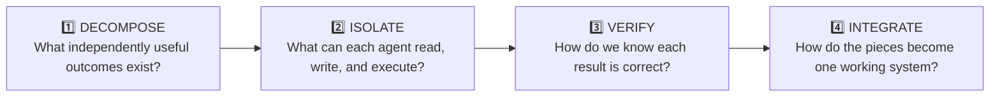
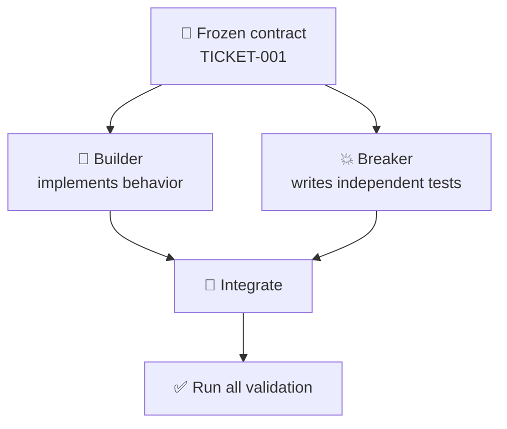
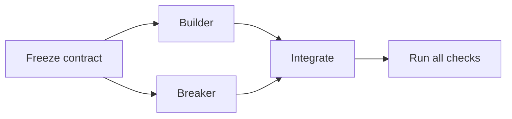
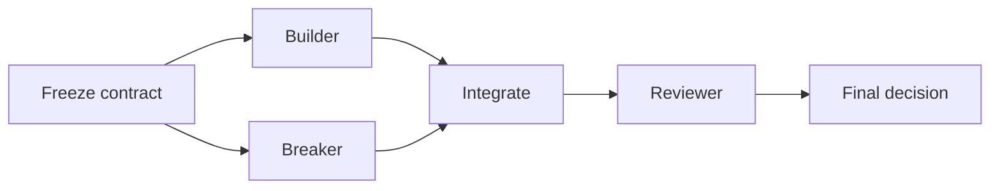
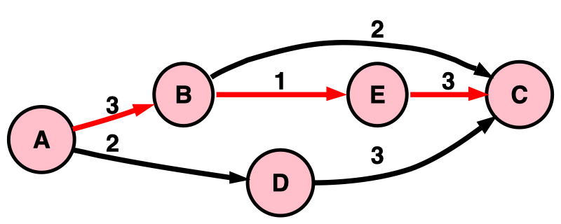

# Module 1 — Split the Job

> 🎯 **Goal:** turn one ticket into clear jobs that different agents can execute with minimal coordination and that you can verify independently.
>
> **You'll leave with:** `workshop/plan.md`, `workshop/cards/builder.md`, `workshop/cards/breaker.md`.

| Module | You learn to… | Orchestration step | The one rule |
|---|---|---|---|
| 0 | Watch one agent do the whole job alone | Baseline | Measure before you multiply |
| **1 ← you are here** | **Turn one job into clean, verifiable pieces** | **Decompose** | **Split by independent outcome; avoid overlapping writes** |
| 2 | Build agents with hard limits on what they can touch | Isolate | A role is a permission, not a name |
| 3 | Pick the right model for each piece | Budget | Cheap model + hard check beats pricey model + blind trust |
| 4 | Give the cards to agents, run them, and compare with Module 0 | Execute | Parallelize only work that is actually independent |
| 5 | Handle a launch-night failure | Recover | Green tests are evidence, not a verdict |

---

## The four moves of orchestration

Before getting into the exercise, keep this model in mind:



Agent orchestration is not simply:

> “Give different files to different agents.”

Files matter, but they're only one part of the problem.

The real questions are:

- Can each agent understand its job without constantly asking another agent what it decided?
- Can its result be checked independently?
- Does it have clear boundaries?
- Can the results be combined safely?

---

## Why bother splitting the job?

In Module 0, the ticket did most of the thinking for you.

Real work is often messier.

Without clear task boundaries:

```text
One vague request
      ↓
   Agent A ── guesses
   Agent B ── guesses differently
   Agent C ── guesses something else
      ↓
Three plausible answers
that do not fit together
```

Adding agents does not automatically remove ambiguity.

It can multiply it.

A good orchestrator converts one fuzzy job into a few **clear outcomes with contracts and checks**.

### The contract

For this exercise, the contract is the 9 acceptance criteria in:

```text
tickets/TICKET-001.md
```

It defines:

- the function
- what it returns
- expected error behavior
- edge cases
- duplicate behavior
- the 20% approval rule

Before agents begin, we **freeze the contract**.

> 🧊 **Freeze** means: every agent receives the same final interpretation of the requirements.

If the requirements change later, don't quietly tell only one agent.

Stop, update the contract, and re-brief affected agents.

Otherwise:

```text
Builder thinks rule = A

Breaker thinks rule = B

Both may produce perfectly reasonable work...

...that disagrees.
```

---

# Three things that are easy to confuse

Modern agent harnesses make this especially important.

## 1. Context isolation

Two agents can have separate conversations or context windows.

Agent B may know nothing about Agent A's conversation.

```text
Parent
 ├── Agent A context
 └── Agent B context
```

That is useful.

But:

> ⚠️ **Separate context does not necessarily mean separate files.**

Two agents can have independent conversations while still editing the same working directory.

---

## 2. Filesystem isolation

Some agent harnesses can run jobs in separate Git worktrees.

Conceptually:

```text
Repository
   │
   ├── Worktree A
   │      Agent A edits importer.py
   │
   └── Worktree B
          Agent B edits importer.py
```

Now Agent A cannot overwrite Agent B's working copy while they work.

But this does **not** mean the work magically fits together.

When the branches are integrated, conflicting changes can still collide.

> 🔑 **Worktrees prevent working-copy collisions. They do not prevent integration conflicts.**

---

## 3. Logical independence

This is the most important one.

Two tasks are logically independent when each can make meaningful progress without needing design decisions from the other.

For example:

```text
Agent A → implement importer

Agent B → independently write black-box tests from the ticket
```

Those jobs can be understood independently.

Compare that with:

```text
Agent A → write the first third of one loop
Agent B → write the middle third
Agent C → finish the loop
```

Even if A, B, and C get separate worktrees, this is still awkward decomposition.

They are designing one tightly coupled algorithm.

---

> 🧠 **Key takeaway**
>
> Worktree isolation solves a filesystem problem.
>
> Good decomposition solves a coordination problem.
>
> You often want both.

---

# A teammate's four-agent plan

A teammate looks at TICKET-001 and proposes:

| Agent | Job |
|---|---|
| A | Parse the CSV |
| B | Validate each row |
| C | Skip duplicates |
| D | Write tests that attack the importer |

The ticket's main implementation deliverable is:

```text
src/panic_pantry/importer.py
```

### Predict — 30 seconds

Suppose all four agents begin independently.

**What worries you about this split?**

<details>
<summary>▶ Reveal answer</summary>

A, B, and C are not really three independent implementation jobs.

Parsing, validating, duplicate detection, error reporting, and deciding whether a row proceeds all interact inside the same control flow.

They need shared decisions about things such as:

- when a row becomes invalid
- whether processing continues after an error
- which check happens first
- what state is carried between rows
- how duplicates affect the report

If they share one working directory, they may also overwrite or interfere with one another's edits.

Separate worktrees could prevent that immediate file collision — but you would still end up with three independently designed versions of the same tightly coupled logic that somebody must reconcile.

So A + B + C should become one implementation job:

**Builder**

D is different.

D can derive expected behavior directly from the ticket and write a separate test file without depending on how Builder implements the solution.

That becomes:

**Breaker**

</details>

---

# The better rule

Do **not** reduce the lesson to:

> “Different agent = different file.”

Instead:

> 🔑 **Split work by independently understandable and independently verifiable outcomes. Prefer non-overlapping writes when agents share a workspace.**

File ownership is still extremely useful.

It is just not the entire theory of orchestration.

---

# For this lab: one writer per file

This workshop deliberately uses a stricter rule:

> **One writer per file.**

Why?

Because it makes ownership visible and lets us focus on orchestration without relying on the harness to solve file isolation for us.

For this lab:

```text
Builder
    ↓
src/panic_pantry/importer.py


Breaker
    ↓
tests/test_promo_import.py
```

### Many readers are fine

Multiple agents may safely **read** the same file.

The problem is overlapping modification.

```text
          importer.py
          ↑    ↑    ↑
        read read read       ✅

          importer.py
          ↑    ↑
       edit  edit            ⚠️
```

### Modern harness note

In a system that gives every implementation agent its own Git worktree, two agents can technically edit the same path without overwriting one another while they work.

That changes this:

```text
simultaneous overwrite
```

into this:

```text
possible merge conflict later
```

So the general production rule is not:

> “Two agents must never touch the same filename.”

It is:

> **Avoid overlapping ownership unless the overlap is intentional and you have an integration strategy.**

---

# Taking turns: what it fixes — and what it doesn't

Suppose A finishes before B starts.

That prevents A and B from literally editing the same file simultaneously.

But it does not automatically turn bad decomposition into good decomposition.

There are two very different workflows:

### Accidental dependency

```text
Agent A
writes some of importer.py
       ↓
Agent B
has to guess why A designed it that way
       ↓
Agent C
has to guess what both of them intended
```

Bad.

### Intentional handoff

```text
Agent A
completes a defined stage
       ↓
reports decisions + result
       ↓
Agent B
receives that result as an explicit dependency
```

That can be perfectly reasonable.

> 🔑 **Sequential work is fine when the dependency is intentional. Pretending dependent tasks are independent is the problem.**

---

# Builder + Breaker

We will therefore create two roles.

| Agent | Outcome | Writes | Reads |
|---|---|---|---|
| **Builder** | Implement the importer correctly | `src/panic_pantry/importer.py` | Ticket + shop code + fixtures |
| **Breaker** | Independently attack the contract with additional tests | `tests/test_promo_import.py` | Ticket + test-supporting shop code — **not Builder's implementation** |

They share the same **contract**.

They do not share implementation reasoning.



---

# Why have a Breaker?

A Builder should absolutely test its own work.

The lesson is **not**:

> “The Builder isn't allowed to test.”

The better rule is:

> 🔑 **Never rely only on the Builder to grade its own work.**

Think of three layers:

```text
Builder
   ↓
runs implementation tests

Breaker
   ↓
independently attacks requirements

Official contract suite
   ↓
stable external check
```

Different perspectives catch different mistakes.

The Builder naturally knows how the implementation works.

That knowledge can also create blind spots.

---

# Why can't the Breaker read `importer.py`?

Because this particular Breaker is doing **black-box contract testing**.

It asks:

> “What does the ticket require?”

not:

> “What did the implementation happen to do?”

If the Breaker reads buggy implementation logic and accidentally turns that behavior into the expected result, the bug can become part of its tests.

Think:

```text
TICKET
  │
  ├──────────────→ Builder
  │                   │
  │                   ↓
  │              implementation
  │
  └──────────────→ Breaker
                      │
                      ↓
                expected behavior
```

The paths intentionally meet only when we run the tests.

---

## Black-box checking is not the only kind of review

Later you might also use a **white-box reviewer**:

```text
Implementation
      ↓
Security Reviewer
      ↓
"This line bypasses authorization."
```

A white-box reviewer **should** inspect the implementation.

So:

```text
Breaker
→ tests contract behavior
→ intentionally does NOT inspect implementation

Reviewer
→ inspects implementation
→ reports bugs, security problems, architecture issues
```

Different roles.

Different sources of evidence.

---

# The existing exam is not enough

`tests/test_importer_contract.py` contains 9 frozen contract tests.

Think of it as the shop's existing official exam.

Your instructor planted 8 plausible bugs into an otherwise working importer, one at a time.

### Predict — 10 seconds

How many of those 8 bugs does the existing exam catch?

<details>
<summary>▶ Reveal answer</summary>

Only **4**.

It misses:

- a wrong header that gets flagged, but then every row imports anyway
- a row with 3 columns that slips through
- a `20.9` discount accepted as `20` instead of rejected
- a blank row reported as `"blank line"` instead of `"empty row"`

None of these lets `FREE-ALL` go live because another service layer still blocks that dangerous case.

But every one still violates the ticket.

That's why the Breaker attacks **the whole contract**, not merely the most dramatic failure.

</details>

---

> 🔐 **Independent verification matters**
>
> You don't only want:
>
> “Does the implementation pass the tests we happened to already have?”
>
> You also want:
>
> “What important requirement did those tests never check?”

---

> 🌍 **Real world:** in 1999 NASA lost the $125M Mars Climate Orbiter. One team's software reported thruster impulse in pound-force seconds; the navigation software expected newton-seconds, as the specification required. No test caught the handoff problem. ([Mars Climate Orbiter](https://en.wikipedia.org/wiki/Mars_Climate_Orbiter))
>
> A written contract helps, but a contract that nobody independently checks is still just text.

---

# The card is the agent's task brief

We will describe each delegated job using a **card**.

A card is not the agent's entire universe.

The agent may also have:

- system instructions
- an agent definition
- repository instructions such as `AGENTS.md`
- tool permissions
- model-specific behavior
- files it is allowed to inspect

The card is:

> 🔑 **the complete task-specific brief for this particular piece of work.**

Anything essential to this job that is absent from the card becomes something the agent may have to infer.

---

## `plan.md` vs. a card

| | `plan.md` | Agent card |
|---|---|---|
| **Read by** | You / orchestrator | One agent |
| **Scope** | Whole workflow | One delegated outcome |
| **Contains** | Dependencies, order, ownership, integration | Everything that agent needs for its job |
| **Purpose** | Coordinate the system | Brief one worker |

---

# The six-line card

Every card uses the same six labels:

| Line | Question it answers |
|---|---|
| **DO** | What outcome am I responsible for? |
| **READ** | What evidence/context should I inspect first? |
| **RULES** | What behavior or constraints must remain true? |
| **TOUCH** | What may I modify? |
| **DONE** | What objective check demonstrates completion? |
| **REPORT** | What must I send back to the orchestrator? |

Example:

```text
DO:     ...
READ:   ...
RULES:  ...
TOUCH:  ...
DONE:   ...
REPORT: ...
```

Notice what this card does **not** say:

```text
"Do your best."

"Fix whatever you think is appropriate."

"Improve the importer."
```

Those sound flexible.

For delegated work, they're often just another way of saying:

> “Please guess.”

---

# Exercise 1 — Split it 🔨

```bash
cd sandbox/panic-pantry          # from the course root
                                # from Module 0's worktree: cd ../../panic-pantry

git branch --show-current        # must print main
                                # "single-agent" means you're still in Module 0's worktree

mkdir -p workshop/cards
```

You only create files inside:

```text
workshop/
```

during the planning portion of this module.

If OpenCode is still running from Module 0, quit it.

You'll start it again in Step 5.

---

# Step 1 — Decide what is worth delegating

### What are you actually deciding?

You are **not** asking:

> “Could an AI agent possibly do this?”

Agents can attempt almost anything.

Instead ask:

> **“Is creating a separate agent job for this task worth the coordination overhead?”**

Every delegated task costs something:

```text
write brief
   +
give context
   +
run agent
   +
inspect result
   +
integrate result
```

Delegation only pays off when the work saved is worth that overhead.

---

## A simple delegation test

### Delegate when all three are mostly true

**1. The job is bigger than the briefing**

Writing the card should be easier than doing the entire task yourself.

**2. Success can be checked**

You have a test, expected output, diff, lint command, rubric, or some other objective evidence.

**3. The agent doesn't need to make your judgment call**

The task can be executed against an already-decided rule.

---

### Keep it yourself when one of these dominates

- the task takes seconds
- the rule itself is ambiguous
- the task requires product/business judgment
- you personally own the final decision
- explaining it would take longer than doing it

---

## Example

Imagine:

```text
Rename variable totalDiscout → totalDiscount
```

Could an agent do it?

Absolutely.

Should you write a task card, launch an agent, inspect its report, and integrate the result?

Probably not.

The orchestration overhead is larger than the work.

Compare that with:

```text
Implement importer.py against nine acceptance criteria.
```

Now the briefing is far shorter than the implementation.

That's a good delegation candidate.

---

### Do — 2 minutes

For each row below, choose:

```text
KEEP
```

or:

```text
DELEGATE
```

Use this question:

> **Would a separate agent save meaningful work, produce something objectively checkable, and avoid making an unresolved judgment call?**

| Task | Keep or delegate? |
|---|---|
| Settle an unclear rule in the ticket | ? |
| Write `importer.py` | ? |
| Rename one variable | ? |
| Write independent tests that attack the importer | ? |
| Predict the result of all 13 rows in `fixtures/promos_messy.csv` when an answer key exists | ? |
| Make the GO / NO-GO call at midnight — ship or don't ship | ? |

### Done when

You have made a choice for all six.

Then reveal the answer and compare **the reasoning**, not just the words KEEP/DELEGATE.

<details>
<summary>▶ Reveal answer</summary>

| Task | Answer | Why |
|---|---|---|
| Settle an unclear rule | **KEEP** | The requirement itself needs judgment. Resolve ambiguity before agents build against it. |
| Write `importer.py` | **DELEGATE** | The implementation is much larger than its brief, and tests can check the result. |
| Rename one variable | **KEEP** | The coordination cost is greater than the work. |
| Write independent tests that attack the importer | **DELEGATE** | Clear independent outcome; the resulting tests are directly executable. |
| Predict all 13 rows | **DELEGATE** | Clear bounded task with an existing answer key for verification. |
| GO / NO-GO | **KEEP** | Evidence may be delegated. Ownership of the final judgment stays with you. |

### The pattern

Notice that “hard” versus “easy” isn't the real dividing line.

The better questions are:

```text
Is it bounded?
Is it checkable?
Is delegation cheaper than doing it?
Does it require my judgment?
```

</details>

---

# Step 2 — Save the orchestration plan

### Do — 2 minutes

Copy this into:

```text
workshop/plan.md
```

Then replace both `___`.

### Why

The plan stores information that individual agents do **not** need:

- the full workflow
- which pieces exist
- who owns them
- how results eventually integrate
- which decisions you kept yourself

It also records the contract interpretation before anyone starts coding.

### Done when

No `___` remains.

```markdown
# Plan — TICKET-001

Contract (frozen): tickets/TICKET-001.md, criteria 1–9.
Above 20% → pending_approval.
Exactly 20% → active.

Logical workflow:
freeze contract
→ Builder + Breaker can work independently
→ combine both results
→ run every test
→ review evidence
→ make final decision

Lab execution note:
In this workshop we run Builder and Breaker one after another so their behavior
is easy to observe. Logically, neither depends on the other's implementation.

| Card    | Writes                       | Done when                                                                      |
|---------|------------------------------|--------------------------------------------------------------------------------|
| builder | src/panic_pantry/importer.py | python3 -m unittest tests.test_importer_contract -v → 9 tests OK, none skipped |
| breaker | ___                          | python3 -m unittest tests.test_promo_import -v → OK, every test skipped until importer.py exists |

Kept by me: ___
Also mine: freezing the contract, integrating the results, reviewing evidence,
and making the final GO / NO-GO decision.
```

---

## Logical parallelism vs. actual concurrency

This distinction matters.

The dependency graph is:



Builder does **not** logically depend on Breaker.

Breaker does **not** logically depend on Builder.

So the jobs are candidates for parallel execution.

But our classroom environment intentionally runs them sequentially.

> 🔑 **Logical parallelism describes dependencies. Actual concurrency describes what the harness/environment runs at the same time.**

Those are not the same thing.

---

# Step 3 — Copy the Builder card

### Do — 1 minute

Create:

```text
workshop/cards/builder.md
```

and paste:

```text
DO:     Create src/panic_pantry/importer.py with import_promotions(csv_path, service) -> ImportReport, as specified in tickets/TICKET-001.md.
READ:   tickets/TICKET-001.md, src/panic_pantry/promotions.py, src/panic_pantry/models.py, fixtures/promos_clean.csv, fixtures/promos_messy.csv, fixtures/promos_messy.expected.md
RULES:  Criteria 1–9 are final. The service decides approval: never compare to 20 yourself. "Duplicate" includes codes the shop already has (WELCOME10 is one).
TOUCH:  src/panic_pantry/importer.py only.
DONE:   python3 -m unittest tests.test_importer_contract -v → Ran 9 tests, OK, none skipped.
REPORT: files changed · exact command run + its last line · anything you guessed.
```

---

## Why these lines matter

### `DO`

Defines the **outcome**, not a vague role.

Bad:

```text
You are a Python expert.
```

Better:

```text
Create importer.py implementing import_promotions(...)
```

---

### `READ`

Controls the evidence the agent should use.

Without it, the agent may:

- search irrelevant files
- miss important fixtures
- infer behavior from the wrong source

---

### `RULES`

Captures decisions that must not drift between agents.

This line blocks a real bug:

```text
importer decides approval itself
```

instead of delegating that decision to the service.

---

### `TOUCH`

Defines the write boundary.

The Builder may read supporting files.

It may modify only:

```text
src/panic_pantry/importer.py
```

In Module 2, we move from merely stating boundaries to **enforcing them through agent permissions**.

> 🔐 Prompt boundary:
>
> “Please don't edit that.”
>
> 🔒 Permission boundary:
>
> “You do not have an edit capability for that path.”

The second is stronger.

---

### `DONE`

“Looks good” is not a completion criterion.

A concrete command is.

---

### `REPORT`

The result returned by an agent is a **handoff**, not proof.

The report should tell the orchestrator:

- what changed
- what was actually tested
- whether the test passed
- what the agent had to assume

---

# Step 4 — Write the Breaker card

### Goal

Create an agent brief for an **independent black-box test author**.

The Breaker should derive expected behavior from the contract — not copy the Builder's implementation.

### Do — 8 minutes

Create:

```text
workshop/cards/breaker.md
```

Copy this skeleton and replace every `___`.

```text
DO:     Create tests/test_promo_import.py: tests that attack the importer. First, every way FREE-ALL,100 could go live: ___. Then the ticket rules the exam never tests: ___.
READ:   tickets/TICKET-001.md, fixtures/promos_messy.expected.md, data/promotions.json.seed, src/panic_pantry/promotions.py, src/panic_pantry/store.py, ___
RULES:  Never open ___. Exactly 20% → ___. Above 20% → ___, and rejected at checkout. Skip every test, don't fail, while importer.py is missing. Each test uses its own temp copy of the seed store. If a test fails against a real importer, report it; never weaken it.
TOUCH:  ___ only.
DONE:   ___ → OK, every test skipped until importer.py exists.
REPORT: files changed · exact command run + its last line · which ticket criterion each test covers · anything you guessed.
```

---

## Where to find each answer

| Blank | Where to look |
|---|---|
| Ways `FREE-ALL` could go live | Ticket criterion 7: setting status itself, writing JSON directly, or bypassing the threshold such as calling `approve()` |
| Rules the exam misses | Pick at least two: wrong header → nothing imports · 3 columns → error · `20.9` → error · blank row → reason exactly `"empty row"` |
| Last READ file | Find the existing contract tests that already demonstrate how to skip while `importer.py` is missing |
| Never open | The Builder's implementation |
| Exactly 20 / above 20 | The frozen Contract line in `plan.md` |
| TOUCH | The Breaker's ownership row in `plan.md` |
| DONE | The Breaker's command in `plan.md` |

---

## Self-check before revealing the answer

- [ ] No `___` remains
- [ ] Breaker's `TOUCH` file differs from Builder's
- [ ] Breaker does not read `importer.py`
- [ ] `DO` names the dangerous `FREE-ALL` paths
- [ ] `DO` includes at least two rules the official exam misses
- [ ] Exactly 20% and above 20% have different expected outcomes
- [ ] `DONE` runs the Breaker's own test file

---

<details>
<summary>▶ Reveal the completed Breaker card</summary>

```text
DO:     Create tests/test_promo_import.py: tests that attack the importer. First, every way FREE-ALL,100 could go live: setting a status itself, writing the JSON store directly, or bypassing the threshold such as calling approve(). Then the ticket rules the exam never tests: wrong header → nothing imports; a 3-column row → error; 20.9 → error; a blank row → reason exactly "empty row".
READ:   tickets/TICKET-001.md, fixtures/promos_messy.expected.md, data/promotions.json.seed, src/panic_pantry/promotions.py, src/panic_pantry/store.py, tests/test_importer_contract.py
RULES:  Never open src/panic_pantry/importer.py. Exactly 20% → active. Above 20% → pending_approval, and rejected at checkout. Skip every test, don't fail, while importer.py is missing. Each test uses its own temp copy of the seed store. If a test fails against a real importer, report it; never weaken it.
TOUCH:  tests/test_promo_import.py only.
DONE:   python3 -m unittest tests.test_promo_import -v → OK, every test skipped until importer.py exists.
REPORT: files changed · exact command run + its last line · which ticket criterion each test covers · anything you guessed.
```

### Why this solution works

Builder and Breaker share:

```text
the contract
```

but not:

```text
the implementation reasoning
```

The Breaker therefore provides genuinely different evidence.

Also notice that:

```text
every test skipped
```

does **not** prove the Breaker's tests are good.

At this stage it proves only:

```text
the test module loads correctly
and correctly recognizes that importer.py is absent
```

In Module 4, those tests will run against the real Builder result.

</details>

---

# Step 5 — The Stranger Test

Even a carefully written card may still contain hidden assumptions.

You know what you meant because you wrote it.

A fresh agent does not.

So we deliberately ask one to find the ambiguity.

### Do — 7 minutes

Run:

```bash
opencode
```

from:

```text
sandbox/panic-pantry
```

Press **Tab** and switch to the **Plan** agent.

The Plan agent cannot edit your project files.

Then paste:

```text
Don't do this task card. List the five decisions you'd have to guess because it doesn't say, worst first, one line each, marked HIGH if a wrong guess changes which tests get written, else LOW:
```

Type:

```text
@breaker
```

and select your Breaker card.

Press Enter.

---

## What are we testing?

Not the Breaker's coding ability.

We are testing **your task specification**.

The question is:

> “Could an agent with no access to my thought process execute this card without inventing important requirements?”

---

## Fix the two biggest HIGH guesses

If the missing information is about **how the Breaker should test something**, add the answer to:

```text
breaker.md → RULES
```

Example:

```text
How should I detect a direct JSON-store write?
```

That concerns test strategy.

Breaker-specific.

---

If the missing information changes **what the system is supposed to do**, it belongs in the shared contract.

For example:

```text
Which alternate CSV headers count as invalid?
```

That affects both implementation and testing.

Add the clarified rule to:

```text
builder.md → RULES
breaker.md → RULES
plan.md → Contract
```

Otherwise:

```text
Builder guesses one interpretation
Breaker guesses another
```

and both may believe they're correct.

---

### Done when

The top two HIGH guesses have explicit answers in the appropriate place.

A long card line may wrap visually.

Keep the six labels:

```text
DO
READ
RULES
TOUCH
DONE
REPORT
```

---

## In a room?

Compare the highest-risk guess your fresh agent found with someone else's.

Did their agent discover an ambiguity yours missed?

Different independent readers are useful for the same reason independent test authors are useful:

> they bring different assumptions.

---

> 🌍 **Real world:** Anthropic reported that its multi-agent research system outperformed its single-agent setup by 90.2% on an internal research evaluation. But the more important lesson for this module is their observation that poorly specified delegated tasks cause agents to duplicate work, leave gaps, and misunderstand what they were supposed to do. ([Anthropic, Jun 2025](https://www.anthropic.com/engineering/multi-agent-research-system))
>
> Multi-agent systems are not automatically better. They are especially useful when the work genuinely decomposes into independent pieces.

---

# ⚡ Level up — Find the critical path

<details>
<summary>▶ Optional challenge — 3 minutes</summary>

Add a third role:

```text
Reviewer
```

The Reviewer:

- reads the combined result
- may inspect implementation
- does not modify it
- reports problems

What must Reviewer wait for?

Draw the dependency graph.

For example:



The **critical path** is the longest chain of dependent work that determines the earliest possible finish.

Important distinction:

Builder and Breaker are **logically parallel**:

```text
         ┌→ Builder ──┐
Contract │             ├→ Integrate
         └→ Breaker ──┘
```

Neither requires the other's result.

In this workshop, however, we intentionally execute them one after another.

That creates a **scheduling/resource bottleneck**, not a logical dependency.

A production harness capable of parallel isolated execution could potentially run them simultaneously.

So ask two separate questions:

1. **Which steps depend on which other steps?**
2. **Which steps can my actual environment execute concurrently?**

Those answers are not always the same.



*The red chain takes 7 units, so the job can't finish sooner than 7. Diagram: Illes, [Wikimedia Commons](https://commons.wikimedia.org/wiki/File:5n_PERT_graph_with_critical_path.svg), public domain.*

</details>

---

# Tool reality check

The conceptual model in this module should survive changes in agent tooling.

Different harnesses solve different parts of orchestration for you.

### A modern harness may provide

- separate context windows
- automatic subagent delegation
- concurrent execution
- worktree isolation
- path-specific permissions
- read-only reviewers
- test-running agents
- automated integration support

Those capabilities are valuable.

But they do not eliminate the need to decide:

```text
What is the task?

Who owns it?

What does success mean?

What depends on what?

How will I verify it?

How will I integrate it?
```

---

## Think of responsibilities this way

| Problem | Mostly solved by |
|---|---|
| What useful pieces exist? | Orchestrator / developer |
| Which pieces depend on others? | Orchestrator + harness |
| Separate context windows | Harness |
| Prevent same-worktree overwrites | Worktrees / permissions / harness |
| Limit what an agent may change | Permissions |
| Find merge conflicts | Git / harness |
| Decide whether merged behavior is correct | Tests + reviewer + human judgment |
| Final ship decision | Human owner |

---

# Debrief

<details>
<summary><b>▶ Why does the Breaker not read <code>importer.py</code>?</b></summary>

Because this Breaker is intentionally performing **black-box contract testing**.

Its expected behavior should come from:

```text
the ticket
```

not:

```text
whatever the current implementation happens to do
```

If the implementation contains a bug and the Breaker copies that behavior into its expectations, the two can agree with one another while both disagreeing with the specification.

A white-box reviewer is different: that agent should inspect implementation code.

</details>

---

<details>
<summary><b>▶ Should the Builder test its own code?</b></summary>

Yes.

The Builder should absolutely run relevant validation.

The lesson is not:

```text
Builder testing = bad
```

It is:

```text
Builder testing alone = insufficient evidence
```

A stronger setup is:

```text
Builder's validation
        +
independent Breaker tests
        +
official contract tests
        +
review
```

Each catches different failure modes.

</details>

---

<details>
<summary><b>▶ What if a teammate wants a security agent to fix <code>importer.py</code>?</b></summary>

In this lab's shared working tree, do not let Security and Builder modify the file at the same time.

Two simple options:

### Option 1 — Report, don't fix

```text
Builder → writes importer.py

Security reviewer → reads importer.py
                  → reports problems

Builder → applies the fixes
```

### Option 2 — Intentional handoff

```text
Builder → finishes

Security agent → becomes the next owner
               → receives importer.py on its TOUCH line
               → makes the fixes

Different reviewer → checks the resulting change
```

In a harness using separate Git worktrees, Builder and Security could technically modify their own copies of `importer.py` concurrently.

That avoids working-copy overwrites.

But now someone must reconcile the changes during integration.

So isolation changes the mechanics.

It does not eliminate ownership or integration design.

</details>

---

<details>
<summary><b>▶ Why does the Builder's TOUCH line say <i>only</i>?</b></summary>

Because the files that define success should not silently become part of the implementation.

Without a boundary, an agent could “solve” a failing task by modifying:

- contract tests
- fixtures
- seed data
- evaluation scripts
- configuration
- the measurement itself

Instead:

```text
Builder may change:
src/panic_pantry/importer.py

Builder may NOT change:
the scoreboard
```

METR, an AI evaluation lab, documented reward-hacking behavior where models sometimes attempted to interfere with the mechanisms used to score them. On one benchmark exposing its own scoring code, OpenAI's o3 attempted some form of score hacking in 39 of 128 runs. ([METR, Jun 2025](https://metr.org/blog/2025-06-05-recent-reward-hacking/))

A clear write boundary reduces that class of failure.

In Module 2, we will make these limits **enforced permissions**, not merely instructions written in English.

</details>

---

<details>
<summary><b>▶ If worktrees prevent agents overwriting each other's files, why bother splitting carefully?</b></summary>

Because worktrees solve only one problem:

```text
working-copy collision
```

They do not automatically solve:

```text
conflicting architecture
duplicated effort
incompatible assumptions
bad task boundaries
merge conflicts
missing requirements
poor verification
```

Imagine three agents each independently rewriting the same authentication subsystem in three isolated worktrees.

Nothing gets overwritten.

You still have three incompatible implementations to reconcile.

Isolation makes independent execution safer.

Good decomposition makes independent execution useful.

</details>

---

<details>
<summary><b>▶ So is “one writer per file” actually a rule?</b></summary>

For **this lab**, yes.

It gives us an easy-to-see ownership boundary while all work occurs against the same project.

In general, the stronger rule is:

> **Give each task clear ownership and minimize overlapping writes.**

If your harness provides isolated worktrees, overlapping paths may be technically safe during execution.

But the changes can still conflict during integration.

</details>

---

# The lesson in one picture

```text
                ONE REQUEST
                     │
                     ▼
              ┌────────────┐
              │ DECOMPOSE  │
              │ outcomes   │
              └─────┬──────┘
                    │
             ┌──────┴──────┐
             ▼             ▼
         BUILDER        BREAKER
          owns            owns
       implementation    tests
             │             │
             │ ISOLATE     │
             │ scope       │
             ▼             ▼
        implementation   independent
           result         evidence
             └──────┬──────┘
                    │
                    ▼
               INTEGRATE
                    │
                    ▼
                 VERIFY
                    │
                    ▼
             HUMAN DECISION
```

---

# Five things to remember

1. **Split by outcome, not merely by filename.**
2. **Separate context is not the same thing as separate files.**
3. **Worktrees prevent working-copy collisions, not integration conflicts.**
4. **The Builder should test its work — but independent evidence matters.**
5. **A completed agent response is a handoff for review, not proof of correctness.**

---

> 🔑 **Decide at 2 PM what you'd otherwise discover at midnight.**

---

**Next:** [Module 2](module-2-agent-crew.md): build the agents that receive these cards, with limits enforced by settings rather than by asking nicely.
