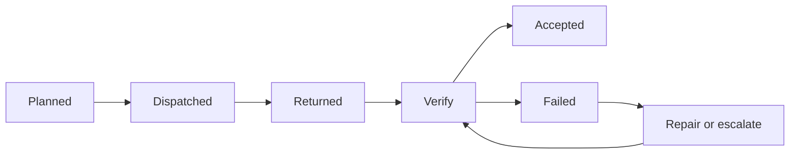
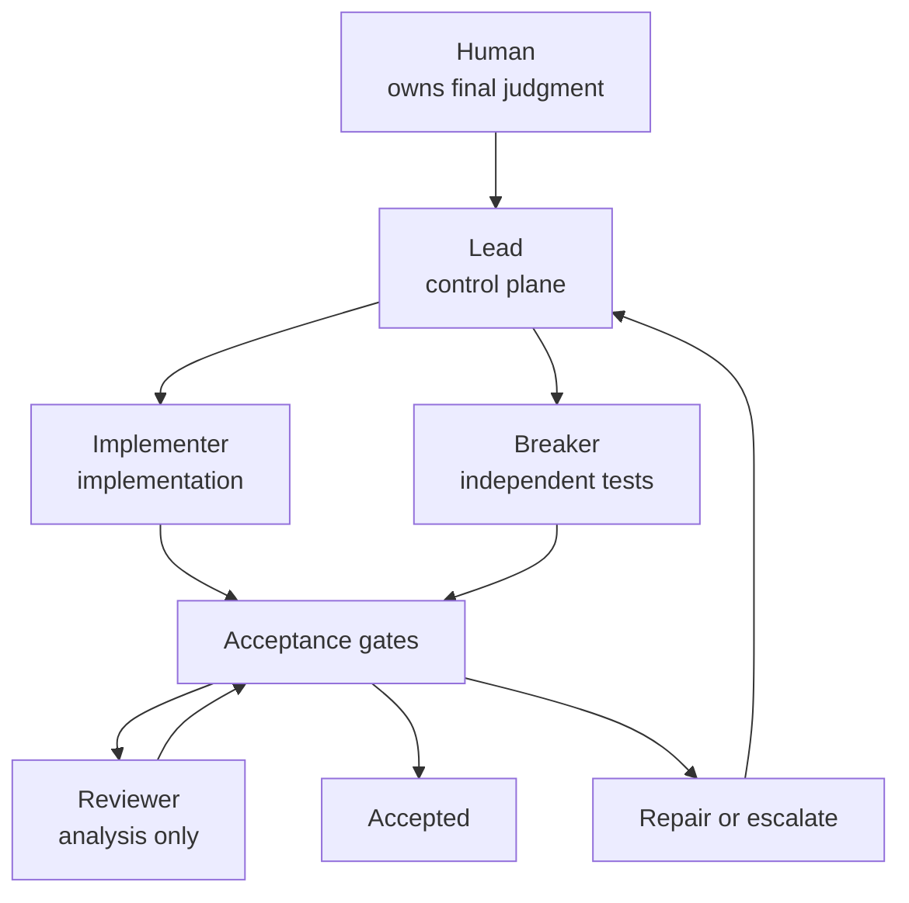
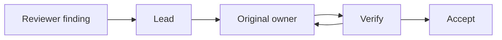

# Module 3 — Execute the Crew 🚦

> 🎯 **Goal:** put the cards, capability boundaries, acceptance checks, and repair rules from Modules 1–2 into one real orchestrated workflow—then compare it fairly with the single-agent baseline.
>
> **You'll leave with:**
>
> - a completed orchestrated implementation
> - independent Breaker tests
> - Reviewer findings with dispositions
> - `workshop/integration-notes.md`
> - a matched comparison against Module 0
> - evidence of where orchestration helped—and where it cost you

| Module | You learn to… | Orchestration step | The one rule |
|---|---|---|---|
| 0 | Watch one agent do the whole job alone | Baseline | Measure before you multiply |
| 1 | Turn one job into independently understandable pieces | **Decompose** | Split by independent outcome |
| 2 | Give each worker only the authority it needs | **Isolate** | Minimum necessary authority |
| **3 ← you are here** | **Run the system and decide what work is actually acceptable** | **Execute** | **Returned is not done. Verify before you accept.** |
| 4 | Give each worker enough model capability | **Route** | Minimum sufficient capability |
| 5 | Handle a launch-night failure | Recover | Green tests are evidence, not a verdict |

> 🧭 **Why execute before routing?** Every worker in this run uses the *same* model you used in Module 0. That's not a shortcut. It's what makes the comparison fair: if the crew does better, it's because the **workflow** changed, not because it secretly got a smarter model. Model routing (Module 4) is a tuning step you apply to a crew you've already watched work.

---

# Three ideas before you run 🧠

## 1. Returned is not accepted ❗

An agent saying "Done." tells you only that it **returned**. It does not tell you the artifact is correct.



> 🔑 **Returned is a transport state. Accepted is a quality state.**

Agent reports sound confident and final. The orchestrator's job is not to believe the report—it is to **hold the receipt against the acceptance check**. Every artifact crosses the same three-question gate:

| Gate question | How you check it |
|---|---|
| **Ownership** — did only the correct owner write it? | `git status --short` |
| **Scope** — did it change only what its card permitted? | Compare the diff with the card's `TOUCH` line |
| **Evidence** — does the actual DONE check pass? | Run it yourself. The report points to evidence; it isn't the evidence. |

## 2. Lead coordinates, specialists produce 🗼


*The tower flies no planes. It decides who goes where, and when. Photo: Harrison Keely, "The FAA air traffic control tower at Philadelphia International Airport," [Wikimedia Commons](https://commons.wikimedia.org/wiki/File:The_FAA_air_traffic_control_tower_at_Philadelphia_International_Airport.jpg), [CC BY 4.0](https://creativecommons.org/licenses/by/4.0/) (resized).*



- The **control plane** (Lead) decides who gets which task, whether a result passed its gate, and whether to repair or escalate.
- The **work plane** (Implementer, Breaker, Reviewer) produces implementation, executable evidence, and analytical evidence.

If Lead silently starts writing `importer.py`, the architecture has collapsed back into one general-purpose agent.

**Repairs go back to the artifact's owner.** If Reviewer finds a defect, Reviewer doesn't fix it and Lead doesn't quietly patch it. Lead sends a narrow repair to whoever owns that file, and the gate reruns. Otherwise you lose provenance, permission boundaries, and accountability.

> 🔑 **Artifact ownership persists through repair.**

## 3. A fair comparison changes one thing ⚖️

Today's run is a **matched comparison** with Module 0:

| Hold constant | Change |
|---|---|
| starter commit · ticket · acceptance tests · 15-minute timebox · model + variant | workflow structure: one agent → Lead + specialists + acceptance gates |

If you also changed models, prompts, or review policy, you couldn't say which change caused any difference.

Two more rules keep it honest:

- **Hard stop at 15 minutes.** Unfinished under the same limit is valid data. Don't give the crew an extra eight minutes and then compare it to the 15-minute baseline.
- **Record post-window time separately.** Review, integration, and rework after the timer are real costs, but they're kept apart from the matched result. That extra overhead is the **coordination tax**.

> 🔑 **Match your conclusion to your experiment.**

---

# Exercise 3 — Orchestrated Run + Matched Comparison 🔬

**Time:** approximately 40 minutes

> **Core question:** Can an orchestrated workflow produce a better accepted result than the Module 0 single-agent baseline under the same implementation timebox?

---

# Part A — Set up (before the clock) 🧰

## A1. Enter the orchestrated worktree

```bash
cd sandbox/worktrees/orchestrated

git branch --show-current
# must print: orchestrated

git status
git log --oneline -1

python3 -m unittest discover -s tests -v
# expected starter state: suite OK with importer tests skipped
```

Confirm this worktree and the single-agent worktree began from the **same starter commit**.

## A2. Bring in the experiment harness

Your agents and cards were created outside this worktree and were never part of the starter commit. Copy them in:

```bash
mkdir -p .opencode/agents workshop/cards
cp ../../panic-pantry/.opencode/agents/*.md .opencode/agents/
cp ../../panic-pantry/workshop/cards/*.md workshop/cards/

# optional: reusable commands from Module 2
mkdir -p .opencode/commands
cp ../../panic-pantry/.opencode/commands/*.md .opencode/commands/ 2>/dev/null || true
```

These files are the **experiment harness**, not the **system under test**. Keep the two apart:

| Experiment harness | System under test |
|---|---|
| `.opencode/agents/`, `workshop/cards/`, timer, scorecard, integration notes | `src/panic_pantry/importer.py`, `tests/test_promo_import.py` |

> 🔑 **Do not accidentally score the harness as if it were the product.**

## A3. Meet the gate 🚧

You won't keep a ledger by hand. The starter repo ships a checker that does the three-question gate for you:

```bash
bash scripts/gate.sh builder        # importer.py, after Implementer returns
bash scripts/gate.sh breaker        # test_promo_import.py, after Breaker returns
bash scripts/gate.sh integration    # the staged product diff + the whole suite
```

| Gate question | What `gate.sh` does |
|---|---|
| **Ownership / scope** | Lists every changed product file and checks that each one sits on exactly one card's `TOUCH` line. A frozen file or a file that no card owns means **FAIL**. |
| **Evidence** | Runs the card's `DONE` command **itself**. It never reads the agent's report. For Breaker, it checks the "every test skipped until importer.py exists" rule in a temporary copy that has no importer. |

Each run ends with **PASS: accept it** or **FAIL: not accepted**. It also adds one line to the **Gate log** in `workshop/integration-notes.md` and creates that file the first time. The log is your record of the run, and nobody fills it in by hand.

Try it now, before anything has run:

```bash
bash scripts/gate.sh builder
# FAIL  returned   src/panic_pantry/importer.py is unchanged: nothing has come back yet
```

That's correct: nothing has been returned, so nothing can be accepted.

> ⚠️ git can't see **who** wrote a file, only what changed. The gate checks scope. You still confirm ownership by opening the child session.

Also put a sticky note or a scrap of paper next to your keyboard for **intervention tally marks**, just like in Module 0. That's the only thing you track by hand.

## A4. Preflight checklist

Don't start the clock until every row is true. Fix the harness *before* timing. Don't discover halfway through that everyone was secretly `general`.

| Check | What "ready" looks like |
|---|---|
| **Contract frozen** | `tickets/TICKET-001.md` criteria 1–9 are unambiguous, especially: above 20% → pending approval · exactly 20% → active · the service decides approval. If anything is ambiguous, **do not launch workers.** |
| **Ownership** | `@implementer` → `src/panic_pantry/importer.py` · `@breaker` → `tests/test_promo_import.py` · `@reviewer` → nothing · `lead` → nothing · final decision → you |
| **Permissions** | Lead may launch only Implementer, Breaker, Reviewer. Implementer can edit only `importer.py`; Breaker only `test_promo_import.py`; Reviewer nothing. |
| **Model matched** | Lead, Implementer, and Breaker use the Module 0 model + variant from your Module 0 scorecard. Don't guess—if you can't identify it, write `MODEL CONDITION NOT MATCHED` at the top of `workshop/integration-notes.md` and don't call the result a matched comparison. |

There's no routing yet: every agent inherits the session model. Select the Module 0 model + variant in `/models`, then check that no agent pins its own:

```bash
grep -n '^model:' .opencode/agents/*.md || echo "no pins: every agent inherits the session model ✅"
```

If a file *does* have a `model:` line, delete it in **this worktree's copy only** for the timed run.

---

# Part B — The 15-minute matched run ⏱️

## B1. Start OpenCode as Lead

```bash
opencode
```

Press **Tab** until the primary agent is `lead`.

## B2. Start the clock and send Lead this prompt

> **15 minutes. Stop at 15 even if unfinished.**

```text
Run the matched TICKET-001 implementation.

Read:
- workshop/plan.md if present
- workshop/cards/builder.md
- workshop/cards/breaker.md
- tickets/TICKET-001.md

Rules:

1. You coordinate only. Do not implement code or write tests yourself.
2. Delegate the complete Builder card to @implementer.
3. Delegate the complete Breaker card to @breaker.
4. Preserve each card's DO, READ, RULES, TOUCH, DONE, and REPORT requirements.
5. After each worker returns, verify its reported DONE evidence before accepting it.
6. If an acceptance check fails, send a targeted repair back to the owner of that artifact.
7. Never weaken a test, contract, or permission merely to make the run pass.
8. Do not delegate to any agent other than implementer, breaker, or reviewer.
9. Stop when the 15-minute implementation window ends, even if unfinished.
10. After every worker returns, print this status board, then continue:

| Artifact | Owner | State | Evidence you checked |
|---|---|---|---|
| importer.py | implementer | planned/dispatched/returned/accepted/failed | |
| test_promo_import.py | breaker | planned/dispatched/returned/accepted/failed | |

Begin.
```

> 💡 **Why do the workers run one at a time?** Implementer and Breaker are logically independent: both build against the frozen contract, and neither needs the other's unfinished output. But this lab's pinned OpenCode V1 runs delegated children in the **foreground**, so they execute sequentially. Order doesn't matter. *Independence is a property of the work; concurrency is a property of the scheduler.*

## B3. While it runs: audit Lead's board 👀

Lead prints a status board each time a worker returns. **That board is a claim.** Your job is to audit it, not to copy it:

1. When Lead says a worker has **returned**, run its gate in a second terminal: `bash scripts/gate.sh builder` or `bash scripts/gate.sh breaker`.
2. Compare. If Lead says `accepted` and the gate says **FAIL**, Lead accepted a receipt without checking it. That's a finding about your control plane. Tell Lead what the gate printed (one tally mark).
3. A **FAIL** is not accepted, whatever anyone's report says. It goes back to the artifact's owner (B5).

Then inspect the child sessions, using the navigation keys from Module 2:

- **Implementer:** did its delegated message preserve the Builder card?
- **Breaker:** did it get the Breaker task, stay inside its `TOUCH` boundary, and avoid using `importer.py` as the source of expected behavior?

This tests **orchestration fidelity**: did Lead send the task you designed, or rewrite it into something else? If Lead sends the Builder card to Breaker, the specialist may behave perfectly and the workflow still failed. That's a **routing failure**, not a model failure.

## B4. Integrate

When both artifacts have returned (or the timer is nearly up), check that every changed product file maps to one owner, then stage **only** the system under test:

```bash
git status --short

git add src/panic_pantry/importer.py
git add tests/test_promo_import.py

git diff --cached starter -- src/ tests/
```

Don't use `git add -A`. It would stage `.opencode/`, `workshop/`, and your notes, which would mix the harness into the product diff.

Now run the integrated suite:

```bash
python3 -m unittest discover -s tests -v
```

This is its own gate. "Implementer passed its tests" and "Breaker's tests load" don't prove that the two pieces work together. Run the integration gate, which also checks that you staged only product files:

```bash
bash scripts/gate.sh integration
```

## B5. If integration fails, route the repair to the owner 🚨

Don't let whoever happens to be available patch whatever file is convenient. Ask: **who owns the failing artifact?**

| What you find | Repair goes to |
|---|---|
| Breaker's test matches the ticket; the importer violates it | **Implementer** |
| Breaker's test contradicts the ticket | **Breaker** |

Keep repairs narrow. Not "Fix everything," but a mini-card:

```text
DO:     Fix the 3-column-row behavior exposed by test_x.
READ:   the failing test and ticket criterion 4.
RULES:  Do not modify tests or contract files.
TOUCH:  src/panic_pantry/importer.py only.
DONE:   the failing test passes and the full contract suite passes.
REPORT: changed lines · commands run · assumptions.
```

Decomposition doesn't happen only at the start. You decompose again whenever feedback creates new work. After each repair, rerun the owner's gate. The gate log records it for you: a **FAIL** followed later by a **PASS** for the same artifact is one repair cycle.

## B6. Hard stop 🛑

At 15 minutes, **stop**, even if a child is unfinished, tests are red, or a repair is still open. If you haven't run a gate on something that returned, run it now. The gate log then shows what returned, what passed, what failed, and what remained open.

> 🔑 **Unfinished under the same limit is valid experimental data.**

The matched implementation result is now frozen.

---

# Part C — Assurance (after the window) 🔍

From here on, log time separately as **assurance / integration / rework time**. Keep Reviewer on the same model as the rest of the crew. Testing whether a stronger Reviewer finds more is a Module 4 question.

## C1. Ask Reviewer to inspect the integrated product

```text
@reviewer

Review the product changes since the starter tag against tickets/TICKET-001.md.

Read the staged product diff under src/ and tests/.

Check:
- approval bypass
- service boundary
- duplicate handling
- row reporting
- malformed input handling
- missing tests
- scope creep
- anything else that could violate the frozen contract

Do not modify files.

Report findings by severity.
For every finding include file:line, the contract rule at risk, and whether the issue is confirmed or uncertain.
Also report missing coverage separately.
```

## C2. Disposition every finding

Reviewer produces **evidence**, not commands. Turn every finding into a decision in `workshop/integration-notes.md`:

```markdown
## Reviewer dispositions

| Finding | Severity | Disposition | Reason | Owner |
|---|---|---|---|---|
```

| Disposition | Meaning |
|---|---|
| **FIX** | Real, and fixed now. Assign the repair to the artifact owner. |
| **ACCEPT** | You conclude it isn't actually a problem. Record why. |
| **DEFER** | Real, but outside tonight's scope. Record why and who owns follow-up. |

## C3. Repair loop

For each `FIX`, Lead writes a narrow repair card (same format as B5), the **original owner** repairs, you rerun that owner's gate and then `gate.sh integration`, and Reviewer rechecks if needed.



Record every cycle. Each one is part of the coordination tax.

---

# Part D — Compare and conclude 📏

## D1. Fill in the scorecard

Use the same definitions as your Module 0 scorecard. Don't invent token or cost data you can't observe.

Most of the Orchestrated column comes from things you already have:

| Row | Where it comes from |
|---|---|
| Contract tests, whole suite, changed files | `bash scripts/score.sh` |
| Repair cycles | Gate log: count each FAIL that later turned into a PASS for the same gate |
| Human interventions | Your tally marks |
| Integration/rework minutes | Gate log timestamps after the hard stop, or your timer |

| Metric | Single agent | Orchestrated |
|---|---:|---:|
| 15-minute artifact complete? | | |
| Contract tests passing at hard stop | | |
| Whole suite passing | | |
| Independent defects caught | | |
| Policy behavior correct | | |
| Human interventions | | |
| Repair cycles | | |
| Integration/rework minutes | | |
| Total elapsed human time | | |
| Token/cost data where observable | | |
| Number of changed product files | | |

Speed is only one dimension. Orchestration can win through more contract coverage, more independent defects found, smaller blast radius, or clearer provenance. It can lose through extra tokens, handoff mistakes, integration overhead, and human attention. Module 4 formalizes this as *cost to an accepted result*.

## D2. Diagnose any failure by layer 🩺

Don't stop at "the agent failed." Name the layer, because each layer has a different fix.

| Layer | What it looks like in this run | What to do |
|---|---|---|
| **Harness** | An agent is missing; `git diff` shows cards or agents | Re-copy `.opencode/agents/`; stage and diff only `src/` and `tests/` |
| **Contract** | The ticket was ambiguous; the card omitted seeded duplicates, so Breaker never tested them | Fix the contract or card, not the worker |
| **Routing** | Lead sent the Breaker card to Implementer | Correct Lead's routing |
| **Control** | Breaker edited `importer.py`; Implementer edited tests; Lead edited code | Stop, fix permissions, rerun from a clean state |
| **Execution** | Correct task and worker, wrong code (e.g. Breaker expects seeded duplicates, importer imports `WELCOME10` anyway) | Repair through the artifact's owner |
| **Integration** | Each piece passes alone and fails together | Inspect shared assumptions and the dependency graph |
| **Verification** | Tests and review both missed a defect | Strengthen the checks |
| **Environment** | Strange Python behavior | Inspect the environment before blaming routing |

A strong model that keeps failing usually points to a problem with task clarity, context, or decomposition, not the model. A clock that runs out mid-task isn't a failure layer. It's a valid result.

## D3. Inspect the orchestration itself

- [ ] Did Lead remain a coordinator, or did it start implementing?
- [ ] Did each artifact keep one owner?
- [ ] Did the task cards survive delegation intact?
- [ ] Were returned claims independently verified?
- [ ] Did repairs go back to the original owner?
- [ ] Did any worker exceed its intended authority?
- [ ] Did your chosen checks catch real defects?

## D4. Write the conclusion

At the bottom of `workshop/integration-notes.md`:

```markdown
## Comparison conclusion

Under the matched 15-minute implementation condition:

The orchestrated workflow was better / worse / mixed because:
___

The strongest evidence:
___

The largest coordination cost:
___

The most important defect caught only by independent verification:
___

What this one run does NOT prove:
___
```

> ✅ **Good:** Under the same starter state, implementation model, and 15-minute timebox, the orchestrated workflow produced more independent test coverage but required additional integration time.
>
> ❌ **Bad:** Multi-agent systems are better than single agents.

One run is one observation, and model output varies. The honest claim is narrow: *under these conditions, this workflow produced these results.*

---

# Required artifacts 📦

- `src/panic_pantry/importer.py`
- `tests/test_promo_import.py`
- `workshop/integration-notes.md`, containing the gate log (written by `gate.sh`), Reviewer dispositions, scorecard, and conclusion
- captured product diff and full test output

The `.opencode/` files and cards are experiment infrastructure, not product output.

---

# Acceptance checks ✅

Before leaving Module 3:

- [ ] Orchestrated worktree began from the same starter commit as Module 0
- [ ] Frozen contract confirmed before delegation
- [ ] Lead remained read-only and acted as coordinator
- [ ] Builder card went to `@implementer`
- [ ] Breaker card went to `@breaker`
- [ ] Timed Implementer/Breaker/Lead model condition matched Module 0—or mismatch was explicitly recorded
- [ ] Each product file had one clear owner
- [ ] Every returned artifact passed `scripts/gate.sh` before you called it accepted, and the gate log shows it
- [ ] Hard stop occurred at 15 minutes regardless of completion
- [ ] Product diff contains `src/` and `tests/`, not orchestration scaffolding
- [ ] `gate.sh integration` ran after staging, and you reran it after every repair
- [ ] Reviewer ran after the matched window
- [ ] Every Reviewer finding became FIX, ACCEPT, or DEFER
- [ ] FIX items returned to the original artifact owner
- [ ] Integration/rework time was recorded separately
- [ ] Comparison conclusion stays within what one matched run can actually support

---

# ⚡ Going deeper (optional)

<details>
<summary><b>▶ Independence vs. concurrency — and why different files don't prove independence</b></summary>

Two different questions:

- **Logical independence:** can either task be completed correctly without seeing the other's unfinished output?
- **Concurrency:** does the harness actually run them at the same time?

Implementer and Breaker are independent because both build against the frozen contract. In this lab they still run sequentially because V1 runs children in the foreground. Current OpenCode V2 can run subagents as [background child sessions](https://opencode.ai/v2/docs/agents), but you don't need that here.

```text
Freeze contract
      ├──── Implementer ────┐
      └──── Breaker ────────┤
                            ▼
                        Integrate → Review → Final decision
```

Writing to different files is **not** proof of independence. If Agent A changes an API in `api.py` and Agent B updates its caller in `checkout.py`, they're dependent. Non-overlapping writes reduce friction, but they don't remove semantic dependencies.

Before launching workers in parallel on a harness that supports it, ask: do they depend on each other's unfinished output? Is there a stable shared contract? Are write collisions controlled? Can results be integrated deterministically? Is the extra compute worth the shorter wall-clock time? Three agents running in parallel for 10 minutes is a 10-minute wait but ~30 agent-minutes of compute.

> **Concurrency is an optimization, not a substitute for decomposition.**

</details>

<details>
<summary><b>▶ Three kinds of collision</b></summary>

| Collision | Example | Mitigation |
|---|---|---|
| **Physical** | Two workers edit `importer.py` in the same working copy | Permissions, worktrees |
| **Semantic** | Different files, incompatible assumptions (one returns `Decimal`, the other expects a string) | A shared frozen contract |
| **Integration** | Branch A ✅ + Branch B ✅ → A + B ❌ | An integration gate |

> 🔑 **Clean files do not guarantee a clean system.**

</details>

<details>
<summary><b>▶ Layers of protection — and why a worktree isn't a sandbox</b></summary>

| Layer | Example | Protects against |
|---|---|---|
| **Coordination** | Card says `TOUCH importer.py only` | Workers misunderstanding ownership |
| **Capability control** | `edit` permission limited to `importer.py` | An agent directly taking an unauthorized action |
| **Workspace isolation** | Git worktree | Independent runs overwriting the same working files |
| **Runtime isolation** | Container, sandbox, restricted credentials | Executed code reaching files, networks, or systems outside the intended environment |

Modules 0 and 3 use separate worktrees from the same starter commit. That isolates working-copy changes, but [Git worktrees](https://git-scm.com/docs/git-worktree) share one repository (refs and config), and code they run still has your normal filesystem, network, and credentials. `edit: deny` isn't a runtime sandbox either.

> 🔑 **Defense in depth means combining boundaries, not assuming one does everything.**

</details>

<details>
<summary><b>▶ Calculate the coordination tax (3 minutes)</b></summary>

Add up delegation + integration + repair + extra human-review minutes. Then answer: **what benefit did we buy with that tax?** Three more edge cases? A security finding? Cleaner provenance? Lower model cost? Zero benefit?

That answer matters more than whether "multi-agent" sounded sophisticated. For a tiny, tightly coupled change, one capable agent may simply win. Recognizing that isn't a failure of orchestration. It's good routing.

</details>

---

# Five things to remember 🔑

1. **Returned is not done. Verify before you accept.**
2. **The orchestrator coordinates; specialists produce.**
3. **Integration deserves its own acceptance gate.**
4. **Artifact ownership persists through repair.**
5. **Match your conclusion to the experiment you actually ran.**

> 🔑 **Module 1:** own the outcome.  
> 🔑 **Module 2:** bound the authority.  
> 🔑 **Module 3:** verify before acceptance.  
> 🔑 **Module 4 (next):** right-size the intelligence.

---

**Next:** [Module 4](module-4-model-routing.md) — you've watched every worker run on one model. Now decide which model each one actually needs, and why the most expensive model shouldn't automatically get every job.
