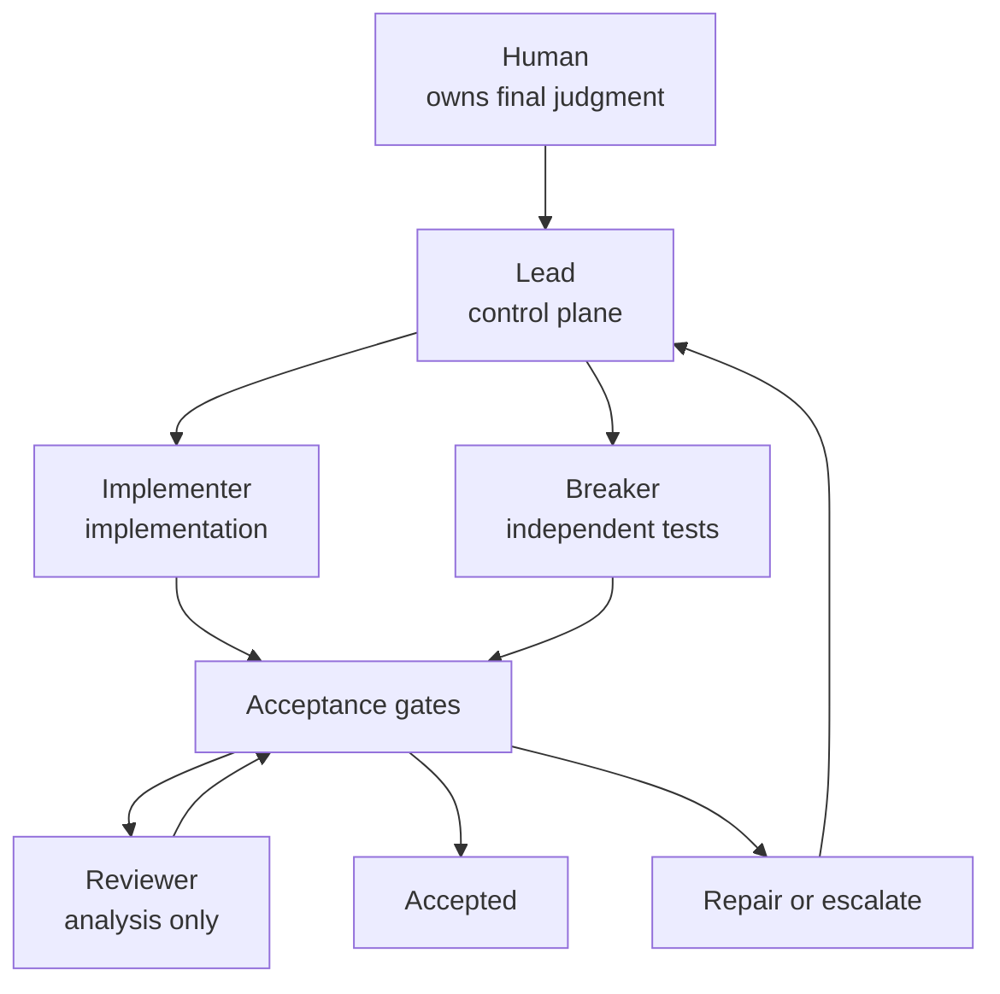
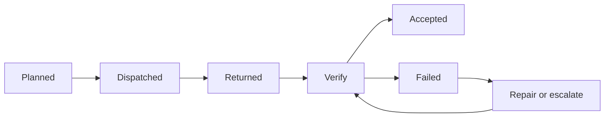
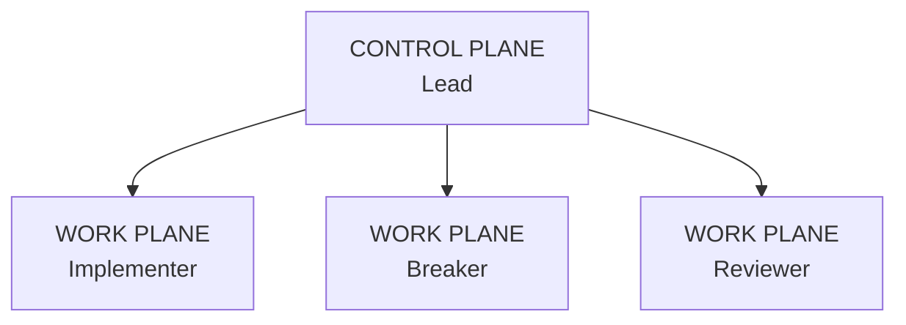
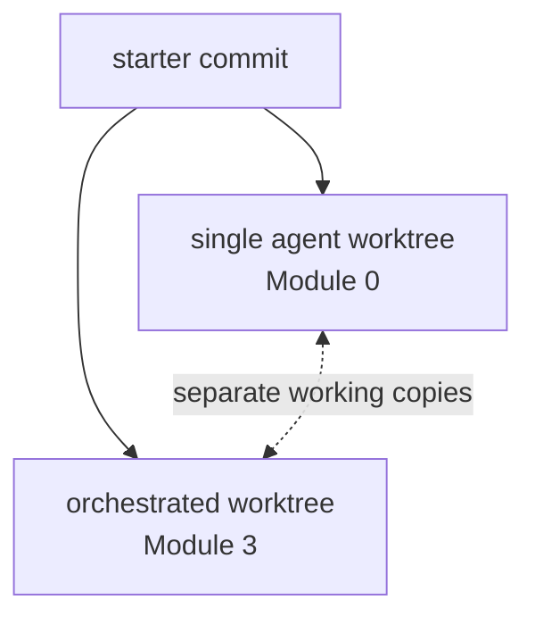
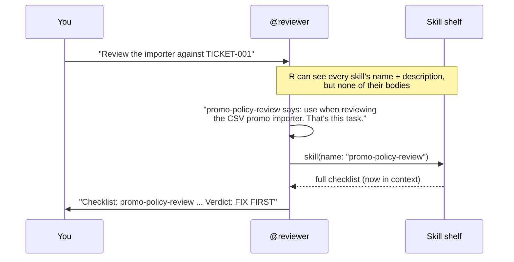
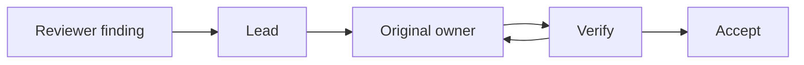

# Module 3 — Execute the Crew 🚦

> 🎯 **Goal:** put the cards, capability boundaries, acceptance checks, and repair rules from Modules 1–2 into one real orchestrated workflow—then compare it fairly with the single-agent baseline.
>
> **You'll leave with:**
>
> - a completed orchestrated implementation
> - independent Breaker tests
> - Reviewer findings with dispositions
> - `workshop/integration-notes.md`
> - a matched comparison against Module 0
> - evidence of where orchestration helped—and where it cost you
> - 🪝 a hook that logs (and guards) every agent's tool calls
> - 🧩 evidence of whether your Reviewer pulled in a skill on its own

| Module | You learn to… | Orchestration step | The one rule |
|---|---|---|---|
| 0 | Watch one agent do the whole job alone | Baseline | Measure before you multiply |
| 1 | Turn one job into independently understandable pieces | **Decompose** | Split by independent outcome |
| 2 | Give each worker only the authority it needs | **Isolate** | Minimum necessary authority |
| **3 ← you are here** | **Run the system and decide what work is actually acceptable** | **Execute** | **Returned is not done. Verify before you accept.** |
| 4 | Give each worker enough model capability | **Route** | Minimum sufficient capability |
| 5 | Handle a launch-night failure | Recover | Green tests are evidence, not a verdict |

> **Module 1 designed the jobs.**
>
> **Module 2 bounded the workers.**
>
> **Module 3 finds out whether the system actually works.** 🚀
>
> **Module 4 then tunes which model each worker gets, using the evidence from this run.**

> 🧭 **Why execute before routing?** Every worker in this run uses the *same* model you used in Module 0. That's not a shortcut. It's what makes the comparison fair: if the crew does better, it's because the **workflow** changed, not because it secretly got a smarter model. Model routing (Module 4) is a tuning step you apply to a crew you've already watched work.

---

# Everything meets here 🤝

You now have:

```text
MODULE 1
cards + ownership

        ↓

MODULE 2
agents + permissions

        ↓

MODULE 3  ← you are here
execute → verify → integrate → review → repair
(one model for everyone, matched to Module 0)

        ↓

MODULE 4
model routes + escalation rules, informed by this run
```

The architecture you've been building finally becomes a running system.



---

# The most important distinction in this module ❗

An agent can say:

> “Done.”

That tells you only that the agent **returned**.

It does not tell you that the artifact is correct.

A useful orchestration state machine is:



> 🔑 **Returned is a transport state. Accepted is a quality state.**

This distinction is easy to miss when using agents because their reports often sound confident and final.

The orchestrator's job is not to believe the report.

It is to **hold the receipt against the acceptance check**.

---

# Control plane vs. work plane 🗼


*The tower flies no planes. It decides who goes where, and when. Photo: Harrison Keely, "The FAA air traffic control tower at Philadelphia International Airport," [Wikimedia Commons](https://commons.wikimedia.org/wiki/File:The_FAA_air_traffic_control_tower_at_Philadelphia_International_Airport.jpg), [CC BY 4.0](https://creativecommons.org/licenses/by/4.0/) (resized).*

Your crew now resembles a real distributed system.

## Control plane

The **Lead** decides:

- which worker receives which task
- whether the result passed its acceptance gate
- whether a repair is needed
- whether something should escalate

## Work plane

The specialists do the work:

```text
Implementer → implementation

Breaker     → executable evidence

Reviewer    → analytical evidence
```

Visually:



> 🔑 **The orchestrator coordinates. Specialists produce.**

If Lead silently starts writing `importer.py`, the architecture has collapsed back into one general-purpose agent.

---

# Independence before concurrency 🧵

You may hear:

> “Multi-agent means running lots of agents at once.”

Not necessarily.

First ask:

> **Are the tasks actually independent?**

Then ask:

> **Can my execution environment run them concurrently?**

Those are different questions.

```text
LOGICAL INDEPENDENCE
"Does B require A's unfinished output?"

          ≠

ACTUAL CONCURRENCY
"Does the harness run A and B at the same time?"
```

Your Builder and Breaker are logically independent because both build against the frozen contract.

```text
                    Frozen contract
                    /             \
                   ▼               ▼
             Implementer        Breaker
                   \               /
                    \             /
                     ▼           ▼
                       Integrate
```

The lab's pinned OpenCode V1 environment runs delegated children in the **foreground**, so these independent jobs execute sequentially here.

That does not make them dependent.

It means the **scheduler serializes independent work**.

Current OpenCode V2 can run subagents in foreground or background child sessions, but that is not required for this exercise. [OpenCode](https://opencode.ai/v2/docs/agents?utm_source=chatgpt.com)

> 🔑 **Independence is a property of the work. Concurrency is a property of the scheduler.**

Parallel execution is an optimization you can apply **after** proving independence.

---

# Different files do not prove independence 📁

Suppose:

```text
Agent A → changes an API in api.py

Agent B → updates a caller in checkout.py
```

Different files.

Still dependent.

Agent B needs to know what Agent A changed.

So do not use:

```text
different files = independent
```

as your test.

Instead ask:

> **Can either task be completed correctly without seeing the other's unfinished output?**

Non-overlapping writes are still extremely useful.

They reduce integration friction.

But they are not proof of logical independence.

---

# Three kinds of collision 💥

Agent systems can collide in different ways.

### 1. Physical collision

Two workers modify the same working copy.

```text
Agent A ──┐
          ├── importer.py
Agent B ──┘
```

Tools, permissions, or worktrees can help.

### 2. Semantic collision

Workers edit different files but make incompatible assumptions.

```text
Agent A:
returns Decimal

Agent B:
expects string
```

No file conflict.

Still broken.

### 3. Integration collision

Two isolated changes are individually reasonable but do not combine cleanly.

```text
Branch A ✅

Branch B ✅

A + B ❌
```

> 🔑 **Clean files do not guarantee a clean system. Integration is its own acceptance gate.**

---

# Four protection layers 🛡️

Earlier modules introduced several forms of protection.

Do not think of them as substitutes.

They protect against different failures.

| Layer | What it protects against |
|---|---|
| **Coordination** | workers misunderstanding task ownership |
| **Capability control** | an agent directly performing an unauthorized action |
| **Workspace isolation** | independent runs overwriting the same working-copy files |
| **Runtime isolation** | executed code reaching files, networks, databases, or systems outside the intended environment |

For example:

```text
Card:
TOUCH importer.py only
```

is coordination.

```text
edit permission:
importer.py only
```

is capability control.

```text
Git worktree
```

is working-copy isolation.

```text
container / sandbox / restricted credentials
```

is runtime isolation.

> 🔑 **Defense in depth means combining boundaries—not assuming one boundary does everything.**

---

# Worktrees: useful isolation, not magic 🌳

Module 0 and Module 3 use separate Git worktrees:



*Figure 4 — Both experiments begin from the same starter commit but use separate working directories.*

This protects the ordinary working files of one experiment from the other.

But a Git worktree is **not**:

```text
a VM
a container
a network sandbox
a separate Git repository
```

Git describes worktrees as multiple working trees attached to the same repository; many refs and repository configuration remain shared. [Git](https://git-scm.com/docs/git-worktree?utm_source=chatgpt.com)

So the precise rule is:

> **Worktrees isolate normal working-copy changes. They do not provide full runtime or repository isolation.**

That connects directly to Module 2:

```text
edit deny
≠ runtime sandbox

worktree
≠ runtime sandbox
```

---

# What exactly are we comparing? ⚖️

This matters.

In Module 4 you'll build a routing policy such as:

```text
Breaker     → Tier 1
Implementer → Tier 1 or Tier 2
Reviewer    → Tier 2
Lead        → Tier 2
```

But Module 0 used **one model configuration**, so today's run does too.

If we now change:

```text
number of agents
+
prompts
+
permissions
+
models
+
review
```

all at once, we cannot honestly say which change caused any improvement.

So Module 3 separates **two useful questions**.

---

## Experiment A — Matched workflow comparison

This is today's core experiment.

Hold constant:

```text
starter commit
ticket
acceptance tests
implementation timebox
model + variant
```

Change:

```text
workflow structure
```

Compare:

```text
Module 0
one agent

versus

Module 3
Lead + specialists + explicit acceptance gates
```

This gets us closer to asking:

> **What happened when we changed the workflow?**

---

## Experiment B — Best routed system

The routing policy you'll build in Module 4 may intentionally use different models for different jobs.

That answers another question:

> **How does our best designed system perform?**

Also valuable.

But if it wins, we cannot attribute the improvement solely to multi-agent orchestration.

The model routing changed too.

> 🔑 **Match your conclusion to your experiment.**

Today we run Experiment A only.

Experiment B (a fully routed rerun) is a Level Up at the end of Module 4, once you have a routing policy worth testing.

---

# Fair comparisons need more than a stopwatch ⏱️

Suppose three agents truly execute in parallel for ten minutes:

```text
Agent A ────────── 10 min
Agent B ────────── 10 min
Agent C ────────── 10 min
```

Human wait time:

```text
10 minutes
```

Total model execution:

```text
roughly 30 agent minutes
```

So:

> 🔑 **Equal wall-clock time does not mean equal compute.**

When evaluating orchestration, record multiple dimensions.

| Metric | Question |
|---|---|
| **Wall-clock time** | How long did the human wait? |
| **Model usage / cost** | How much compute did the workflow consume? |
| **Human interventions** | How much attention did orchestration require? |
| **Repair cycles** | How often did work have to go back? |
| **Integration time** | How large was the coordination tax? |
| **Defects caught** | Did independent checking improve quality? |
| **Accepted result** | What usable outcome did you actually get? |

---

# The coordination tax 💸

Multi-agent workflows can gain:

```text
specialization
independent verification
context isolation
possible concurrency
different model routes
```

But they pay for:

```text
delegation
context packaging
waiting
verification
integration
repair
human attention
```

Call the second group the:

> **coordination tax**

A useful mental model is:

```text
ORCHESTRATION VALUE

specialization
+ independent evidence
+ possible concurrency
+ better routing

MINUS

coordination tax
```

Sometimes orchestration wins.

Sometimes one good agent is simply better.

Finding out **where** each wins is the purpose of the experiment.

---

# 🧩 Skills and 🪝 hooks: two more parts of the harness

So far your crew gets its instructions in three ways:

- **AGENTS.md**, loaded into every session whether it's needed or not
- **task cards**, which Lead pushes to a worker when it delegates
- **permissions**, a static allow / ask / deny list checked on every tool call

OpenCode has two more, and they sit at opposite ends of a spectrum:

| Mechanism | Who decides it gets used? | When it acts | Good for | Panic Pantry example |
|---|---|---|---|---|
| 📜 AGENTS.md | Nobody. It's always loaded | Every session | Project-wide rules | "Never write `data/promotions.json`" |
| 🗂️ Task card | Lead pushes it | At delegation | One job's brief | `workshop/cards/builder.md` |
| 🔐 Permission | Config | Every tool call | Allow or deny a tool or path | Implementer may edit only `importer.py` |
| 🧩 **Skill** | **The agent pulls it in** | Only when the agent decides it's relevant | Reusable know-how, loaded on demand | A promo-policy review checklist |
| 🪝 **Hook** | **Code, not the model** | Every tool call, by every agent | Logging, guards and nudges that must not depend on the model remembering | A flight recorder plus a frozen-file guard |

> 🔑 **A skill is pulled. A hook is pushed.** An agent can ignore a skill. It can't ignore a hook.

---

## 🧩 Skills: know-how the agent fetches when it needs it


*A pilot doesn't memorize every checklist. The right one comes out for the right phase of flight. Photo: U.S. Air Force, "Preflight checklist," [Wikimedia Commons](https://commons.wikimedia.org/wiki/File:Preflight_checklist_(14443492762).jpg), public domain.*

A skill is a folder with one file in it:

```text
.opencode/skills/promo-policy-review/SKILL.md
```

```markdown
---
name: promo-policy-review
description: Panic Pantry checklist for reviewing, auditing or accepting code that
  creates, imports or changes promotions or discounts (importer.py, ...). Use when
  reviewing the CSV promo importer or any promo/discount change.
---

# Promo policy review
Start your report with: Checklist: promo-policy-review
1. The 20% rule lives in the service, not the importer ...
```

Here's the important part: **at startup, OpenCode shows each agent only the `name` and `description` of every skill.** The body stays on the shelf. When the agent decides a task matches a description, it calls the `skill` tool and the full checklist lands in its context.



*Figure 3a — How an agent pulls in a skill.*
Text alternative: you ask the Reviewer for a review. The Reviewer sees only the names and descriptions of available skills, decides the promo-policy-review description matches the task, calls the skill tool, receives the full checklist, and then reports using it.

Three consequences:

1. **The description is the trigger.** Write it like a search query: name the files, the task and the words people will actually use. A vague description means the skill never gets pulled.
2. **Skills are cheap until used.** AGENTS.md costs context in every session. A skill's body costs nothing until an agent loads it.
3. **"Pulled" means "optional".** If the rule must hold every time, a skill is the wrong tool. Use a permission, a hook or a test.

You can control which skills an agent may load with the `skill` permission, the same way you locked `edit` and `task` in Module 2:

```yaml
permission:
  skill:
    "*": deny
    "promo-policy-review": allow
```

`skill: deny` removes the skill tool from that agent entirely.

---

## 🪝 Hooks: code that runs on every tool call


*An airliner's flight data recorder writes down what happened whether or not the crew remembers to. Photo: U.S. National Transportation Safety Board, [Wikimedia Commons](https://commons.wikimedia.org/wiki/File:Fdr_sidefront.jpg), public domain.*

A hook is a function OpenCode calls at a fixed point in its loop. You register hooks in a **plugin**, a JavaScript or TypeScript file that OpenCode auto-loads from `.opencode/plugins/` at startup.

| Hook | When OpenCode calls it | What it can do |
|---|---|---|
| `tool.execute.before` | Just before any tool runs | Read the arguments, log them, change them, or **throw to block the call** |
| `tool.execute.after` | Just after a tool returns | Log the result, or **append text the model will read** |
| `chat.message` | When a new message arrives | Observe or annotate the conversation |
| `event` | On every internal event (session idle, file edited, …) | Notify, record, react |

You won't write a plugin from scratch today. The course ships one in `workshop/kit/plugins/crew-guard.js`, with three hooks:

```text
🛫 Flight recorder   before every tool call → append a row to workshop/tool-log.md
🛑 Frozen-file guard before every write     → refuse writes to fixtures/, scripts/, tickets/,
                                              data/promotions.json*, the contract test, AGENTS.md
🔔 Test nudge        after a write to src/ or tests/ → add "run the tests before you report DONE"
                                              to the result the agent reads
```

The guard's core is about ten lines:

```js
"tool.execute.before": async (input, output) => {
  if (WRITE_TOOLS.has(input.tool)) {
    const hit = targetPaths(output.args, directory).find((p) => FROZEN.some((f) => p.startsWith(f)))
    if (hit) throw new Error(`crew-guard: ${hit} is frozen for every agent. Report the problem instead.`)
  }
},
```

When a hook throws, the tool call doesn't happen and the agent sees the error message as the tool's result. Nobody had to remember the rule.

> ⚠️ **Hooks are another slice of Swiss cheese, not a sandbox.** This guard only checks the edit/write tools. An agent that runs `sed -i` on a fixture through `bash` slips past it (that's what your Module 2 `bash` allowlist is for). Hooks also see only what goes through OpenCode's tools, the same limit permissions have.

> 🧪 **Test hooks live.** `opencode debug agent … --tool …` (Module 2) checks permissions without a model, and it **does not run plugin hooks**. To see a hook fire, use a real session.

---

# Exercise 3 — Orchestrated Run + Matched Comparison 🔬

**Time:** approximately 50 minutes (the 40-minute run, plus about 10 for the hook and skill)

### Core question

Can an orchestrated workflow produce a better accepted result than the Module 0 single-agent baseline under the same implementation timebox?

---

# Starting checkpoint 📍

Move into the orchestrated worktree:

```bash
cd sandbox/worktrees/orchestrated

git branch --show-current
# must print: orchestrated

git status

git log --oneline -1

python3 -m unittest discover -s tests -v
# expected starter state: suite OK with importer tests skipped
```

Confirm that:

```text
single-agent worktree
```

and:

```text
orchestrated worktree
```

began from the same starter commit.

---

# Step 1 — Bring in the experiment harness 🧰

Your cards and custom agents were created outside this worktree and were never part of the starter commit.

Create the directories:

```bash
mkdir -p .opencode/agents workshop/cards
```

Copy the crew:

```bash
cp ../../panic-pantry/.opencode/agents/*.md .opencode/agents/
```

Copy the task cards:

```bash
cp ../../panic-pantry/workshop/cards/*.md workshop/cards/
```

If you created reusable OpenCode commands in Module 2 and want them here:

```bash
mkdir -p .opencode/commands
cp ../../panic-pantry/.opencode/commands/*.md .opencode/commands/ 2>/dev/null || true
```

These files are part of the **experiment harness**.

They are not the product change we're evaluating.

---

# Experiment harness vs. system under test

Keep this distinction clear.

```text
EXPERIMENT HARNESS

.opencode/agents/
workshop/cards/
routing configuration
timer
scorecard
integration notes

           │
           ▼

SYSTEM UNDER TEST

src/panic_pantry/importer.py
tests/test_promo_import.py

           │
           ▼

RESULTS

test output
review findings
comparison metrics
```

> 🔑 **Do not accidentally score the harness as if it were the product.**

This will matter when you inspect the diff.

---

# Step 2 — Create the run ledger 📒

Create:

```text
workshop/integration-notes.md
```

Start with:

```markdown
# Orchestrated Run Ledger

| Artifact | Owner | State | Acceptance check | Result | Next action |
|---|---|---|---|---|---|
| importer.py | Implementer | planned | contract tests | — | — |
| test_promo_import.py | Breaker | planned | breaker tests load/run | — | — |
| integrated change | Lead / human | planned | full suite | — | — |
| review | Reviewer | planned | review checklist | — | — |

## Repairs

| Finding / failed check | Artifact owner | Repair requested | Result |
|---|---|---|---|

## Human interventions

| Time | Intervention | Why |
|---|---|---|
```

You—not Lead—maintain this file during the experiment.

Why?

Lead has:

```text
edit: deny
```

and should remain a coordinator.

---

# Step 3 — Preflight the contract 📜

Before the timer starts, re-read:

```text
tickets/TICKET-001.md
```

Confirm:

```text
criteria 1 through 9 are frozen
```

and especially:

```text
above 20 percent → pending approval
exactly 20 percent → active
service decides approval
```

If the contract is ambiguous:

> **Do not launch workers.**

Resolve ambiguity before implementation.

Module 1's rule still applies.

---

# Step 4 — Preflight ownership 🏷️

Your ownership map should now be boringly obvious:

| Artifact | Owner | Writable scope |
|---|---|---|
| Importer | `@implementer` | `src/panic_pantry/importer.py` |
| Independent attack tests | `@breaker` | `tests/test_promo_import.py` |
| Review findings | `@reviewer` | Nothing |
| Coordination | `lead` | Nothing |
| Final decision | You | Not delegated |

There is no mystery helper.

There is no built-in `general`.

Module 2 deliberately created the exact workers needed for these jobs.

---

# Step 5 — Match the model condition 🎛️

For the **timed matched comparison**, Lead, Implementer, and Breaker must use the same model + variant used in your Module 0 baseline.

Find that value on the Module 0 scorecard.

For example:

```text
provider/model
variant
```

Do **not** guess.

If you cannot identify the original configuration, note:

```text
MODEL CONDITION NOT MATCHED
```

and continue—but do not describe the result as a perfectly matched comparison.

---

## No routing yet: that's deliberate 🎛️

You haven't picked per-agent models yet. That's Module 4.

So for this run, **every agent inherits the session model**. Pick the Module 0 model + variant in `/models` before you start, and every child session will use it.

Quick check that nobody has a stray `model:` line:

```bash
grep -n '^model:' .opencode/agents/*.md || echo "no pins: every agent inherits the session model ✅"
```

If a file *does* have a `model:` line, delete it in **this worktree's copy only** for the timed run.

Why so strict?

```text
Module 3 matched run:
"What changes when only the workflow structure changes?"

Module 4:
"Now that we've seen the crew work, which model does each worker need?"
```

Different questions require different controls.

---

# Step 6 — Preflight the locks 🔐

Before the clock begins, verify the capability architecture still exists.

You should have:

```text
Lead
  ├── may launch Implementer
  ├── may launch Breaker
  └── may launch Reviewer

Implementer
  └── importer.py only

Breaker
  └── test_promo_import.py only

Reviewer
  └── no edits
```

If an agent definition is missing or its permissions are wrong, fix the harness **before** timing.

Do not discover halfway through the experiment that everyone was secretly `general`.

---

## 🪝 Add one more slice: the crew-guard hook

Copy the course's plugin into this worktree:

```bash
mkdir -p .opencode/plugins
cp ../../panic-pantry/workshop/kit/plugins/crew-guard.js .opencode/plugins/
```

Open it and skim it (2 minutes). Find the three hooks: flight recorder, frozen-file guard, test nudge.

> 🔮 **Predict:** will you see any 🛑 BLOCKED rows today?
>
> <details><summary>Reveal</summary>
>
> Probably not. If your Module 2 locks hold, no crew member can write a frozen file, so the guard never fires. That's fine: seatbelts mostly don't. The guard earns its place because its holes are in **different places** from the YAML locks. It still holds if someone loosens an agent file later, if you switch to the built-in `build` agent, or if a new agent joins the crew without locks. Different holes, more slices.
>
> </details>

Plugins load when OpenCode starts, so it'll be active from Step 7 on. You'll know it's live when `workshop/tool-log.md` appears.

Add one row to your ledger's **Human interventions** table: `crew-guard hook on`. The Module 0 baseline didn't have it, so it's part of what you're comparing.

---

# Step 7 — Start OpenCode as Lead 🧭

Run:

```bash
opencode
```

Press **Tab** until the primary agent is:

```text
lead
```

Lead is now the control plane.

---

# Step 8 — The 15-minute matched window ⏱️

The same hard implementation limit used in Module 0 applies here:

> **15 minutes. Stop at 15 even if unfinished.**

That is what makes unfinished work useful evidence instead of an embarrassment.

---

## Start the clock

Send Lead:

```text
Run the matched TICKET-001 implementation.

Read:
- workshop/plan.md if present
- workshop/cards/builder.md
- workshop/cards/breaker.md
- tickets/TICKET-001.md

Rules:

1. You coordinate only. Do not implement code or write tests yourself.
2. Delegate the complete Builder card to @implementer.
3. Delegate the complete Breaker card to @breaker.
4. Preserve each card's DO, READ, RULES, TOUCH, DONE, and REPORT requirements.
5. After each worker returns, verify its reported DONE evidence before accepting it.
6. If an acceptance check fails, send a targeted repair back to the owner of that artifact.
7. Never weaken a test, contract, or permission merely to make the run pass.
8. Do not delegate to any agent other than implementer, breaker, or reviewer.
9. Stop when the 15-minute implementation window ends, even if unfinished.

Begin.
```

---

# What Lead should do 🧭

Because this V1 lab runs child delegations in the foreground, you will probably observe something like:

```text
Lead
 │
 ├── Implementer
 │      ↓
 │    returns
 │
 ├── verifies
 │
 ├── Breaker
 │      ↓
 │    returns
 │
 └── verifies
```

The order of Implementer and Breaker does not matter logically.

The environment happens to serialize them.

That's the difference between:

```text
logical independence
```

and:

```text
runtime concurrency
```

---

# Step 9 — Watch the state, not the prose 👀

> 🛫 **Open a second terminal** in this worktree and run:
>
> ```bash
> tail -f workshop/tool-log.md
> ```
>
> Now you see every tool call by every agent, as it happens, written by code rather than summarized by a model. Each session has its own short ID in the **Session** column. When Lead delegates you'll see a `delegated to @implementer` row, and the new ID that follows is the child's session. If a 🛑 **BLOCKED** row ever appears, an agent tried to touch a frozen file: log it as a caught boundary violation in your ledger.

When a child returns:

```text
"I successfully completed the task."
```

do **not** immediately mark:

```text
accepted
```

Update your ledger first:

```text
planned
→ dispatched
→ returned
```

Now verify.

---

# The acceptance gate 🚪

For each artifact, ask three questions.

### 1. Ownership

Did only the correct owner write it?

```bash
git status --short
```

### 2. Scope

Did it change only what its card permitted?

### 3. Evidence

Does the actual DONE check pass?

The report is a pointer to evidence.

It is not the evidence itself.

---

# Step 10 — Inspect the child sessions 🔍

After both workers have run, inspect their child sessions.

Use the navigation controls from Module 2.

For Implementer, confirm that its delegated message preserved the Builder card.

For Breaker, confirm that:

- it received the Breaker task
- its `TOUCH` boundary remained intact
- it did not turn itself into an implementation agent
- it did not use `importer.py` as the source of expected behavior

This is useful evidence about **orchestration fidelity**:

> Did Lead send the task you designed—or accidentally rewrite it into something else?

---

# A new failure category: routing failure 🔀

Suppose:

```text
Builder card
      ↓
Breaker
```

or:

```text
Breaker card
      ↓
Implementer
```

The specialist may behave perfectly.

The workflow still failed.

That's not necessarily a model failure.

It's a:

> **routing failure**

Module 3 is where you start diagnosing the system instead of saying:

> “The AI got it wrong.”

---

# Step 11 — Integration gate 🧩

When both artifacts have returned—or the timer is nearly finished—inspect the whole system.

First:

```bash
git status --short
```

Every product file should map to one known owner.

Now stage only the **system under test**:

```bash
git add src/panic_pantry/importer.py
git add tests/test_promo_import.py
```

Do **not** use:

```bash
git add -A
```

because that would also stage:

```text
.opencode/
workshop/
cards
run notes
```

and contaminate the product diff with the experiment harness.

---

## Inspect the product diff

Run:

```bash
git diff --cached starter -- src/ tests/
```

This is the artifact you actually want to evaluate.

Separately, use:

```bash
git status --short
```

to inspect everything else in the experiment directory.

---

# Step 12 — Run the integrated suite ✅

Run:

```bash
python3 -m unittest discover -s tests -v
```

This is a different gate from:

```text
Implementer passed its tests
```

and:

```text
Breaker tests load correctly
```

because:

> **Integration is its own experiment.**

Two individually plausible pieces can still fail together.

Record the result in the ledger.

---

# If integration fails 🚨

Do not let whoever happens to be available patch whatever file is convenient.

Ask:

> **Who owns the failing artifact?**

---

## Example A — Breaker exposes an importer bug

```text
Breaker test fails
      ↓
test matches ticket
      ↓
importer violates ticket
```

Repair goes to:

```text
Implementer
```

---

## Example B — Breaker wrote an incorrect expectation

Independent evidence shows:

```text
Breaker test
≠
ticket
```

Repair goes to:

```text
Breaker
```

---

# Artifact ownership persists through repair 🔁

This is a major orchestration rule.

```text
Reviewer finds defect
        ↓
Lead creates repair request
        ↓
original owner fixes artifact
        ↓
acceptance gate reruns
```

Not:

```text
Reviewer sees defect
        ↓
Reviewer edits it
```

And not:

```text
Lead sees defect
        ↓
Lead quietly patches it
```

> 🔑 **Artifact ownership persists through repair.**

Why?

Because otherwise you lose:

```text
provenance
permission boundaries
model attribution
task ownership
clear accountability
```

---

# Repair cards 🛠️

A repair should be narrow.

Bad:

```text
Fix everything.
```

Better:

```text
DO:     Fix the 3-column-row behavior exposed by test_x.
READ:   the failing test and ticket criterion 4.
RULES:  Do not modify tests or contract files.
TOUCH:  src/panic_pantry/importer.py only.
DONE:   the failing test passes and the full contract suite passes.
REPORT: changed lines · commands run · assumptions.
```

Notice what happened:

> **Decomposition doesn't only occur at the beginning.**

You decompose again when feedback creates new work.

---

# Hard stop means hard stop 🛑

At 15 minutes:

> **Stop.**

Even if:

```text
one child is unfinished
tests are red
one repair remains
```

capture the state.

Record:

```text
what returned
what passed
what failed
what remained open
```

Do not secretly give the orchestrated workflow another eight minutes and then compare it to the 15-minute baseline.

> 🔑 **Unfinished under the same limit is valid experimental data.**

---

# Phase 2 — Assurance after the matched window 🔍

The 15-minute matched implementation comparison is now frozen.

From this point forward, record additional time separately as:

```text
assurance / integration / rework time
```

The Reviewer enters here.

Keep it on the same model as the rest of the crew. If you're curious whether a stronger Reviewer finds more, that's exactly the kind of question Module 4 teaches you to test properly.

Recording assurance time separately means:

```text
matched implementation result
```

and:

```text
post-window assurance result
```

remain distinguishable.

---

# Step 13 — Ask Reviewer to inspect the integrated product 🔎

## 🧩 First, put a skill on the shelf (and don't tell Reviewer)

The matched window is over, so you can change the harness now without spoiling the comparison.

```bash
mkdir -p .opencode/skills
cp -R ../../panic-pantry/workshop/kit/skills/promo-policy-review .opencode/skills/
opencode debug skill | grep '"name"'     # promo-policy-review should be listed
```

Skills load at startup: **quit OpenCode (`ctrl+c`) and start it again.** Lead's session isn't lost: `/sessions` brings it back if you need it.

> 🔮 **Predict:** the prompt below never mentions the skill. Will Reviewer load it anyway? What in `SKILL.md` would make it decide to?

Seeing other skills listed too? OpenCode also loads skills from `~/.config/opencode/skills/`, `~/.claude/skills/` and `~/.agents/skills/`. Every agent can see those as well, which is worth knowing about any machine you run agents on.

Send:

```text
@reviewer

Review the product changes since the starter tag against tickets/TICKET-001.md.

Read the staged product diff under src/ and tests/.

Check:
- approval bypass
- service boundary
- duplicate handling
- row reporting
- malformed input handling
- missing tests
- scope creep
- anything else that could violate the frozen contract

Do not modify files.

Report findings by severity.
For every finding include file:line, the contract rule at risk, and whether the issue is confirmed or uncertain.
Also report missing coverage separately.
```

## 🔍 Did it pull the skill in?

Check two places:

```bash
grep 'skill' workshop/tool-log.md
# expect a row like: | 21:14:09 | …a3F9 | skill | loaded skill: promo-policy-review |
```

and the first line of Reviewer's report: `Checklist: promo-policy-review`.

| What you see | What it means |
|---|---|
| ✅ Log row **and** checklist line | The description matched the task, so the agent pulled the know-how in by itself |
| 🤔 Checklist line, no log row | The hook didn't see the call. Check that `crew-guard.js` is in `.opencode/plugins/` and that you restarted |
| ❌ Neither | The agent decided the skill wasn't relevant. Reread the `description`: would *you* match it to this task? Or check whether `reviewer.md` denies `skill` |

If it didn't load, don't rewrite the prompt to say "use the skill". That turns a *pulled* skill into a *pushed* instruction and hides the real problem. Fix the description, restart, and run Step 13 again. Note it in the ledger.

Reviewer produces **evidence**.

Reviewer does not make the release decision.

---

# Step 14 — Disposition every finding 🗳️

Do not leave Reviewer output as a pile of prose.

Every finding must become:

```text
FIX
ACCEPT
DEFER
```

Add this to `workshop/integration-notes.md`:

```markdown
## Reviewer dispositions

| Finding | Severity | Disposition | Reason | Owner |
|---|---|---|---|---|
```

### FIX

The finding is real and should be corrected now.

Assign the repair to the artifact owner.

### ACCEPT

You conclude it is not actually a problem.

Record why.

### DEFER

The finding is real but outside tonight's scope.

Record:

```text
why
+
who owns follow-up
```

> 🔑 **Reviewer findings are evidence, not commands.**

The human owner still decides what they mean.

---

# Step 15 — Repair loop 🔁

For each `FIX`:



Example:

```text
Reviewer:
HIGH — approval bypass possible

        ↓

Lead:
creates narrow repair card

        ↓

Implementer:
repairs importer.py

        ↓

Tests:
rerun

        ↓

Reviewer:
recheck if needed
```

Record every repair cycle.

That is part of the coordination tax.

---

# Step 16 — Measure the workflow honestly 📏

Now compare with Module 0.

Use the same scorecard definitions where possible.

Record at least:

| Metric | Single agent | Orchestrated |
|---|---:|---:|
| 15-minute artifact complete? | | |
| Contract tests passing at hard stop | | |
| Whole suite passing | | |
| Independent defects caught | | |
| Policy behavior correct | | |
| Human interventions | | |
| Repair cycles | | |
| Integration/rework minutes | | |
| Total elapsed human time | | |
| Token/cost data where observable | | |
| Number of changed product files | | |

Do not invent unavailable token or cost data.

---

# Quality-adjusted economics 💰

Module 4 will formalize this as:

> **Optimize cost to accepted result—not token price alone.**

This run lets you observe the idea first, with your own numbers.

Imagine:

```text
Single agent

15 minutes
+
2 missed bugs
+
20 minutes later debugging
```

versus:

```text
Orchestrated

15 minutes
+
7 minutes integration
+
Breaker catches both bugs
```

Which was cheaper?

There is no universal answer.

You need:

```text
quality
+
model cost
+
human attention
+
coordination tax
```

---

# What counts as an orchestration win? 🏆

Not only:

```text
faster
```

Possible wins include:

```text
more contract coverage
more independent defects found
smaller blast radius
better provenance
clearer ownership
less context pollution
better use of cheaper models
```

And orchestration can lose through:

```text
extra tokens
more setup
handoff mistakes
integration overhead
waiting
routing errors
human attention
```

> 🔑 **Speed is only one dimension of orchestration value.**

---

# Step 17 — Diagnose failures by layer 🩺

Instead of saying:

> “The agent failed.”

classify the failure.

| Failure layer | Example |
|---|---|
| **Contract failure** | Requirement was ambiguous |
| **Decomposition failure** | Two supposedly independent jobs secretly depended on each other |
| **Routing failure** | Wrong worker or insufficient model got the task |
| **Control failure** | Worker could modify something outside its intended scope |
| **Execution failure** | Correct task and worker, wrong implementation |
| **Integration failure** | Individually acceptable pieces fail together |
| **Verification failure** | Tests or review fail to catch the defect |

This is much more actionable than:

```text
AI bad
```

---

## Example

Suppose Breaker's tests expect seeded duplicates correctly, but Importer imports `WELCOME10`.

That is probably:

```text
execution failure
```

Suppose Breaker never checks seeded duplicates because the card omitted them.

That may be:

```text
task / contract specification failure
```

Suppose Lead sends the Breaker card to Implementer.

That's:

```text
routing failure
```

Suppose Breaker edits importer.py despite the architecture.

That's:

```text
control failure
```

Different layer.

Different fix.

---

# Step 18 — Inspect the orchestration itself 🔬

Before finishing, ask:

### Did Lead remain a coordinator?

Or did it start implementing?

### Did each artifact retain one owner?

### Did task cards survive delegation accurately?

### Were returned claims independently verified?

### Did repairs return to the original owner?

### Did any worker exceed its intended authority?

### Did your chosen checks catch real defects?

This evaluates the **orchestration**, not just the Python code.

---

# Step 19 — Write the comparison conclusion carefully ✍️

At the bottom of `workshop/integration-notes.md`, write:

```markdown
## Comparison conclusion

Under the matched 15-minute implementation condition:

The orchestrated workflow was better / worse / mixed because:
___

The strongest evidence:
___

The largest coordination cost:
___

The most important defect caught only by independent verification:
___

What this one run does NOT prove:
___
```

A good statement:

> Under the same starter state, implementation model, and 15-minute timebox, the orchestrated workflow produced more independent test coverage but required additional integration time.

A bad statement:

> Multi-agent systems are better than single agents.

One classroom trial cannot support that.

> 🔑 **Match your claim to your evidence.**

---

# Required artifacts 📦

By the end you should have:

```text
src/panic_pantry/importer.py
tests/test_promo_import.py
workshop/integration-notes.md
workshop/tool-log.md        ← written by the crew-guard hook, not by you
```

plus captured evidence for:

```text
product diff
full test output
Reviewer findings
finding dispositions
matched comparison scorecard
```

The `.opencode/` files and cards are experiment infrastructure, not product output.

---

# Acceptance checks ✅

Before leaving Module 3:

- [ ] Orchestrated worktree began from the same starter commit as Module 0
- [ ] Frozen contract confirmed before delegation
- [ ] Lead remained read-only and acted as coordinator
- [ ] Builder card went to `@implementer`
- [ ] Breaker card went to `@breaker`
- [ ] Timed Implementer/Breaker/Lead model condition matched Module 0—or mismatch was explicitly recorded
- [ ] Each product file had one clear owner
- [ ] Every returned artifact crossed an acceptance gate before being called accepted
- [ ] Hard stop occurred at 15 minutes regardless of completion
- [ ] Product diff contains `src/` and `tests/`, not orchestration scaffolding
- [ ] Full suite ran after integration
- [ ] Reviewer ran after the matched window
- [ ] crew-guard hook was live for the timed run (`workshop/tool-log.md` exists) and any 🛑 BLOCKED rows were logged
- [ ] You checked whether Reviewer pulled in `promo-policy-review` on its own, and recorded the answer
- [ ] Every Reviewer finding became FIX, ACCEPT, or DEFER
- [ ] FIX items returned to the original artifact owner
- [ ] Integration/rework time was recorded separately
- [ ] Comparison conclusion stays within what one matched run can actually support

---

# Troubleshooting 🩹

| Problem | Diagnose it as | What to do |
|---|---|---|
| Agent missing | Harness problem | Verify `.opencode/agents/` was copied |
| Breaker edits `importer.py` | Control failure | Stop, fix Breaker permission boundary, rerun from clean state |
| Lead edits code | Orchestration/control failure | Stop; Lead is the control plane |
| Implementer edits tests | Control failure | Restore test file and verify permissions |
| Breaker tests fail against implementation | Possible execution finding | Check test against contract before changing anything |
| Breaker test itself contradicts ticket | Breaker execution failure | Repair through Breaker |
| Different files fail together | Integration or decomposition failure | Inspect assumptions and dependency graph |
| Wrong specialist receives card | Routing failure | Correct Lead routing |
| Strong model still fails repeatedly | Maybe not a model problem | Check task clarity, context, decomposition, and acceptance criteria |
| Clock expires mid-task | Valid experiment result | Stop and record unfinished state |
| `git diff` shows cards/agents | Harness mixed with product | Stage/diff only `src/` and `tests/` |
| Strange Python behavior | Runtime/environment issue | Inspect environment before blaming routing |

---

# ⚡ Level Up — Lock the skill shelf 🧩🔐

<details>
<summary><b>▶ Optional — decide which agents may pull which skills</b></summary>

Right now every agent can load every skill, including whatever is in `~/.claude/skills/` on this machine.

1. In this worktree's `.opencode/agents/reviewer.md`, add under `permission:`

   ```yaml
   skill:
     "*": deny
     "promo-policy-review": allow
   ```

2. In `breaker.md`, add `skill: deny`.
3. Check the result without spending a token:

   ```bash
   opencode debug agent breaker | grep -A4 '"skill"'
   # look for "action": "deny" on the skill permission, and "skill": false in its tools
   ```

**Deeper lesson:** a skill is context, and context can carry instructions. Treat the skill shelf like any other input to an agent with tools: decide who may read what.

</details>

---

# ⚡ Level Up — Write your own hook 🪝

<details>
<summary><b>▶ Optional — add a guard of your own to crew-guard.js</b></summary>

Pick one, add it inside the `tool.execute.before` hook, restart OpenCode, and **prove it fires in a live session** (remember: `opencode debug agent` skips hooks).

- **No pushes during the run:** throw if `input.tool === "bash"` and the command contains `git push` or `git commit`.
- **No network:** throw on `webfetch` and `websearch`. (Which Module 2 "lethal trifecta" leg does that cut?)
- **Size limit:** throw if a `write` to `src/` has more than 120 lines of content (AGENTS.md's file-size rule, now enforced).

Then ask yourself: should this rule live in a **permission**, a **hook** or a **test**? A permission is simplest when it's just "this tool / this path". A hook earns its keep when the rule needs logic: content, counts, combinations.

</details>

---

# ⚡ Level Up — What if the harness can run in parallel?

<details>
<summary><b>▶ Optional concurrency thought experiment</b></summary>

Imagine a newer harness can launch:

```text
Implementer
+
Breaker
```

simultaneously.

Should you?

Ask:

1. Do they depend on one another's unfinished output?
2. Do they have stable shared contracts?
3. Are write collisions controlled?
4. Can their results be integrated deterministically?
5. Is the extra compute worth the reduced wall-clock time?

If yes:

```text
parallel execution
```

may be useful.

If not:

```text
more concurrency
```

just creates faster confusion.

> **Concurrency is an optimization—not a substitute for decomposition.**

</details>

---

# ⚡ Level Up — Calculate the coordination tax

<details>
<summary><b>▶ Optional — 3 minutes</b></summary>

Estimate:

```text
delegation minutes
+
integration minutes
+
repair minutes
+
extra human review minutes
```

Call that:

```text
coordination tax
```

Then write:

```text
What benefit did we buy with that tax?
```

Possible answers:

```text
3 additional edge cases
1 security finding
cleaner provenance
lower model cost
zero benefit
```

That final answer matters more than whether “multi-agent” sounded sophisticated.

</details>

---

# ⚡ Level Up — Critical path vs. available parallelism

<details>
<summary><b>▶ Optional — connect back to Module 1</b></summary>

Draw the actual run:

```text
Freeze contract
      │
      ├──── Implementer ─────┐
      │                      │
      └──── Breaker ─────────┤
                             ▼
                         Integrate
                             │
                             ▼
                           Review
                             │
                             ▼
                         Final decision
```

Logically, Implementer and Breaker can overlap.

In this V1 lab they do not.

So distinguish:

```text
dependency graph
```

from:

```text
scheduler behavior
```

If a future harness adds background workers, the architecture already tells you which jobs are candidates for concurrency.

You do not need to redesign the task decomposition just because the scheduler improved.

</details>

---

# Debrief 🗣️

<details>
<summary><b>▶ If Implementer and Breaker are independent, why run them sequentially?</b></summary>

Because this lab's execution environment serializes foreground delegation.

That's a scheduler limitation, not a dependency.

Their logical independence still matters because either order should produce valid deliverables.

A different harness could run them concurrently.

</details>

---

<details>
<summary><b>▶ If two agents edit different files, are they automatically parallel-safe?</b></summary>

No.

Different files prevent one kind of collision.

They do not prevent semantic dependencies.

If one task requires an API decision from another task, the jobs remain dependent even if their filenames differ.

</details>

---

<details>
<summary><b>▶ Why doesn't Reviewer fix a defect it finds?</b></summary>

Because Reviewer owns:

```text
findings
```

not:

```text
implementation
```

The repair goes back to the artifact owner.

That preserves independent verification and clear provenance.

</details>

---

<details>
<summary><b>▶ Why rerun the full suite if Implementer and Breaker each passed their own checks?</b></summary>

Because individual acceptance does not prove integration.

```text
A passes alone

B passes alone

A + B
```

is a new state that deserves its own check.

</details>

---

<details>
<summary><b>▶ Why isn't a Git worktree a sandbox?</b></summary>

Because it primarily provides another working tree attached to the same Git repository.

The working files are separate, but repository state such as many refs and default repository configuration is shared. [Git](https://git-scm.com/docs/git-worktree?utm_source=chatgpt.com)

Executed code may also still have your normal host filesystem, network, and credential access.

Workspace separation and runtime isolation solve different problems.

</details>

---

<details>
<summary><b>▶ Why doesn't this experiment prove multi-agent systems are better?</b></summary>

Because one run is one observation.

Even with matched conditions, model output varies.

And if other variables differ—models, prompts, routing, review policy—you are evaluating a whole system, not isolating one causal factor.

The correct conclusion is narrow:

```text
Under these conditions, this workflow produced these observable results.
```

That's evidence.

Not a universal law.

</details>

---

<details>
<summary><b>▶ Where should orchestration actually pay off?</b></summary>

Not on every task.

It tends to make more sense when work benefits from:

```text
independent verification
specialized context
clear ownership
different permission boundaries
different model routes
genuine parallelism
```

For one tiny tightly coupled implementation, a single capable agent may still win.

That's not a failure of orchestration.

It's good routing.

</details>

---

# The whole course so far 🗺️

```text
MODULE 1 — DECOMPOSE
        │
        │  What outcomes exist?
        ▼

MODULE 2 — ISOLATE
        │
        │  What authority is necessary?
        ▼

MODULE 3 — EXECUTE   ← you are here
        │
        │  Dispatch
        │  Verify
        │  Integrate
        │  Review
        │  Repair
        ▼

        ACCEPTED RESULT
        │
        ▼

MODULE 4 — ROUTE     ← next
        │
        │  How much capability is sufficient?
        ▼

        A CHEAPER (OR SAFER) ACCEPTED RESULT
```

And throughout Module 3:

```text
                 HUMAN
                   │
                   ▼
                  LEAD
             control plane
          ┌────────┼────────┐
          ▼        ▼        ▼
   IMPLEMENTER  BREAKER  REVIEWER
          │        │        │
          └────────┼────────┘
                   ▼
                 VERIFY
              ┌────┴────┐
              ▼         ▼
           ACCEPT     REPAIR
                        │
                        └──→ original owner
```

---

# Nine things to remember 🔑

1. **Returned is not done. Verify before you accept.**
2. **The orchestrator coordinates; specialists produce.**
3. **Independence is about dependencies—not filenames.**
4. **Concurrency is an optimization after independence is established.**
5. **Worktrees isolate working copies; they are not runtime sandboxes.**
6. **Integration deserves its own acceptance gate.**
7. **Artifact ownership persists through repair.**
8. **Match your conclusion to the experiment you actually ran.**
9. **A skill is pulled; a hook is pushed.** Know-how the agent may need goes in a skill. A rule that must hold every time goes in a hook, permission or test.

---

> 🔑 **Module 1:** own the outcome.  
> 🔑 **Module 2:** bound the authority.  
> 🔑 **Module 3:** verify before acceptance.  
> 🔑 **Module 4 (next):** right-size the intelligence.

---

**Next:** [Module 4](module-4-model-routing.md) — you've watched every worker run on one model. Now decide which model each one actually needs, and why the most expensive model shouldn't automatically get every job.
