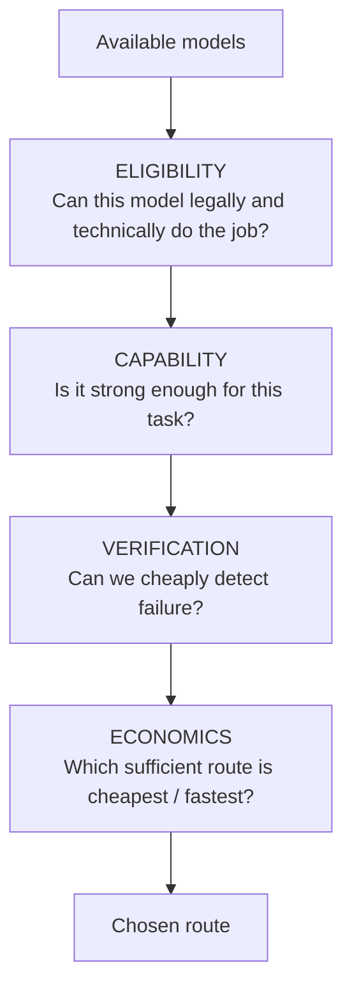
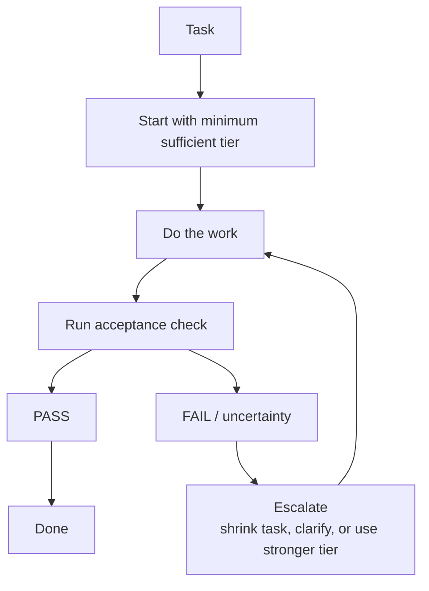

# Module 4 — Route the Models 🧠

> 🎯 **Goal:** choose the **minimum sufficient model capability** for each agent role, prove those choices with evidence, and define exactly when the workflow should escalate to something stronger.
>
> **You'll leave with:**
>
> - `workshop/model-comparison.md`
> - a routing policy for Implementer, Breaker, Reviewer, and Lead
> - explicit escalation rules
> - pinned model assignments for the capstone (and an optional routed rerun of Module 3)

| Module | You learn to… | Orchestration step | The one rule |
|---|---|---|---|
| 0 | Watch one agent do the whole job alone | Baseline | Measure before you multiply |
| 1 | Turn one job into independently understandable pieces | **Decompose** | Split by independent outcome |
| 2 | Give each worker only the authority it needs | **Isolate** | Minimum necessary authority |
| 3 | Run the crew, verify, escalate, and integrate | Execute | Parallelize work that is actually independent |
| **4 ← you are here** | **Give each worker enough model capability—without wasting it** | **Route** | **Minimum sufficient capability** |
| 5 | Handle a launch-night failure | Recover | Green tests are evidence, not a verdict |

> **Module 1 decided WHAT jobs exist.**
>
> **Module 2 decided WHAT each worker may do.**
>
> **Module 3 ran the crew on one model and showed you where it struggled.**
>
> **Module 4 decides HOW MUCH model each worker actually needs.**

> 🔁 **Why routing comes *after* the run:** in Module 3 every worker used your Module 0 model, on purpose, to keep the comparison fair. You now have real evidence (which worker needed repairs, which one breezed through, what the Reviewer caught). Routing is a lot easier to reason about when you're tuning a crew you've watched work, not guessing about one you haven't.


*A switch lever is cheap, simple and decisive: it sends each train down the track that fits it. Routing a model is the same job. Photo: W.carter, "Railway switch lever on Grötö," [Wikimedia Commons](https://commons.wikimedia.org/wiki/File:Railway_switch_lever_on_Gr%C3%B6t%C3%B6.jpg), public domain.*

---

# Authority and intelligence are different knobs 🎚️

In Module 2 you built:

```text
@implementer
@breaker
@reviewer
lead
```

and gave each one limited authority.

Now suppose someone says:

> “Easy. Put the strongest model on every agent.”

That will probably work.

It may also be:

- slower
- more expensive
- unnecessarily scarce
- harder to scale
- no more reliable on tasks already protected by deterministic checks

The opposite approach is also bad:

> “Always use the cheapest model.”

Some failures are difficult to detect.

Saving a few cents on the call may create much more expensive human work later.

The question is therefore not:

> **Which model is best?**

It is:

> **What is the least expensive model configuration that reliably clears this task's acceptance bar?**

---

# The symmetry across Modules 2 and 4

Module 2 taught:

> 🔐 **Minimum necessary authority**

Do not give a Reviewer write access it does not need.

Module 4 teaches:

> 🧠 **Minimum sufficient capability**

Do not give a bounded classification job expensive reasoning it does not need.

Put together:

```text
                    AGENT DESIGN

          ┌──────────────────────┐
          │ TASK RESPONSIBILITY  │
          │ Module 1             │
          │ What does it own?    │
          └──────────┬───────────┘
                     ▼
          ┌──────────────────────┐
          │ AUTHORITY            │
          │ Module 2             │
          │ What may it do?      │
          └──────────┬───────────┘
                     ▼
          ┌──────────────────────┐
          │ CAPABILITY           │
          │ Module 4             │
          │ How much model?      │
          └──────────┬───────────┘
                     ▼
          ┌──────────────────────┐
          │ VERIFICATION         │
          │ Modules 3 + 4        │
          │ Did it work?         │
          └──────────────────────┘
```

> 🔑 **More intelligent does not mean more authority.  
> More authority does not mean more intelligence.**

They are separate design decisions.

---

# Model choice is a hypothesis—not a ranking 🧪

You are not going to create a permanent leaderboard such as:

```text
Model X > Model Y > Model Z
```

because models change.

Providers change.

Prices change.

Variants change.

And tasks differ.

A configuration that is excellent at:

```text
bounded classification
```

may be poor at:

```text
architecture review
```

A configuration that excels at:

```text
debugging
```

may be wasteful for:

```text
summarizing a fixture
```

So your routing statement should sound like:

> **For this class of task, under this acceptance check, this configuration currently appears sufficient.**

That's a testable hypothesis.

---

# First: filter out models that cannot do the job 🚧

Before ranking model quality, ask whether the configuration is even **eligible**.

Think of model routing as a funnel.



---

## Eligibility questions

Before comparing quality, ask:

### Tools

Can the model reliably perform the tool calls the agent needs?

A model may be impressive in chat but weak at agentic tool use.

---

### Context

Can it handle the required files and instructions?

---

### Privacy

Is this provider/model approved for the data being sent?

For proprietary source code, credentials, customer data, or sensitive files:

```text
privacy failure
```

is not something you compensate for with a higher evaluation score.

The model is simply ineligible.

---

### Availability

Is the model actually enabled in this project?

Can you access it reliably?

---

### Latency

Does the workflow have a response-time requirement?

For example:

```text
interactive developer help
→ latency may be a hard constraint

overnight code review
→ latency may matter much less
```

---

> 🔑 **Some routing factors are preferences. Others are gates.**
>
> A model that fails a privacy or required-tool constraint doesn't get to compete.

---

# Free is a pricing label—not a privacy classification ⚠️

OpenCode Zen offers a changing catalog of models, including some temporarily free-labeled models.

The catalog changes.

So can the privacy terms.

Some free endpoints may allow submitted data to be used for model improvement; others may have different retention or training policies.

Always check the current Zen documentation before sending real organizational data:

[OpenCode Zen documentation](https://opencode.ai/docs/zen)

The durable rule is:

```text
Before routing proprietary data:

check provider
check retention
check training/data-use terms
check organizational policy
```

> 🔑 **“Free” tells you what it costs. It does not tell you what happens to your data.**

---

# Once a model is eligible: ask three questions ❓

These three questions drive the real routing decision.

---

## 1️⃣ How difficult is the task?

Does it require:

```text
simple extraction

or

multi-step reasoning?
```

Compare:

```text
Rename one variable
```

with:

```text
Find the likely architectural path that could bypass manager approval.
```

Different reasoning demand.

---

## 2️⃣ How easy is failure to detect?

This is **verifiability**.

Compare:

### Highly verifiable

```text
Write code
        ↓
run 47 deterministic tests
        ↓
PASS / FAIL
```

with:

### Weakly verifiable

```text
Review architecture
        ↓
"Did it miss anything important?"
        ↓
???
```

A task can be technically difficult yet surprisingly safe to send to a cheaper model when failure is inexpensive to detect.

That gives us one of the most important principles in this course:

> 🔑 **Strong verification can reduce the amount of model capability you need.**

---

## 3️⃣ What happens if a bad result gets through?

This is the **consequence of undetected failure**.

Compare:

```text
bad summary
→ annoying
```

with:

```text
approval bypass
→ unauthorized discount goes live
```

The second deserves more assurance.

---

# The original routing matrix 🔲


These ideas can still be compressed into a useful two-dimensional picture.


*Figure 3 — First-pass model-routing matrix.*

Text alternative: tasks move from low to high ambiguity horizontally and from low to high consequence vertically. Bounded low-risk tasks tend toward economical models; ambiguous high-consequence tasks tend toward stronger reasoning and independent review. Low-ambiguity high-consequence rules should often become deterministic controls rather than LLM decisions.

---

# But the matrix hides a third dimension 🧊

Consider:

```text
Task A:
Write complicated code.

Verification:
100 deterministic tests.
```

Now compare:

```text
Task B:
Write a three-sentence security recommendation.

Verification:
A human has to notice what it forgot.
```

Task A may involve far more code.

Yet Task B can justify a stronger model because a failure is harder to detect.

So imagine **verifiability** sitting above the matrix:

```text
                 VERIFIABILITY

        EASY TO VERIFY
             ↑
             │   cheaper models become
             │   much more viable
             │
             │
             │
             │   stronger models /
             │   independent review
             ↓
        HARD TO VERIFY
```

The complete question is therefore:

> **How hard is the task, how hard is failure to detect, and how bad is an undetected failure?**

---

# An important exception: sometimes the answer is “don't use an LLM” 🙅

Consider the shop rule:

```text
discount > 20%
→ manager approval required
```

Should we route that runtime decision to the most powerful reasoning model?

No.

We already know the rule.

Code can evaluate it deterministically.

```python
if discount > 20:
    status = "pending_approval"
```

Or better in our application:

```text
the service enforces the rule
```

The LLM can help with:

- interpreting an ambiguous policy
- implementing the policy
- reviewing the implementation
- attacking the implementation with tests

But once the rule is deterministic:

> 🔑 **Policy enforcement belongs in code, rules, tests, or permissions—not in a “smarter” model.**

Do not solve determinism with more intelligence.

---

# Think in model tiers—not favorite brands 🪜

Model names change too quickly to make them the architecture.

Instead think:

| Tier | Meaning | Typical work |
|---|---|---|
| **Tier 1 — Fast** | Lowest sufficient capability | extraction, classification, bounded test generation |
| **Tier 2 — Strong** | Stronger reasoning | implementation, debugging, risk review |
| **Tier 3 — Strong + independent check** | High assurance | security-sensitive interpretation, architecture, difficult reviews |
| **Human** | Judgment/ownership | policy ambiguity, irreversible decisions, GO / NO-GO |

The actual model occupying each tier can change next month.

Your workflow doesn't have to.

---

# Your crew now needs a routing hypothesis 🗺️

Start with a hypothesis—not a permanent answer.

| Agent | Task shape | Starting hypothesis |
|---|---|---|
| **Breaker** | Frozen contract → executable tests | Tier 1 may be sufficient because tests themselves are checkable |
| **Implementer** | Coding against deterministic contract tests | Tier 1 or Tier 2—measure it |
| **Reviewer** | Find things existing checks may have missed | Tier 2 |
| **Lead** | Routing, dependencies, integration judgments | Tier 2 |
| **GO / NO-GO** | Accountability / business judgment | Human |

Notice:

```text
Breaker does important work

≠

Breaker automatically needs the most expensive model
```

Its output is executable.

That makes it comparatively easy to challenge.

Reviewer is different.

If Reviewer says:

```text
"No problems found."
```

you don't have a perfect command that proves Reviewer didn't miss one.

That weak verification can justify more reasoning capability.

---

# Routing should be a control loop—not a static assignment 🔁

A mature router doesn't merely say:

```text
Breaker = cheap model forever
```

It says:



> 🔑 **Routing is a control loop.**

Start economical.

Observe evidence.

Escalate when the evidence tells you to.

---

# When should the router escalate? 📈

Do **not** use a magical universal rule like:

```text
always retry exactly twice
```

Instead define observable triggers.

### Escalate when:

- ❌ a deterministic acceptance check fails
- ❌ the agent cannot supply required evidence
- ❌ the task turns out to be more ambiguous than the card suggested
- ❌ requirements conflict
- ❌ repeated attempts produce the same defect
- ❌ the agent exhausts its step/tool budget without completing the task
- ❌ there is no reliable automatic acceptance check
- ❌ the consequences exceed what the current route was designed to handle

Possible escalation actions:

```text
shrink the task
        ↓
clarify the contract
        ↓
provide missing context
        ↓
switch to a stronger model/variant
        ↓
add an independent reviewer
        ↓
escalate to a human
```

> 🔑 **Never respond to a failed evaluation by weakening the evaluation.**

If a cheap model fails the test:

```text
do not delete the test
do not loosen the permission
do not redefine success
```

Change the route.

---

# The real cost is not token price 💸

Suppose:

```text
Fast model = $
Strong model = $$$
```

It is tempting to conclude that Fast is cheaper.

Not necessarily.

The true cost is:

```text
TOTAL COST TO ACCEPTED RESULT

model inference
+
verification
+
retries
+
escalation
+
human review
+
latency
```

Example:

```text
FAST MODEL

$ → FAIL → retry → FAIL → investigate → escalate
                                   │
                                   ▼
                              total $$$$
```

versus:

```text
STRONG MODEL

$$$ → PASS
      │
      ▼
   accepted
```

But the opposite can happen too:

```text
FAST MODEL

$ → PASS all deterministic checks
```

versus:

```text
STRONG MODEL

$$$$ → PASS exactly the same checks
```

Now the stronger model bought you nothing observable.

> 🔑 **The cheapest model is not the one with the lowest token price.  
> It is the route with the lowest expected cost to a verified result.**

---

# OpenCode: provider + model + variant ⚙️

When you run an experiment, “GPT” or “Claude” is not a useful experimental record.

You need the actual configuration.

---

## Provider

A **provider** is the service sending the model request.

Examples could include:

```text
OpenCode Zen
Anthropic
OpenAI
a local server
another configured provider
```

The same nominal model can behave differently depending on provider configuration, serving stack, available tools, and model settings.

So provider matters.

---

## Model ID

OpenCode model IDs use:

```text
provider_id/model_id
```

For example:

```text
some-provider/some-model
```

Use the ID OpenCode actually displays.

Do not reconstruct it from memory.

---

## Variant

A **variant** is another configuration of the same model—often a reasoning/effort level.

For example, a model might expose variants resembling:

```text
low
medium
high
max
```

Availability varies by model.

More effort commonly means:

```text
more reasoning budget
+
more latency
+
more tokens
```

It does **not** guarantee a better answer for every task.

---

## The experiment condition

The thing you're really comparing is:

```text
PROVIDER
   +
MODEL
   +
VARIANT
   +
SAME TASK
   +
SAME CONTEXT
   +
SAME TOOLS
```

> 🔑 **A display name is a label.  
> `provider/model + variant` is an experiment condition.**

---

# OpenCode mechanics 🔧

This course environment targets the same OpenCode V1 setup used in Module 2.

Use:

```text
/models
```

inside the TUI to see models enabled **here, today**.

You can also run:

```bash
opencode models
```

to see the exact IDs available from configured providers.

Documentation:

[OpenCode models](https://opencode.ai/docs/models)

[OpenCode CLI](https://opencode.ai/docs/cli)

---

## Variants

In the course environment, use:

```text
ctrl+t
```

to cycle supported variants.

The status bar shows the current selection.

Record it.

Do not write:

```text
Model X
```

when what you actually tested was:

```text
Model X / high effort
```

---

# ⚠️ V1 vs. V2 model syntax

Our lab configuration remains V1 for consistency with Module 2.

V1 agent frontmatter can keep model and variant separate:

```yaml
model: provider/model
variant: high
```

Current OpenCode V2 combines them:

```yaml
model: provider/model#high
```

The concept is identical:

> **Pin the exact model configuration when routing consistency matters.**

Do not convert the rest of the lab to V2 syntax halfway through.

---

# The silent inheritance trap 👻

Suppose your Lead uses an expensive reasoning model.

Your Breaker file contains no `model:` line.

What happens?

By default, an unpinned subagent can inherit the model of the primary agent that invoked it.

So this architecture:

```text
Lead
Strong / expensive
      │
      ▼
Breaker
"cheap worker"
```

may secretly become:

```text
Lead
Strong / expensive
      │
      ▼
Breaker
Strong / expensive
```

Your routing policy exists only in your head.

The reverse can be worse.

Suppose you switch Lead to a small model for experimentation:

```text
Lead
Fast model
    │
    ▼
Reviewer
inherits fast model
```

Now your high-assurance Reviewer silently changed too.

> 🔑 **An unpinned model is an inherited routing decision.**

That's why this module ends by pinning important specialist routes.

---

# OpenCode Zen 🧘

OpenCode Zen is OpenCode's curated model provider.

Its goal is not merely to list models, but to test model/provider combinations suitable for agentic coding.

See:

[OpenCode Zen](https://opencode.ai/docs/zen)

The live list changes.

So:

> **Never hardcode “Model X is the best model” into your architecture.**

Use:

```text
/models
```

in your actual environment.

Measure.

Then route.

---

# Exercise 4 — Build a routing policy 🔬

**Time:** approximately 35–40 minutes

> ⏱️ **Short on time?** This module sits late in the day on purpose, so it can flex. **Minimum path (~15 min):** Step 1 → Step 3 (Task A only) → Steps 10–12 (policy, crew map, pin). Drop Task B (Steps 4–6) and Steps 7–9 first, then the Level ups. You'll still leave with a routing policy and pinned models for the capstone.

### Goal

Compare two model/effort configurations on the **same inputs** using observable outcomes.

Then convert what you observed, here *and* in your Module 3 gate log (`workshop/integration-notes.md`), into a routing policy for the crew.

---

# Step 1 — Inspect the live catalog 📚

Start:

```bash
cd sandbox/panic-pantry
opencode
```

Inside OpenCode:

```text
/models
```

Pick two configurations that are actually available.

Ideally choose something meaningfully different:

```text
Configuration A
fast / economical

Configuration B
stronger reasoning
```

If only one model is available, compare two variants/effort settings if supported.

If neither is possible, use the instructor's recorded trace.

---

## Record the exact configurations

Create:

```text
workshop/model-comparison.md
```

Start with:

```markdown
# Model comparison

## Configurations

A
Model: ___
Provider: ___
Variant: ___

B
Model: ___
Provider: ___
Variant: ___
```

Do not write:

```text
cheap model
```

or:

```text
GPT
```

Record what OpenCode actually showed.

---

# Step 2 — Make the comparison fair ⚖️

A model comparison is only useful if you try to hold the rest constant.

Keep these constant:

```text
same prompt
same repository state
same allowed files
same acceptance criteria
same tools
fresh conversation
```

Change only:

```text
model / variant
```

---

## Fresh session ≠ empty universe

Use:

```text
/new
```

or the configured new-session shortcut between runs.

A new session removes the previous conversation.

It still operates in the same project and may receive project-level instructions.

That's what we want:

```text
same project
same instructions
new dialogue history
```

Run 2 should not benefit from Model 1's answer.

---

# One run is not a benchmark 🎲

You are about to run each configuration once per task.

That's enough for:

> **a routing smoke test**

It is **not** enough to declare:

```text
"Model A is 17% better than Model B."
```

LLM behavior varies from run to run.

Today's goal is:

```text
form a routing hypothesis
```

not:

```text
publish a leaderboard
```

---

## If you're doing this in a room: counterbalance the order

Half the room should run:

```text
A → B
```

Half:

```text
B → A
```

Why?

So Configuration B doesn't always receive any accidental “second-run” advantage.

This simple technique is called **counterbalancing**.

At the end, comparing multiple people's results gives much stronger evidence than one person's single pair.

> 🔑 **One run is an anecdote. Repeated matched runs begin to look like evidence.**

---

# Step 3 — Task A: bounded + objectively checkable ✅

This task represents work we suspect a Tier 1 model may handle well.

### Task

Predict the final disposition of every row in the messy promotion fixture.

Run the exact same prompt once with Configuration A and once with Configuration B.

Use a fresh session each time.

Paste exactly:

```text
Read:

- tickets/TICKET-001.md
- src/panic_pantry/models.py
- data/promotions.json.seed
- fixtures/promos_messy.csv

Assume the store begins with exactly the contents of data/promotions.json.seed.

For each of the 13 data rows in fixtures/promos_messy.csv, predict the import
disposition:

- created-active
- created-pending_approval
- skipped_duplicate
- error (include the reason)

Use 1-based file line numbers, where the CSV header is line 1.

Output one table only. Do not write code.
```

---

## Why explicitly include the seed?

Because:

```text
duplicate in the CSV
```

is not the only kind of duplicate.

A code already present in:

```text
data/promotions.json.seed
```

is also a collision.

For example:

```text
WELCOME10
```

can be a duplicate even if it appears only once in the new CSV.

The model should receive the evidence required to answer the question.

We are testing reasoning—not whether it guessed hidden context.

---

## Score Task A objectively

Only after both answers are complete, compare each against:

[fixtures/promos_messy.expected.md](../sandbox/panic-pantry/fixtures/promos_messy.expected.md)

Score:

```text
correct dispositions / 13
```

Example:

```text
Configuration A: 13/13

Configuration B: 13/13
```

If both ace it, that's **not** a failed experiment.

That's a valuable result:

> The stronger configuration may not be justified for this bounded task.

---

# Step 4 — Task B: hard-to-verify risk reasoning 🕳️

We want everyone to evaluate the **same** flawed plan.

That removes a confound:

```text
different model
+
different participant plan
```

would make the comparison much harder to interpret.

---

## Create the fixed evaluation artifact

Create:

```text
workshop/evals/risky-plan.md
```

You may need:

```bash
mkdir -p workshop/evals
```

Paste:

```markdown
# Risky Midnight Crunch Plan

Contract:
- discounts above 20% require manager approval
- exactly 20% may become active

Implementation:
- Implementer writes importer.py.
- Importer should compare discount_pct to 20 and assign active or pending_approval itself.
- If contract tests fail, Implementer may update the failing tests so they reflect the implementation.

Breaker:
- Breaker writes tests/test_promo_import.py.
- Breaker should inspect importer.py first so its tests match the implementation.
- Duplicate means a code appears more than once in the incoming CSV.

Reviewer:
- Reviewer checks the final implementation.
- Reviewer may fix importer.py directly when it finds a simple defect.

Lead:
- Lead may delegate to implementer, breaker, reviewer, or general if a specialist struggles.

Launch:
- Run all tests.
- If they are green, automatically mark the release GO.
```

There are **six deliberately planted orchestration or correctness risks**.

Don't open the answer yet.

---

# Step 5 — Run Task B ▶️

Use a fresh session for each configuration.

Paste exactly:

```text
Read:

- workshop/evals/risky-plan.md
- tickets/TICKET-001.md
- workshop/plan.md
- .opencode/agents/implementer.md
- .opencode/agents/breaker.md
- .opencode/agents/reviewer.md
- .opencode/agents/lead.md

Review workshop/evals/risky-plan.md.

Find every material correctness, orchestration, verification, or authority risk you
can justify from those files.

Order findings by consequence.

For each finding give:
1. the risk
2. evidence from the repo
3. the smallest practical mitigation

Do not modify files.
```

---

# Step 6 — Score Task B 🧮

First, score how many planted risks each configuration found.

<details>
<summary>▶ Reveal the six planted risks only after both runs finish</summary>

### 1. Importer enforces the 20% policy itself

The plan says:

```text
Importer should compare discount_pct to 20
```

But the architecture deliberately delegates approval behavior to the service.

The model should recognize the boundary violation.

---

### 2. Implementer may rewrite failing tests

That lets the worker change the scoreboard when its implementation fails.

A failing acceptance check should cause:

```text
repair
or escalation
```

not:

```text
rewrite success
```

---

### 3. Breaker reads `importer.py`

Breaker is supposed to provide independent black-box evidence from the contract.

Reading the implementation can make its tests mirror an implementation bug.

---

### 4. Duplicate detection ignores existing store data

The plan defines a duplicate only as:

```text
appears more than once in incoming CSV
```

But codes already in the seed/store also count.

---

### 5. Reviewer may edit the implementation

Reviewer is supposed to provide independent analytical evidence.

If it fixes its own finding, another party should verify the resulting change.

---

### 6. Lead may delegate to unrestricted `general`

Lead's effective authority includes the authority reachable through delegated helpers.

Allowing an unrestricted helper can bypass the specialist capability boundaries.

---

### Bonus problem

The release becomes automatically GO when the tests are green.

The course principle is:

> **Green tests are evidence, not a verdict.**

The final launch decision remains a human judgment.

If a model catches this too, record it as a bonus finding.

</details>

Score the six planted risks:

```text
Configuration A: __ / 6
Configuration B: __ / 6
```

Then separately note:

```text
Were the mitigations actually useful?

Did either configuration find a legitimate additional issue?

Did either invent a problem unsupported by evidence?
```

This matters because:

> **More findings ≠ better review if half of them are hallucinations.**

---

# Step 7 — Record time and economics ⏱️

For all four core runs, record:

| Run | Configuration | Score | Time | Cost/tokens |
|---|---|---:|---:|---|
| Task A | A | __ / 13 | __ | __ |
| Task A | B | __ / 13 | __ | __ |
| Task B | A | __ / 6 | __ | __ |
| Task B | B | __ / 6 | __ | __ |

Use wall-clock time.

For token/cost information:

```bash
opencode stats
```

may provide useful usage data depending on your OpenCode version/provider.

But be careful:

> **Do not attribute an aggregate statistic to one run unless your environment lets you isolate that run.**

If per-run cost or tokens cannot be identified confidently, record:

```text
unavailable
```

Never estimate it.

---

# Step 8 — Interpret the result 🔍

Do **not** immediately ask:

> “Which model won?”

Ask better questions.

---

## Question 1

Did both configurations pass Task A?

If:

```text
A = 13/13
B = 13/13
```

but B took 3× longer or cost substantially more, then A may be the better route for that task class.

---

## Question 2

Did stronger reasoning materially improve Task B?

For example:

```text
A = 3/6 risks

B = 6/6 risks
```

That's evidence that hard-to-verify review work may justify a stronger route.

---

## Question 3

Was a configuration confident but wrong?

This is critical.

Do not score:

```text
confidence
eloquence
length
```

Score:

```text
correct output
evidence
useful mitigation
```

> 🔑 **Judge the artifact—not how intelligent the model sounded.**

---

## Question 4

Did the cheaper model fail in a way that verification caught immediately?

If yes, that's very different from a silent failure.

For example:

```text
cheap model produces bad code
        ↓
deterministic tests fail
        ↓
router escalates
```

may still be economically attractive.

---

# Step 9 — Calculate “cost to accepted result” 💰

You don't need precise accounting to reason correctly.

Imagine:

```text
Configuration A
cost = 1 unit

Configuration B
cost = 4 units
```

If A passes:

```text
A
1 unit
↓
PASS
```

then routing straight to B would waste capability.

But if:

```text
A
1
↓
FAIL
↓
retry
1
↓
FAIL
↓
human debugging
5
↓
B
4
```

then the apparently cheap route cost:

```text
11 units
```

That's the metric that matters.

> 🔑 **Optimize the route—not the sticker price of the first call.**

---

# Step 10 — Build your routing policy 🗺️

At the bottom of:

```text
workshop/model-comparison.md
```

add:

```markdown
# Routing policy

## Tier 1 — Fast / economical

Configuration:
___

Use for:
- bounded extraction/classification
- deterministic fixture analysis
- contract-derived work with strong acceptance checks
- other tasks where failure is inexpensive to detect

Escalate when:
- a deterministic check fails
- required evidence is missing
- requirements turn out to be ambiguous
- repeated attempts reproduce the same defect

## Tier 2 — Strong reasoning

Configuration:
___

Use for:
- implementation when Tier 1 is not reliable enough
- debugging
- reviewer work
- architecture/risk analysis
- dependency/integration reasoning

Escalate to human or independent review when:
- requirements conflict
- impact is security- or policy-sensitive
- no reliable acceptance check exists
- the result controls an irreversible decision

## Human-owned

Keep human ownership for:
- unresolved business-policy interpretation
- changing the frozen contract
- final GO / NO-GO
- accepting high-consequence residual risk

## Never route to an LLM at runtime when deterministic logic suffices

Examples:
- is 27 > 20?
- does this path match the allowlist?
- did the unit test pass?
```

---

# Step 11 — Map the policy to your crew 👥

Now write:

```markdown
## Crew routing

| Agent | Starting tier | Why | Escalation trigger |
|---|---|---|---|
| Implementer | ___ | ___ | ___ |
| Breaker | ___ | ___ | ___ |
| Reviewer | ___ | ___ | ___ |
| Lead | ___ | ___ | ___ |
```

A plausible answer might look like:

```text
Breaker
→ Tier 1
because contract-derived tests are highly checkable

Reviewer
→ Tier 2
because a missed risk can be difficult to detect

Lead
→ Tier 2
because routing/dependency mistakes can contaminate the workflow

Implementer
→ whichever tier your evidence actually supports
```

Do not copy that mechanically.

Use what your experiment showed.

---

# Step 12 — Pin model assignments 🔒

Once a routing choice matters, do not rely on accidental inheritance.

Update the appropriate files in:

```text
.opencode/agents/
```

For this V1 lab, add:

```yaml
model: provider/model-id
variant: high
```

using the exact values you selected.

For example:

```yaml
---
description: ...
mode: subagent
model: YOUR_PROVIDER/YOUR_MODEL
variant: YOUR_VARIANT
temperature: 0.1
...
---
```

Do this for agents whose routing policy you want to keep stable from here on.

Your Module 3 worktree still has **copies** of the agents without these `model:` lines. To carry the routing into the capstone, copy the pinned files across:

```bash
cp .opencode/agents/*.md ../worktrees/orchestrated/.opencode/agents/
```

---

## Why pin them?

Without a `model:` setting:

```text
Lead model
    │
    └── inherited by subagent
```

A later session-level model change could silently change your experiment.

After pinning:

```text
Lead
Tier 2
 │
 ├── Implementer → chosen route
 ├── Breaker     → chosen route
 └── Reviewer    → chosen route
```

Now your architecture reflects the policy you actually tested.

---

# Predict before revealing 🔮

Suppose your experiment produces:

```text
Task A
Fast:   13/13 in 11 sec
Strong: 13/13 in 38 sec

Task B
Fast:   3/6 risks
Strong: 6/6 risks
```

Which policy is better?

<details>
<summary>▶ Reveal answer</summary>

Something like:

```text
Task A class
→ start Fast

Task B class
→ start Strong
```

Not:

```text
Strong model wins overall
```

and not:

```text
Fast model is cheaper overall
```

The models demonstrated different value on different **task shapes**.

That's the whole point of routing.

</details>

---

# ⚡ Level up — Evaluate the Implementer

<details>
<summary>▶ Optional coding comparison — 8 minutes</summary>

Task A measured bounded reasoning.

Task B measured review.

Neither directly proved which model should write code.

If time permits, compare your two configurations on a tiny implementation task in a scratch branch.

Create:

```bash
git switch -c scratch/model-routing
```

Choose one small task with existing deterministic tests.

Run Configuration A from a fresh session.

Reset the scratch branch.

Run Configuration B from the same starting point.

Compare:

```text
tests passed
tool calls / attempts
time
cost if available
scope violations
```

Then leave the experiment:

```bash
git switch main
git branch -D scratch/model-routing
```

Do not choose Implementer's permanent tier from vibes.

Measure implementation if implementation quality matters.

</details>

---

# ⚡ Level up — Turn the room into an eval

<details>
<summary>▶ Optional classroom aggregation</summary>

One person's four runs are noisy.

A room full of matched runs is much more interesting.

Collect:

```text
Task A accuracy /13
Task B risks /6
wall-clock time
failure/refusal rate
```

for both configurations.

Then calculate:

```text
median Task A accuracy
median Task B score
median latency
number of complete failures
```

Now compare.

You may discover:

```text
Model A usually wins

but

occasionally catastrophically fails
```

or:

```text
Model B is only slightly more accurate

but

takes dramatically longer
```

Those distributions matter more than one flashy run.

This is the beginning of a real model-evaluation practice.

</details>

---

# ⚡ Level up — Different models can fail differently

<details>
<summary>▶ Optional ensemble insight</summary>

Suppose:

```text
Reviewer A finds:
1, 2, 3, 5

Reviewer B finds:
1, 2, 4, 6
```

Who won?

Maybe neither.

They have **different failure modes**.

For especially important reviews, using independent models can provide diversity:

```text
Reviewer A
     │
     ├──────┐
     │      │
Reviewer B  │
     │      │
     └──→ compare findings
```

You would not do this for every task—it costs more.

But high-consequence work may justify:

```text
model diversity
+
independent evidence
```

rather than simply running the same model twice.

</details>

---

# ⚡ Level up — Routing versus retrying

<details>
<summary>▶ Optional decision challenge</summary>

A Tier 1 model fails.

What should Lead do?

Not automatically:

```text
retry the exact same thing forever
```

Ask why it failed.

### Missing context?

Provide the missing evidence.

### Task too large?

Split it.

### Requirement ambiguous?

Escalate to whoever owns the contract.

### Reasoning insufficient?

Route to Tier 2.

### Test incorrect?

Fix the test only if independent evidence proves the test is wrong—not because the implementation dislikes it.

This gives you a richer control loop:

```text
FAIL
 │
 ├── context problem → add context
 │
 ├── task-size problem → decompose
 │
 ├── ambiguity → clarify
 │
 ├── capability problem → stronger model
 │
 └── policy judgment → human
```

Escalation is not synonymous with:

```text
buy more intelligence
```

Sometimes the problem is your task design.

</details>

---

# ⚡ Level up — Rerun Module 3 with your routes 🏁

<details>
<summary><b>▶ Optional — Experiment B: the fully routed crew</b></summary>

Module 3's matched experiment intentionally held model configuration constant.

Now ask a different question:

> **How does our best routed architecture perform?**

Use the model assignments you pinned in Step 12 for:

```text
Lead
Implementer
Breaker
Reviewer
```

Then run the Module 3 workflow again from a fresh starter state (a new worktree from the `starter` tag, so your Module 3 result stays intact for the capstone):

```bash
# from sandbox/panic-pantry
git worktree add -b routed ../worktrees/routed starter
(cd ../worktrees/routed && bash scripts/reset.sh)
mkdir -p ../worktrees/routed/.opencode/agents ../worktrees/routed/workshop/cards
cp .opencode/agents/*.md ../worktrees/routed/.opencode/agents/
cp workshop/cards/*.md ../worktrees/routed/workshop/cards/
cd ../worktrees/routed && opencode
```

Now you are testing:

```text
specialized tasks
+
specialized permissions
+
specialized models
+
acceptance gates
+
repair loop
```

This is closer to how you would actually deploy the architecture.

But phrase the conclusion correctly:

> “Our fully routed orchestrated workflow achieved X.”

Do **not** conclude:

> “Multiple agents caused X.”

Several variables changed.

</details>

---

# What NOT to conclude 🚫

After today's experiment, do not write:

```text
Model A is the best model.
```

Write:

```text
Configuration A was sufficient for Task A under its deterministic check.

Configuration B found more planted risks in Task B.

We'll use A for similar bounded work and B for similar weakly-verifiable review,
and revisit that policy when models, prices, or task characteristics change.
```

That's an engineering conclusion.

---

# Hints 💡

Use these in order.

### Hint 1

Both models ace Task A?

Good.

That's evidence.

The strong model may simply be unnecessary for that workload.

---

### Hint 2

Task A models often miss:

```text
seeded collisions
```

A seeded collision means:

```text
code exists in the starting store
```

even if it appears only once in the incoming CSV.

---

### Hint 3

If Task B returns ten findings, don't automatically celebrate.

Ask:

```text
How many are supported?

How many are planted?

How many are invented?
```

Precision matters too.

---

### Hint 4

Never ask a model to reveal hidden chain-of-thought so you can judge whether it “reasoned harder.”

Judge observable output:

```text
accuracy
evidence
tests
findings
latency
cost
```

---

# Troubleshooting 🩹

| Problem | What to do |
|---|---|
| Only one model appears in `/models` | Compare two variants if supported |
| Only one model and one variant are available | Use the instructor's recorded comparison trace |
| Free model throttles/refuses | Record that as an availability result; routing includes reliability |
| Model produces a beautiful but unsupported Task B finding | Do not award the point |
| `opencode stats` cannot isolate the run | Write `unavailable` |
| You forgot which variant was active | Do not guess; rerun or mark the run invalid |
| Second run saw the first model's answer | Start a fresh session and rerun |
| Model is unavailable midway through class | That's operational evidence; use an eligible alternative and record the change |
| A free endpoint has unsuitable privacy terms | Treat it as ineligible for sensitive data |
| Your subagent uses the wrong model | Check whether you forgot to pin `model:` / `variant:` |

---

# Acceptance checks ✅

Your `workshop/model-comparison.md` should contain:

- [ ] exact provider/model IDs
- [ ] exact variants
- [ ] Task A results for both configurations
- [ ] Task A objective score `/13`
- [ ] Task B results for both configurations
- [ ] Task B planted-risk score `/6`
- [ ] wall-clock time for all four core runs
- [ ] cost/tokens where genuinely observable; otherwise `unavailable`
- [ ] no invented cost estimates
- [ ] written Tier 1 and Tier 2 definitions
- [ ] explicit escalation triggers
- [ ] routing decision for Implementer, Breaker, Reviewer, and Lead
- [ ] human-owned decisions identified
- [ ] relevant agent models pinned (and copied into the orchestrated worktree if you want them for the capstone)

---

# Debrief 🗣️

<details>
<summary><b>▶ Why not just put the strongest model everywhere?</b></summary>

Because capability you cannot turn into better accepted outcomes is waste.

If:

```text
Fast → 13/13
Strong → 13/13
```

under the same deterministic check, stronger reasoning produced no measurable advantage for that task.

Save it for work where it changes the result.

</details>

---

<details>
<summary><b>▶ Why can a cheaper model be reasonable for important work?</b></summary>

Because **importance and verifiability are different**.

Writing contract tests is important.

But the resulting artifact is executable and inspectable.

Strong verification can make an economical model useful even on meaningful work.

The key question is:

> Can failure be detected before it matters?

</details>

---

<details>
<summary><b>▶ Why might a three-sentence review need a stronger model than 100 lines of code?</b></summary>

Because code may have deterministic tests.

A review often has no equivalent oracle.

If the reviewer forgets an important attack path:

```text
"No findings."
```

can look exactly like:

```text
"I found everything."
```

Weak verifiability increases the value of stronger reasoning and independent review.

</details>

---

<details>
<summary><b>▶ Should the strongest model decide whether a 27% discount needs approval?</b></summary>

No.

That policy is deterministic.

Use code.

Use the model to help:

```text
implement it
test it
review it
attack it
```

but do not insert probabilistic reasoning into a decision that can be expressed exactly.

</details>

---

<details>
<summary><b>▶ Why isn't token price enough to pick the cheaper route?</b></summary>

Because inference is only part of the cost.

The useful unit is:

```text
cost to accepted result
```

which can include:

```text
calls
retries
verification
human time
latency
escalation
```

A cheap model that fails repeatedly can be the expensive route.

</details>

---

<details>
<summary><b>▶ Why pin subagent models?</b></summary>

Because an unpinned subagent can inherit the invoking primary agent's model.

That means your intended routing policy can silently change when someone switches the parent session's model.

Pinning converts:

```text
"I think Breaker uses the cheap model"
```

into:

```text
"Breaker is configured to use this exact route."
```

</details>

---

<details>
<summary><b>▶ Why isn't one paired run enough to say which model is better?</b></summary>

Because model output varies.

One run tells you what happened:

```text
this time
```

It does not establish the full performance distribution.

Today's experiment is enough to form a routing hypothesis.

Repeated trials—or aggregated class results—provide stronger evidence.

</details>

---

<details>
<summary><b>▶ What should happen when the cheap route fails?</b></summary>

Diagnose the failure.

Possible responses include:

```text
clarify
add context
decompose
repair
rerun
stronger model
independent review
human escalation
```

The correct response is **not** automatically “use the expensive model.”

And it is never:

```text
weaken the acceptance check
```

just to make the result pass.

</details>

---

# The entire routing model 🖼️

```text
                         TASK
                           │
                           ▼
               ┌─────────────────────┐
               │ ELIGIBILITY         │
               │ tools               │
               │ privacy             │
               │ context             │
               │ availability / SLA  │
               └──────────┬──────────┘
                          ▼
               ┌─────────────────────┐
               │ DIFFICULTY          │
               │ How much reasoning? │
               └──────────┬──────────┘
                          ▼
               ┌─────────────────────┐
               │ VERIFIABILITY       │
               │ How cheaply can a   │
               │ bad answer be seen? │
               └──────────┬──────────┘
                          ▼
               ┌─────────────────────┐
               │ CONSEQUENCE         │
               │ What if a miss gets │
               │ through?            │
               └──────────┬──────────┘
                          ▼
                  MINIMUM SUFFICIENT
                        MODEL
                          │
                          ▼
                        WORK
                          │
                          ▼
                       VERIFY
                     /        \
                  PASS        FAIL
                   │            │
                   ▼            ▼
                 DONE       DIAGNOSE
                                │
                  ┌─────────────┼──────────────┐
                  ▼             ▼              ▼
               CLARIFY      DECOMPOSE       ESCALATE
                                                │
                                                ▼
                                      STRONGER / HUMAN
```

---

# Eight things to remember 🔑

1. **Model routing is not a leaderboard.**
2. **Filter for tools, privacy, context, availability, and SLA before comparing intelligence.**
3. **Route by difficulty, verifiability, and consequence.**
4. **Strong verification can make cheaper models viable.**
5. **Deterministic policy belongs in deterministic controls—not stronger LLMs.**
6. **Optimize cost to an accepted result, not token price alone.**
7. **An unpinned subagent model is an inherited routing decision.**
8. **Start with minimum sufficient capability; escalate on evidence.**

---

> 🔑 **Module 2: minimum necessary authority.**
>
> 🔑 **Module 4: minimum sufficient capability.**

And the single idea to carry into the capstone:

> **Routing isn't a leaderboard. It's a control loop.**

---

**Next:** [Module 5](module-5-capstone.md) — the crew says the release is ready. Now the system fails on launch night, and you have to decide what evidence to trust (and which model to send the fix to).
