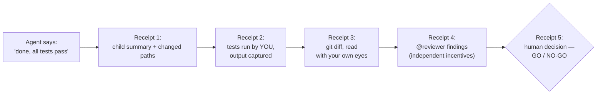
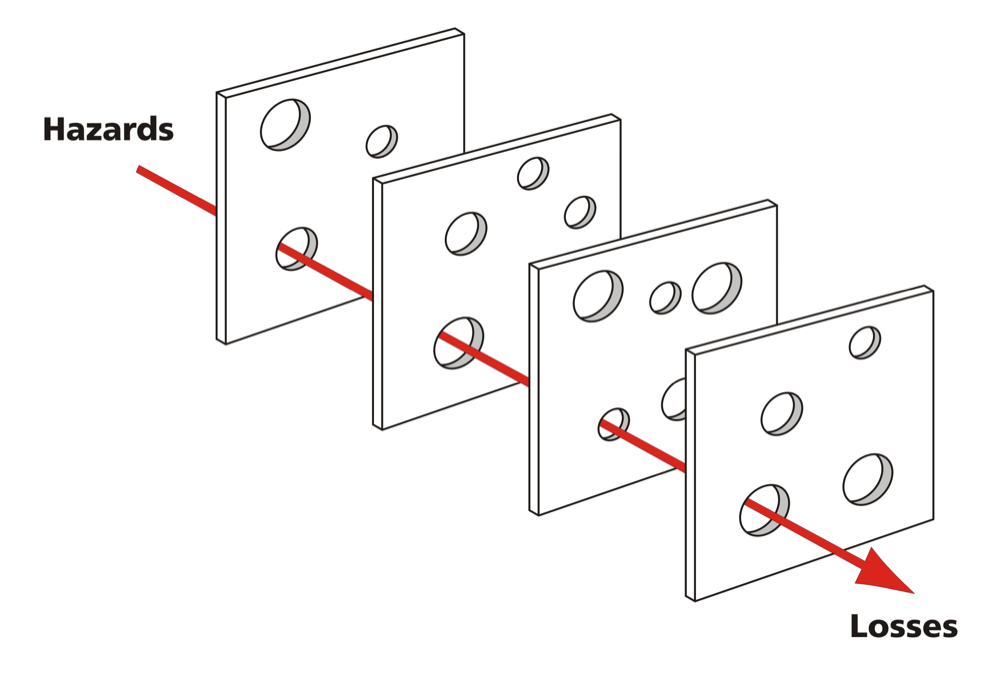

# Module 5 — Micro-lecture 5 + Capstone: midnight launch

**Where you are:** your orchestrated worktree holds an importer, new tests, integration notes, and a filled comparison scorecard. This module is the last skill — verifying and integrating what agents hand back — and the capstone that tests everything under launch pressure.

---

## Micro-lecture 5 — A green check is evidence, not a handoff

**Claim: the parent still owns integration.** An agent saying "done, all tests pass" is a claim. Your job is to hold the receipts.

The receipts, in order — and the specific failure each one exists to catch:

1. **Child summary + changed paths** — does every path map to a task card? *Catches boundary violations:* a file changed that no card owns is invisible to a green suite but obvious against the ownership map.
2. **Deterministic tests** — `python3 -m unittest discover -s tests -v`, run by *you*, output captured. *Catches claimed-but-never-run:* an agent reporting "all tests pass" from a stale or partial run is a claim; your own captured output is evidence.
3. **The diff** — `git diff starter` (everything since the starting line; Module 4's `git add -A` made the new files visible to it), read with your own eyes. *Catches plausible-but-wrong:* agents write code that looks finished; the diff is where reimplemented policy and quiet scope creep hide. Plausible is not the bar.
4. **Independent review** — `@reviewer`, whose incentives are findings, not completion. *Catches author blindness:* the implementer cannot flag the assumption it didn't know it made; a reviewer with a checklist can.
5. **The human decision** — findings get dispositioned: fix, accept with reason, or defer with an owner. *Catches silent deferral:* a finding nobody answered is a decision nobody made. Silence is not a disposition.



*Figure 5 — Integration receipts: an agent's "done" passes four evidence receipts before the fifth, a human GO/NO-GO decision.*
Text alternative: an agent's "done, all tests pass" claim flows left to right through four evidence receipts — child summary with changed paths, tests run by the human with captured output, the diff read directly, and independent reviewer findings — ending at receipt five, the human GO/NO-GO decision.

Why five receipts and not just "the tests pass"? Safety engineers call it the **Swiss cheese model**:



*The Swiss cheese model: every layer of defense has holes; harm gets through only when the holes line up. Diagram: Davidmack, [Wikimedia Commons](https://commons.wikimedia.org/wiki/File:Swiss_cheese_model_of_accident_causation.png), CC BY-SA 3.0.*

Each receipt is one slice. The test suite has a hole wherever no test exists; the diff read has a hole wherever your attention slipped; the reviewer has a hole wherever its checklist is silent. `FREE-ALL` reaches a customer only if it slips through *every* slice at once. Adding slices with *different* holes is what makes the stack safe. That's why the receipts check different things instead of re-running the same check harder.

> 🔑 **Key takeaway:** No single check is complete. Stack checks whose blind spots differ, and harm has to get lucky five times.

> 🔑 **Key takeaway:** A green check is evidence, not a handoff — and only of what it covers.

The failure mode this prevents is quiet: an importer that passes every *existing* test while creating `FREE-ALL` as active — because nobody wrote the test and nobody read the diff. Exactly 20% sails through legitimately; 21% must not. A green suite that doesn't cover the policy is a green light painted on a wall.

When something is wrong, resist the urge to re-roll the whole task. Classify first — task/context gap, dependency error, boundary conflict, or implementation defect — then assign the **smallest corrective task** to the right agent and model. Recovery is routing, and you just spent an afternoon learning to route.

> 📘 **Concept — the four failure classes**
>
> Each class points to a different fix, so naming it correctly *is* half the repair.
>
> | Class | What went wrong | Panic Pantry example | Smallest corrective task |
> |---|---|---|---|
> | **Task/context gap** | The agent worked from missing or wrong information — something the card never said, or an outdated assumption it was given | The card said "report malformed rows" but never quoted the exact reason string, so blank rows come back as `"blank line"` instead of `"empty row"` | Fix the **card**, then re-delegate just that behavior |
> | **Dependency error** | Right pieces, wrong order: a step ran before the thing it needed was ready | `@reviewer` was launched while the implementer was still mid-edit, reviewed a half-written file, and reported "no findings" | Re-run the dependent step **after** its input is final |
> | **Boundary conflict** | Work landed outside its owner's scope, or two owners touched the same file | The Breaker also "helpfully" added `fixtures/promos_extra.csv` — a frozen directory no card owns | Revert the out-of-scope file; tighten scope or permissions |
> | **Implementation defect** | The spec was clear and complete; the code just gets it wrong | Line numbers are off by one: the first data row is reported as line 1 instead of line 2 | A targeted fix citing the **one failing check** |
>
> Diagnostic order: check the **card** before the **code**. Did the agent have the right information (else: gap), at the right time (else: dependency), within the right files (else: boundary)? Only when all three are yes is it an implementation defect.

The capstone injects a real integration issue. Your finish line is not a fix; it's a fix **with evidence** and an honest five-line release note. That note is the artifact your future teammates (and future you, at 11:58 PM) actually read.

---

## Capstone — Midnight launch (27 min) 🔨

**Goal:** resolve an injected integration issue and ship a release note with evidence. It is 11:45 PM at Panic Pantry; the CSV import just "finished."

**Starting checkpoint:** stay in `sandbox/worktrees/orchestrated` with your Exercise 4 result. **The instructor now injects one integration issue into your worktree.** Then:

```bash
python3 -m unittest discover -s tests -v     # something is now wrong — or is it?
git status && git diff starter
```

You may edit your Exercise 4 files plus `workshop/release-note.md`.

### Steps

1. **Stop and classify** before touching anything. Which is it: task/context gap, dependency error, boundary conflict, or implementation defect? Write the classification and your evidence in `workshop/integration-notes.md`.
2. **Assign the smallest corrective task** to the right agent and model — a targeted delegation citing the exact failing check, or a small human edit if delegation costs more than it returns (that's a legitimate routing decision; say so in the notes).

> 🔑 **Key takeaway:** Classify before you fix — recovery is routing, not re-rolling.

3. **Inspect the resulting diff** and get reviewer findings:

```text
@reviewer Review everything that changed since the starter tag (git diff starter) against tickets/TICKET-001.md.
Policy: discounts above 20% require approval; exactly 20% is active.
Findings by severity with file:line citations, plus anything still missing tests.
```

4. **Run the full gate and capture output:**

```bash
python3 -m unittest tests.test_importer_contract -v
python3 -m unittest discover -s tests -v
```

5. **Write `workshop/release-note.md` — exactly five lines:**

```markdown
1. Changed behavior: <what the shop can now do, one sentence>
2. Tests run: <exact command + result, e.g. "python3 -m unittest discover -s tests -v — OK: 23 from the starter suite + however many your Breaker added">
3. Review status: <reviewer findings and their dispositions>
4. Unresolved concern: <the honest one — "none" needs justification>
5. Decision: GO / NO-GO for midnight, and why you're the one saying so.
```

> 💡 **Field note:** The classification step is incident triage, and the five-line note is a deploy record: what changed, what was verified, what's still open, who decided. Teams that write these stop re-litigating releases in chat threads at midnight.

**Required artifacts:** classification note, the corrective diff, reviewer findings, captured test output, five-line release note.

**Acceptance checks (scored 0–2 each, as the instructor announced):** task clarity; dependency/boundary quality; appropriate agent/model choice; permissions respected; tests and diff review; honest release note. **A correct fix without evidence does not receive full credit.**

**Hints (use in order):**
1. Suite green but something feels off? Green means the *covered* behavior passes. Diff the worktree against the ownership map: `git status` — any file changed that no card owns?
2. Test failure ≠ implementation bug by default. Read what the test *asserts* and compare to the frozen contract in `tickets/TICKET-001.md`. Sometimes the test is the defect.
3. Classification shortcut: wrong *behavior* → implementation defect; wrong *file* → boundary conflict; wrong *assumption* → task/context gap; right pieces, wrong *order* → dependency error.

**Troubleshooting:**
- Can't reproduce the failure → `find . -name __pycache__ -type d` and clear stale caches; re-run.
- Fix keeps failing → shrink the corrective task again; one behavior, one check, one delegation.
- Out of time → an honest NO-GO release note with evidence scores better than a silent green mystery. That's the whole lesson.

---

## Close — exit ticket (5 min)

Write these down before you leave (paper or chat — your instructor collects them):

- one task you'll **delegate** next week;
- one task you'll deliberately **keep**;
- one **control or check** you'll add to make the delegation safe.

> 🔑 **Key takeaway:** The release note is the artifact your future teammates — and future you, at 11:58 PM — actually read.

---

**Next:** [appendices.md](appendices.md) — objective coverage map, command crib sheet, and sources to recheck before you rely on them at work.
